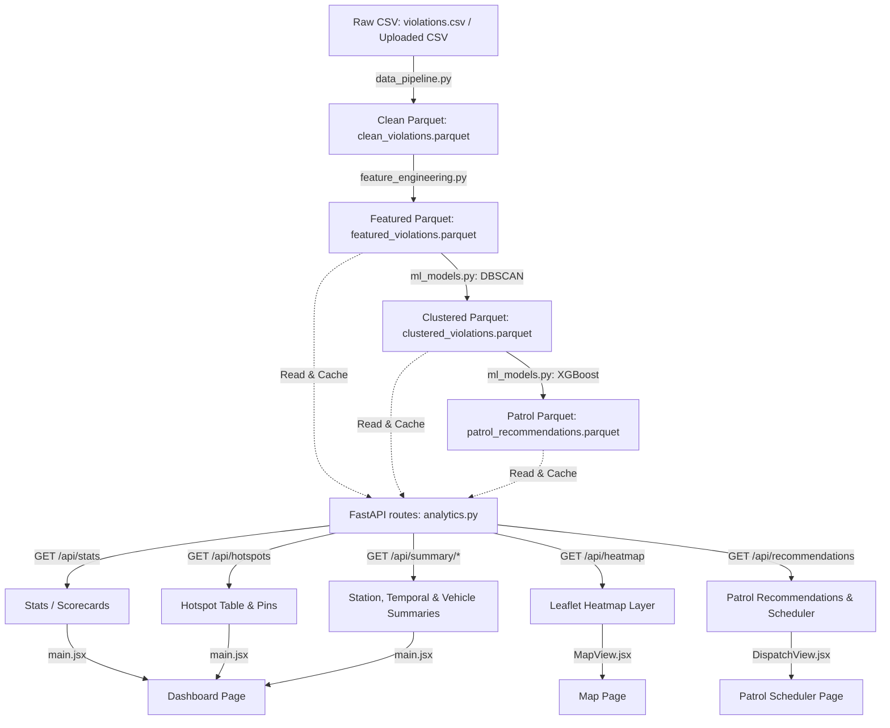

# ParkSense AI - Parking Enforcement Intelligence

<p align="left">
  <a href="https://gridlock-round2-five.vercel.app/"></a>
  
  
</p>
<p align="left">
  
  
  
  
  
</p>
<p align="left">
  
  
  
  
  
  
</p>

ParkSense AI is a full-stack parking intelligence prototype built for Flipkart Gridlock 2.0. It analyzes Bengaluru Traffic Police violation exports, identifies chronic illegal-parking hotspots, scores their congestion impact, and recommends high-priority enforcement windows.

The system is not a static dashboard. It has a FastAPI backend, an AI/ML processing pipeline, and a Vite frontend with two operational modes:

- **Historical Mode**: serves precomputed intelligence from the processed historical dataset.
- **New Data Mode**: accepts a fresh CSV upload, reruns the same pipeline, and shows results for only the uploaded data.

## What It Does

- Cleans and validates raw parking violation CSV data.
- Computes PICI scores: Parking-Induced Congestion Impact.
- Detects spatial violation hotspots using DBSCAN clustering.
- Generates ranked hotspot tables by total congestion impact.
- Trains temporal models for patrol-window recommendations.
- Serves analytics through FastAPI endpoints.
- Provides a professional operations dashboard with mode switching, upload workflow, hotspot rankings, station-load analysis, temporal and vehicle summaries, repeat-offender analysis, a Leaflet heatmap, and a patrol-window workspace.

## Current Status

Implemented:

- Core data pipeline in `src/`.
- FastAPI backend under `backend/app/`.
- Historical processed data under `data/processed/historical/`.
- Upload and reprocessing flow for `new_data`.
- Upload guardrails:
  - CSV-only upload route.
  - 50 MB file-size limit.
  - 50,000 row limit.
  - Required schema validation.
- Backend smoke tests under `backend/tests/`.
- Vite frontend under `frontend/`.
- Historical/New Data mode switching.
- New Data upload workspace.
- Leaflet + OpenStreetMap enforcement heatmap.
- Time slider for hour-by-hour hotspot intensity.
- Enforcement-relief simulation toggle for top chronic hotspots.
- Patrol Window workspace with city-wide scheduler, station filters, and local deploy/recall state.
- Temporal, vehicle, station-load, and repeat-offender dashboard modules.
- Professional deep-blue dashboard layout.

## Repository Structure

```text
.
|-- backend/
|   |-- main.py                  # FastAPI app entrypoint wrapper
|   |-- app/
|   |   |-- main.py              # FastAPI app factory
|   |   |-- api/routes/          # Health, analytics, upload routes
|   |   |-- core/config.py       # App settings and upload limits
|   |   |-- schemas/             # Pydantic response models
|   |   `-- services/            # Dataset and upload pipeline services
|   `-- tests/                   # Backend smoke tests
|-- data/
|   |-- processed/historical/    # Precomputed historical outputs
|   `-- processed/new_data/      # Generated after upload
|-- frontend/
|   |-- src/
|   |   |-- components/          # Dashboard render modules
|   |   |-- utils/apiClient.js   # API helpers
|   |   |-- main.jsx             # Frontend state/controller
|   |   `-- index.css            # Dashboard styling
|   `-- package.json
|-- sample_data/
|   `-- sample_upload.csv        # Demo upload file
|-- src/
|   |-- data_pipeline.py         # Cleaning and raw schema validation
|   |-- feature_engineering.py   # PICI and derived features
|   |-- ml_models.py             # DBSCAN and patrol prediction
|   `-- main.py                  # Pipeline orchestration
|-- approach_strategy.md
`-- requirements.txt
```

## 1. System Architecture

The following diagram illustrates the flow of data from ingestion through feature engineering, spatial/temporal modeling, API serving, and rendering on the user interface:




## Operational Modes

### Historical Mode

Historical Mode uses precomputed files in:

```text
data/processed/historical/
```

Current historical outputs include:

- `clean_violations.parquet`
- `featured_violations.parquet`
- `clustered_violations.parquet`
- `hotspots.parquet`
- `patrol_recommendations.parquet`

This mode is intended for long-term strategic intelligence over the historical BTP dataset.

### New Data Mode

New Data Mode is generated after a CSV upload to:

```text
POST /api/upload
```

The backend saves the upload as:

```text
data/raw/new_violations.csv
```

Then it writes fresh outputs to:

```text
data/processed/new_data/
```

The frontend reads New Data Mode by adding `?mode=new_data` to API calls.

## Backend API

Base URL during local development:

```text
http://127.0.0.1:8000
```

All analytics endpoints support:

```text
?mode=historical
?mode=new_data
```

If no mode is supplied, the backend defaults to `historical`.

### Health

```http
GET /api/ping
GET /api/health
GET /api/health?mode=new_data
```

`/api/ping` is a lightweight liveness endpoint for uptime checks and keep-awake monitors.

Checks whether the required processed datasets exist, are readable, and contain valid signal columns.

### Analytics

```http
GET /api/stats
GET /api/hotspots
GET /api/recommendations
GET /api/heatmap
GET /api/summary/station
GET /api/summary/temporal
GET /api/summary/vehicle
GET /api/summary/repeat-offenders
```

Key endpoint behavior:

- `/api/hotspots`: ranked chronic violation hotspots.
- `/api/recommendations`: patrol deployment windows sorted by priority.
- `/api/heatmap`: top PICI-weighted coordinate points for map rendering.
- `/api/summary/station`: station-level load and PICI totals.
- `/api/summary/temporal`: violation counts by day and hour.
- `/api/summary/vehicle`: violation counts by vehicle category.
- `/api/summary/repeat-offenders`: anonymized repeat-violation vehicles.

### Upload

```http
POST /api/upload
```

Accepts a CSV file and reruns the pipeline in `new_data` mode.

Upload constraints:

- File must be `.csv`.
- Maximum file size: 50 MB.
- Maximum rows: 50,000.
- Required columns:
  - `id`
  - `latitude`
  - `longitude`
  - `location`
  - `vehicle_type`
  - `violation_type`
  - `created_datetime`
  - `police_station`
  - `junction_name`

## PICI Scoring

PICI stands for Parking-Induced Congestion Impact. It is an explainable score derived from fields available in the violation export.

The score uses:

- Violation severity.
- Vehicle size factor.
- Junction presence.
- Peak-hour multiplier.
- Multi-violation factor.
- Repeat-offender penalty.

The final score is normalized to a 0-10 scale and then aggregated by spatial cluster to rank enforcement hotspots.

## Hotspot Detection

Hotspots are detected using DBSCAN over latitude/longitude coordinates with haversine distance.

Historical mode uses a stricter clustering threshold:

```text
min_samples = 50
```

New Data mode uses a smaller threshold:

```text
min_samples = 5
```

This keeps historical hotspot detection strict while allowing smaller uploaded demo files to still produce usable operational results.

## Patrol Recommendations

The patrol recommendation pipeline trains temporal models over clustered violations and predicts priority windows by:

- Hotspot.
- Day of week.
- Hour.
- Predicted violation count.
- Predicted PICI.
- Priority score.

For sparse uploads where model predictions collapse to zero-priority windows, the backend falls back to observed hotspot/day/hour patterns so New Data Mode still returns actionable recommendations.

## Frontend

The frontend is a Vite app located in:

```text
frontend/
```

Current UI behavior:

- Fixed side navigation.
- Collapsed icon-only sidebar by default.
- Sidebar expands on hover/focus.
- Sidebar can be pinned open by clicking the sidebar background/brand area.
- Historical and New Data mode switching.
- New Data upload workspace.
- Top metrics.
- Top 15 hotspot table.
- Top 10 station-load panel with load bars.
- Temporal intensity and vehicle-category analysis.
- Repeat-offender summary panel.
- Leaflet + OpenStreetMap enforcement map with PICI heat layer.
- Time-travel slider for hourly map intensity.
- Enforcement-relief simulation toggle for top chronic hotspots.
- Patrol Window view with weekly scheduler, station/day/hour filters, and deploy/recall controls.
- Muted deep-blue professional theme.

## Local Setup

### 1. Create and Activate Python Environment

On Windows PowerShell:

```powershell
python -m venv .venv
.\.venv\Scripts\Activate.ps1
```

If you already have a compatible Python environment, you can use it instead.

### 2. Install Python Dependencies

```powershell
pip install -r requirements.txt
```

### 3. Install Frontend Dependencies

```powershell
cd frontend
npm install
cd ..
```

## Running Locally

### Start Backend

From the repository root:

```powershell
python -m uvicorn backend.main:app --host 127.0.0.1 --port 8000
```

Backend URL:

```text
http://127.0.0.1:8000
```

FastAPI docs:

```text
http://127.0.0.1:8000/docs
```

### Start Frontend

From `frontend/`:

```powershell
npm.cmd run dev -- --host 127.0.0.1 --port 5173
```

Frontend URL:

```text
http://127.0.0.1:5173/
```

The Vite dev server proxies `/api` requests to:

```text
http://localhost:8000
```

## Render Keep-Awake Monitoring

Render free instances can spin down after inactivity. To keep the backend warm, create an UptimeRobot HTTP monitor against the lightweight ping endpoint:

```text
https://<your-render-service>.onrender.com/api/ping
```

Recommended UptimeRobot settings:

- Monitor Type: HTTP(s)
- URL: the deployed Render backend URL plus `/api/ping`
- Monitoring Interval: 5 minutes
- Expected status: any 2xx response

Use `/api/ping` for keep-awake checks. Use `/api/health` only when you want dataset diagnostics, because it reads the processed data files.

## Demo Flow

1. Start the backend.
2. Start the frontend.
3. Open the dashboard in Historical Mode.
4. Review:
   - top metrics
   - top 15 hotspots
   - top 10 station load
   - temporal and vehicle summaries
   - repeat-offender analysis
   - enforcement map
   - patrol-window scheduler
5. Switch to New Data Mode.
6. Upload:

```text
sample_data/sample_upload.csv
```

7. The backend reruns the pipeline.
8. The frontend refreshes into New Data results.

## Verification

### Backend Compile Check

```powershell
python -m compileall -q backend src
```

### Backend Smoke Tests

```powershell
python -m unittest backend.tests.test_api_smoke
```

The smoke tests verify:

- Historical endpoints return `200`.
- The bundled sample upload reprocesses successfully.
- Invalid schemas are rejected.

### Frontend Build

```powershell
cd frontend
npm.cmd run build
```

## Important Data Notes

- The historical processed dataset is already present in `data/processed/historical/`.
- `data/processed/new_data/` is generated by uploads and can change during local testing.
- The original large raw export may not be committed in every environment because of size constraints.
- The provided sample upload is intended for demoing New Data Mode.

## Project Positioning

This project is designed to show how BTP could move from historical violation exports to operational enforcement intelligence:

- Historical Mode supports strategic analysis.
- New Data Mode simulates fresh operational uploads.
- A production SCITA integration could replace manual CSV upload with an automated data feed.

The same AI pipeline powers both modes, so the prototype demonstrates a realistic path from hackathon dashboard to deployable decision-support system.
