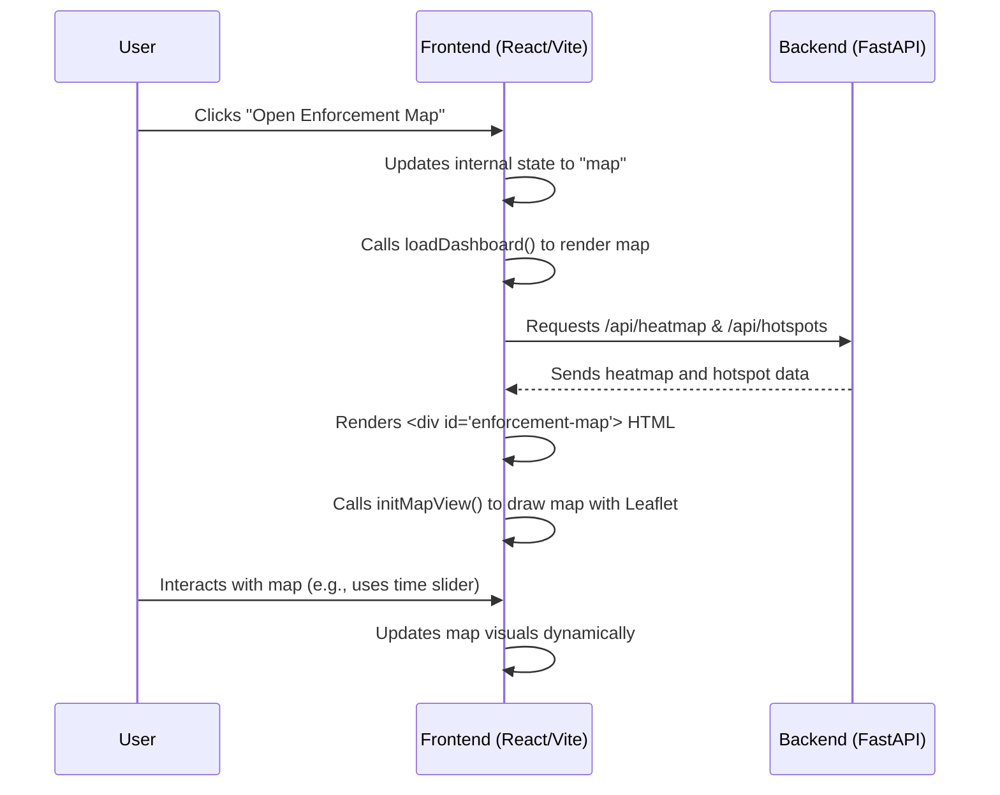

# Chapter 1: Frontend Interactive Dashboard

Welcome to the exciting world of `Gridlock_Round2`! In this first chapter, we're going to explore the **Frontend Interactive Dashboard** – your "command center" for understanding and acting on crucial parking enforcement insights.

### What is the Frontend Interactive Dashboard?

Imagine you're a BTP (Bengaluru Traffic Police) officer, and you need to decide where to send your patrol units to tackle illegal parking. You have tons of violation data, but it's overwhelming! How do you make sense of it quickly and effectively?

This is exactly the problem our Frontend Interactive Dashboard solves. It's a **visually rich web application**, built using modern web technologies like React and Vite, that takes all the complex AI-generated insights and presents them to you in an easy-to-understand way. Think of it like the dashboard in your car – it shows you all the critical information you need at a glance, allowing you to make informed decisions.

**Central Use Case:** A BTP officer needs to identify the most problematic parking areas, understand when they are busiest, and dispatch patrols efficiently. The dashboard is designed to guide them through this process.

### Key Concepts of Our Command Center

The dashboard isn't just one screen; it's a collection of interactive views designed for different needs:

1.  **Main Dashboard View:** This is your home screen, providing an overview of all AI-generated intelligence. It's packed with charts, tables, and metrics summarizing violation density, hotspot rankings, temporal patterns, and even repeat offenders.
2.  **Enforcement Map View:** A geographical visualization tool that lets you see violation hotspots directly on a map. You can "time-travel" through different hours of the day to see how congestion changes and even simulate the impact of enforcement!
3.  **Patrol Window (Dispatch) View:** This view helps officers plan and "dispatch" patrols. It features a calendar-like scheduler and filters, allowing you to pinpoint specific police stations, days, and hours to find patrol recommendations.
4.  **Data Upload Interface:** What if you have new violation data that just came in? This interface allows you to upload new CSV files, so the AI pipeline can process it and provide fresh, actionable intelligence.

### How to Use the Dashboard: A BTP Officer's Workflow

Let's walk through our use case: a BTP officer wants to find the best place and time to deploy a patrol.

#### Step 1: Getting an Overview on the Main Dashboard

When you first open the application, you're greeted by the main dashboard. It summarizes overall statistics, shows you the top hotspots, and displays temporal patterns. This gives you a quick understanding of the general situation.

```javascript
// From frontend\src\main.jsx
async function loadDashboard(mode = state.mode) {
  state.mode = mode;
  state.isLoading = true;
  renderLoading(); // Shows a loading message

  try {
    // ... other view rendering logic ...
    
    // If we're in 'dashboard' view:
    // Fetch various data from the backend
    const [
      health, stats, hotspots, recommendations, stationSummary,
      temporalSummary, vehicleSummary, repeatOffenders
    ] = await Promise.all([
      fetchJson(modePath("/api/health", mode)),
      fetchJson(modePath("/api/stats", mode)),
      fetchJson(modePath("/api/hotspots", mode)),
      // ... more API calls ...
    ]);

    // Render the dashboard with all the fetched data
    root.innerHTML = renderDashboard({
      mode,
      view: state.view,
      navOpen: state.navOpen,
      uploadMeta: state.uploadMeta,
      health,
      stats,
      hotspots,
      recommendations,
      // ... pass other data ...
    });
    bindUploadForm(); // Set up the upload form interactions

    bindNav(); // Bind navigation buttons
  } catch (error) {
    renderError(error); // Show an error if something goes wrong
  } finally {
    state.isLoading = false;
  }
}
// Calls the main function to load the dashboard when the app starts
loadDashboard();
```
**Explanation:** The `loadDashboard` function is like the central coordinator. When the application starts (`loadDashboard()` at the end of the file), it first shows a loading screen. Then, it simultaneously asks the [FastAPI Backend Services](02_fastapi_backend_services_.md) for all the necessary data (like health, statistics, hotspots, etc.). Once it gets this data, it calls `renderDashboard` to draw all the tables and charts you see on the screen.

#### Step 2: Visualizing "Where" and "When" with the Enforcement Map

To get a clearer picture of geographical problem areas, the officer clicks on "Open Enforcement Map". This switches the view to an interactive map.

```javascript
// From frontend\src\components\Dashboard.jsx
// Inside the renderDashboard function, this button is created:
<button type="button" data-view="map" class="btn">
  <svg>...</svg>
  Open Enforcement Map
</button>
```

```javascript
// From frontend\src\main.jsx
// This code listens for clicks on buttons with 'data-view' attributes
document.querySelectorAll("[data-view]").forEach((button) => {
  button.addEventListener("click", () => {
    const nextView = button.dataset.view;
    if (!nextView || nextView === state.view || state.isLoading) return;
    
    // If switching to map or dispatch, ensure we're looking at 'historical' data by default
    let nextMode = state.mode;
    if (nextView === "map" || nextView === "dispatch") {
      nextMode = "historical";
    }
    
    state.view = nextView; // Update the application's current view
    loadDashboard(nextMode); // Reload the dashboard, which will now render the map
  });
});
```
**Explanation:** When you click the "Open Enforcement Map" button, the `bindNav` function (shown above from `main.jsx`) catches this click. It updates the application's internal `state` to tell it to show the "map" view and then calls `loadDashboard` again. This time, `loadDashboard` sees that the `state.view` is "map" and renders the map page instead, fetching heatmap and hotspot data.

On the map, you see a heatmap showing areas with high Parking-Induced Congestion Impact ([PICI Scoring](05_pici__parking_induced_congestion_impact__scoring_.md)). A "time-travel" slider lets you see how congestion changes hour by hour! There's even a toggle to simulate the "enforcement relief" if the top 50 hotspots are cleared – a powerful tool for understanding potential impact.

#### Step 3: Planning Patrols with the Patrol Window (Dispatch)

After identifying potential problem times and areas on the map, the officer moves to the "Patrol Window" view to plan specific deployments.

```javascript
// From frontend\src\components\Dashboard.jsx
// Another button inside the renderDashboard function:
<button type="button" data-view="dispatch" class="btn">
  <svg>...</svg>
  Open Patrol Window
</button>
```
**Explanation:** Similar to the map, clicking this button updates the `state.view` to "dispatch" and triggers `loadDashboard`. This then renders the `DispatchView`. In this view, you can filter recommendations by police station, day of the week, and even a specific time range. The UI then shows a list of recommended patrol windows, allowing the officer to "deploy" or "recall" patrols. These "deploy" actions are for simulation and tracking within the frontend.

#### Step 4: Keeping Intelligence Fresh with Data Upload

To ensure the dashboard always has the latest information, officers can upload new violation data. This activates the "New Data" mode, processing the new CSV file through the entire [AI Data Pipeline](04_ai_data_pipeline_.md).

```javascript
// From frontend\src\main.jsx
function bindUploadForm() {
  const form = document.getElementById("upload-form");
  if (!form) return;

  const fileInput = document.getElementById("csv-file");
  const button = document.getElementById("upload-button");
  const status = document.getElementById("upload-status");

  form.addEventListener("submit", async (event) => {
    event.preventDefault(); // Prevent default form submission
    const file = fileInput.files[0];
    if (!file) { /* ... error message ... */ return; }

    button.disabled = true; // Disable button while processing
    button.textContent = "Processing...";
    status.innerHTML = `<div class="upload-result is-processing">...</div>`;

    try {
      await uploadCsv(file); // Sends the CSV to the backend API
      // Save metadata about the upload
      writeUploadMeta({
        filename: file.name,
        processedAt: formatProcessedTime(),
      });
      status.innerHTML = `<div class="upload-result is-success">...</div>`;
      await loadDashboard("new_data"); // Reload dashboard in "new_data" mode
    } catch (error) {
      status.innerHTML = `<div class="upload-result is-error">...</div>`;
    } finally {
      button.disabled = false;
      button.textContent = "Process Upload";
    }
  });
}
```
**Explanation:** When a new CSV file is selected and the "Process Upload" button is clicked, this `bindUploadForm` function takes over. It sends the file to the [FastAPI Backend Services](02_fastapi_backend_services_.md) using the `uploadCsv` utility. Once the backend confirms the processing is complete (which involves the entire [AI Data Pipeline](04_ai_data_pipeline_.md)), the dashboard reloads in "new data" mode, showing insights derived from the freshly uploaded information.

### Under the Hood: How the Dashboard Works

The Frontend Interactive Dashboard is built using **React** and **Vite**. React helps us build interactive user interfaces by breaking them down into smaller, manageable pieces called "components" (like a `Navbar`, a `HotspotTable`, or a `MapView`). Vite is a super-fast tool that helps us develop and build these web applications quickly.

Let's look at a simplified sequence of events when you interact with the dashboard:



#### The `main.jsx` Orchestrator

The `frontend/src/main.jsx` file is the entry point for our React application. It manages the overall state (which mode and view are active) and orchestrates how different parts of the dashboard are loaded and displayed.

```javascript
// From frontend\src\main.jsx
import "./index.css"; // Basic styling
import { renderDashboard } from "./components/Dashboard.jsx"; // Imports dashboard UI
import { initMapView, renderMapPage } from "./components/MapView.jsx"; // Map UI
import { renderDispatchPage, initDispatchView } from "./components/DispatchView.jsx"; // Dispatch UI
import { renderNavbar } from "./components/Navbar.jsx"; // Navigation bar
import { fetchJson, modePath, uploadCsv } from "./utils/apiClient.js"; // Utilities for API calls

const root = document.getElementById("root"); // The main container in index.html
const state = {
  mode: "historical",   // Default data mode
  view: "dashboard",    // Default view
  isLoading: false,
  navOpen: false,
  uploadMeta: null,
};

// ... functions like readUploadMeta, writeUploadMeta, parseApiError, fetchOptional ...

// The core function to load and render different parts of the dashboard
async function loadDashboard(mode = state.mode) {
  // ... (code discussed above) ...
}

// Binds event listeners for navigation buttons
function bindNav() {
  // ... (code discussed above) ...
}

// Binds event listeners for the data upload form
function bindUploadForm() {
  // ... (code discussed above) ...
}

loadDashboard(); // Kickstarts the application!
```
**Explanation:** `main.jsx` acts as the central brain. It imports all the different UI components (like `Dashboard.jsx` for the main dashboard, `MapView.jsx` for the map, etc.) and utility functions (`apiClient.js` for talking to the backend). It maintains the `state` of the application (e.g., which data `mode` is active, which `view` is being shown) and uses the `loadDashboard` function to fetch data and render the correct page based on this `state`. The `bindNav` and `bindUploadForm` functions ensure that when you click buttons or upload files, the application reacts appropriately.

#### UI Components (`Dashboard.jsx`, `MapView.jsx`, `DispatchView.jsx`)

Each major part of the dashboard lives in its own component file:

*   **`frontend/src/components/Dashboard.jsx`**: This file contains the `renderDashboard` function, which assembles all the various charts and tables for the main dashboard view, such as the `HotspotTable`, `Metrics`, `TemporalCharts`, and the `UploadPanel`. It essentially builds a complex HTML structure by calling other smaller component functions.

    ```javascript
    // From frontend\src\components\Dashboard.jsx
    import { renderHotspotTable } from "./HotspotTable.jsx";
    import { renderMetrics } from "./Metrics.jsx";
    // ... other imports ...

    export function renderDashboard({
      mode, view, navOpen, uploadMeta,
      health, stats, hotspots, recommendations,
      stationSummary, temporalSummary, vehicleSummary, repeatOffenders,
    }) {
      const isHistorical = mode === "historical";
      // Construct the main HTML structure for the dashboard page
      return `
        <main class="shell${navOpen ? " nav-pinned" : ""}">
          ${renderNavbar(mode, view, navOpen)} {/* Always show the navigation bar */}

          <div class="page-top"> {/* Page title and badge buttons */}
            <div class="page-greeting">
              <p>${isHistorical ? "Historical intelligence" : "Uploaded data"}</p>
              <h1>Parking Enforcement Intelligence</h1>
            </div>
            <div class="page-badges">
              <button type="button" data-view="map" class="btn"> {/* Button to switch to map view */}
                <svg>...</svg> Open Enforcement Map
              </button>
              {/* ... other badge buttons ... */}
            </div>
          </div>

          ${renderDataContext(mode, uploadMeta)} {/* Shows current data source context */}
          ${!isHistorical ? renderUploadPanel(mode) : ""} {/* Upload panel only for new_data mode */}
          ${renderMetrics({ health, stats, mode })} {/* Display key performance metrics */}

          <section class="analysis-section" id="spatial-intelligence"> {/* Hotspot table section */}
            <div class="section-heading">...</div>
            ${renderHotspotTable(hotspots)} {/* Renders the table of hotspots */}
          </section>

          {/* ... other sections like operational load, decision intelligence ... */}
        </main>
      `;
    }
    ```
    **Explanation:** The `renderDashboard` function is responsible for building the entire HTML layout of the main intelligence screen. It takes all the data fetched by `loadDashboard` (like `hotspots`, `stats`, `temporalSummary`) and plugs it into smaller rendering functions (like `renderHotspotTable`, `renderMetrics`) to create a comprehensive view. It also includes navigation elements and context about the active dataset.

*   **`frontend/src/components/MapView.jsx`**: This file provides the `renderMapPage` function to set up the basic HTML for the map view, including the map container itself and the overlay controls (like the time slider and simulation toggle). Crucially, the `initMapView` function then takes over to actually create and interact with the interactive map using the Leaflet library. It displays heatmaps and clickable hotspot markers.

    ```javascript
    // From frontend\src\components\MapView.jsx
    import L from "leaflet"; // The Leaflet map library
    import "leaflet.heat"; // Plugin for heatmaps
    // ... other imports ...

    // Renders the HTML structure for the map page
    export function renderMapPage({ mode, view, navOpen }) {
      // ... returns HTML with <div id="enforcement-map"> and map controls ...
    }

    // Initializes the Leaflet map and its layers
    export function initMapView(points = [], hotspots = [], mode = "historical") {
      const mapElement = document.getElementById("enforcement-map");
      if (!mapElement) return null;

      const map = L.map("enforcement-map", {
        center: [12.9716, 77.5946], // Bengaluru centre
        zoom: 13.5,
        scrollWheelZoom: true,
      });

      L.tileLayer("https://{s}.tile.openstreetmap.org/{z}/{x}/{y}.png", { /* ... */ }).addTo(map);

      if (points && points.length > 0) {
        // Initialize the heatmap layer
        let heatLayer = L.heatLayer([], {
          radius: 20, blur: 15, maxZoom: 17, max: 1.0,
          gradient: { 0.4: "blue", 0.6: "lime", 0.75: "yellow", 0.9: "orange", 1.0: "red" },
        }).addTo(map);
        // ... code to update heatmap data with filtered points ...
        // Example: updateHeatmapForHour(parseInt(timeSlider.value));
      }
      
      // ... code to add hotspot markers and bind time slider interactions ...

      return map;
    }
    ```
    **Explanation:** `renderMapPage` lays out the necessary `div` elements, especially the one with `id="enforcement-map"`. Once that's in the browser, `initMapView` jumps in. It uses the `Leaflet` library to turn that `div` into an actual interactive map. It then takes the `points` data (for the heatmap) and `hotspots` data (for the markers) received from the backend and draws them on the map. It also sets up the "time-travel" slider and the simulation toggle to dynamically update what you see on the map.

*   **`frontend/src/components/DispatchView.jsx`**: Similar to `MapView.jsx`, this file provides `renderDispatchPage` for the HTML structure of the patrol planning screen. The `initDispatchView` function then handles all the interactive logic: populating dropdowns (police stations, days, hours), filtering patrol recommendations, calculating summary statistics, and allowing officers to "deploy" virtual patrols.

    ```javascript
    // From frontend\src\components\DispatchView.jsx
    export function renderDispatchPage({ mode, view, navOpen }) {
      // ... returns HTML for the dispatch page including calendar grid, filters, and patrol list ...
    }

    export function initDispatchView(hotspots, recommendations, mode = "historical") {
      // Get references to all the interactive elements on the page
      const stationSelect = document.getElementById("dispatch-station-select");
      const daySelect = document.getElementById("dispatch-day-select");
      // ... other elements ...

      // Enrich recommendations with police station data
      const enrichedRecs = recommendations
        .filter(r => r.hour >= 0 && r.hour <= 14) // Filter to relevant hours
        .map(r => ({ ...r, police_station: "Example Station" })); // Simplified

      // Populate dropdowns with unique stations
      const uniqueStations = Array.from(new Set(enrichedRecs.map(r => r.police_station))).sort();
      stationSelect.innerHTML = uniqueStations.map(station => `<option value="${station}">${station}</option>`).join("");

      // Function to update the main station-specific recommendations list
      function updateStationRecs() {
        const selectedStation = stationSelect.value;
        const selectedDay = daySelect.value;
        // ... filter recommendations based on selections ...

        // Render the filtered list of patrol recommendations
        stationRecsList.innerHTML = filtered.map((item) => {
          // ... generates HTML for each patrol recommendation item with a "Deploy" button ...
        }).join("");
      }

      // Bind event listeners for dropdown changes to re-filter and update
      stationSelect.addEventListener("change", updateStationRecs);
      daySelect.addEventListener("change", updateStationRecs);
      // ... other event listeners for deploy buttons, modal pop-ups ...

      updateStationRecs(); // Initial render of station-specific recommendations
    }
    ```
    **Explanation:** `renderDispatchPage` creates the shell for the patrol planning screen, including placeholder `select` dropdowns and lists. `initDispatchView` then takes the `hotspots` and `recommendations` data, populates these dropdowns (like the list of police stations), and sets up event listeners. When you change a filter (e.g., select a new police station), the `updateStationRecs` function runs to filter the recommendations and re-draw the list of suggested patrols. It also handles the "deploy" and "recall" actions, tracking them locally for simulation.

#### The `Navbar.jsx` for Easy Navigation

Finally, the `frontend/src/components/Navbar.jsx` file is responsible for rendering the persistent navigation bar on the left side of the screen. This bar allows you to quickly switch between "Historical" and "New Data" modes, and between the "Dashboard", "Map", and "Patrol Window" views.

```javascript
// From frontend\src\components\Navbar.jsx
const NAV_ITEMS = [
  { id: "historical", type: "mode", label: "Historical", icon: `<svg>...</svg>` },
  { id: "new_data", type: "mode", label: "New Data", icon: `<svg>...</svg>` },
  { id: "map", type: "view", label: "Map", icon: `<svg>...</svg>` },
  { id: "dispatch", type: "view", label: "Patrol Window", icon: `<svg>...</svg>` },
];

export function renderNavbar(activeMode, activeView, isOpen = false) {
  const buttons = NAV_ITEMS.map((item) => {
    // Determine if this navigation item should be styled as 'active'
    const isActive =
      item.type === "mode"
        ? activeView === "dashboard" && activeMode === item.id
        : activeView === item.id;

    const dataAttr =
      item.type === "mode"
        ? `data-mode="${item.id}"`
        : `data-view="${item.id}"`;

    return `
      <button
        class="nav-item${isActive ? " is-active" : ""}"
        type="button"
        ${dataAttr}
        aria-label="${item.label}"
      >
        <span class="nav-icon">${item.icon}</span>
        <span class="nav-label">${item.label}</span>
      </button>
    `;
  }).join("");

  return `
    <nav class="side-nav${isOpen ? " is-open" : ""}" data-side-nav aria-label="Primary navigation">
      <div class="brand"> {/* App logo and name */}
        <span class="brand-mark"></span>
        <div><p>ParkSense AI</p><strong>Enforcement Intelligence</strong></div>
      </div>
      <div class="nav-items" role="group" aria-label="Navigation">
        ${buttons} {/* The generated navigation buttons */}
      </div>
    </nav>
  `;
}
```
**Explanation:** `renderNavbar` is a simple function that generates the HTML for the sidebar navigation. It defines a list of `NAV_ITEMS` (Historical mode, New Data, Map, Dispatch) and then creates a button for each. It smartly checks the `activeMode` and `activeView` passed to it to highlight the currently selected item, making navigation intuitive.

### Conclusion

In this chapter, you've learned that the Frontend Interactive Dashboard is the friendly face of `Gridlock_Round2`. It's your interactive "command center" for understanding and acting on AI-powered parking enforcement insights. We explored its different views – the main Dashboard for overview, the Map for spatial visualization and simulation, and the Dispatch view for patrol planning – and saw how new data can be easily integrated. You also got a peek under the hood at how `main.jsx` orchestrates everything and how individual React components (`Dashboard.jsx`, `MapView.jsx`, `DispatchView.jsx`, `Navbar.jsx`) build the user interface.

But where does all this amazing intelligence come from? The dashboard doesn't generate the insights itself; it gets them from somewhere else. That "somewhere else" is our powerful backend system, which we'll explore in the next chapter!

[Next Chapter: FastAPI Backend Services](02_fastapi_backend_services_.md)

---

