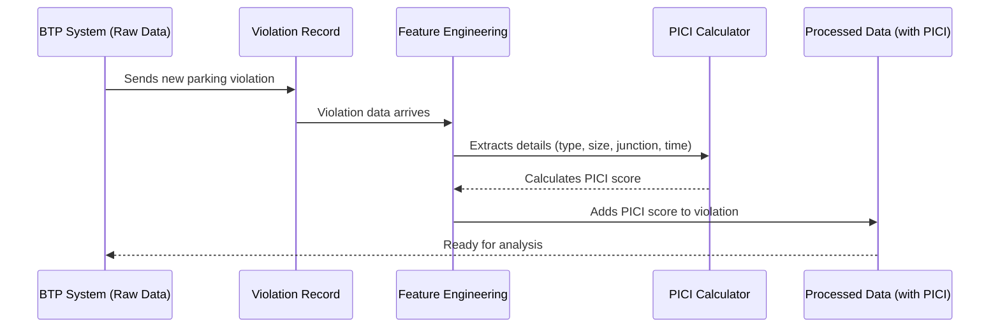

# Chapter 1: PICI (Parking-Induced Congestion Impact) Score

Welcome to the `Gridlock_Round2` project tutorial! In this first chapter, we're going to unravel the very heart of how our system understands and tackles traffic problems caused by illegal parking: the **PICI (Parking-Induced Congestion Impact) Score**.

Imagine you're a traffic officer in a bustling city like Bengaluru. You see illegal parking happening everywhere. Some cars are parked awkwardly on a side street, while others are double-parked right at a busy intersection during rush hour. Both are "illegal parking," but which one is causing *more* trouble for traffic? Which one needs your attention *right now*?

This is the exact problem the **PICI Score** helps us solve! It’s like a special "traffic disruption meter" that tells us how badly a parking incident affects the flow of cars and people.

## What is the PICI Score?

The PICI Score is our project's clever way of putting a number on how much an illegal parking incident messes up traffic. Think of it as a **"severity rating"** for parking violations. A higher PICI Score means more traffic disruption, while a lower score means less.

Why do we need this? Because we don't have fancy real-time traffic cameras telling us exactly how many cars are stuck. So, our AI system looks at different clues from the parking violation itself and combines them into this single, easy-to-understand score. This score then helps traffic police decide which problem areas to tackle first.

### Key Ingredients of a PICI Score

Our AI combines several important details about a parking violation to calculate its PICI Score:

*   **Violation Type:** Is it just "Wrong Parking," or something worse like "Double Parking" or "Parking in a Main Road"? Obviously, some types cause more chaos than others!
*   **Vehicle Size:** Is it a small scooter or a huge truck blocking the road? Larger vehicles take up more space and create bigger problems.
*   **Proximity to Junctions:** Is the parking near a road crossing or intersection? Parking near junctions can cause traffic jams to spread quickly in many directions.
*   **Time of Day:** Is it happening during busy "peak hours" when everyone is commuting, or late at night when roads are empty? Peak-hour violations are more impactful.
*   **Other Factors:** We also look at if the vehicle is a repeat offender or if multiple violations happened at once.

## How the System Uses the PICI Score

You don't directly "calculate" a PICI score yourself as a user of the system. Instead, our project automatically crunches the numbers for *every single parking violation record* it receives. Each violation then gets its own PICI Score attached to it.

Imagine a spreadsheet where each row is a parking violation. Our system adds a new column called "PICI Score" and fills it in for every row.

Once each violation has its PICI Score, the system can then:
*   Identify [Hotspot Detection & Ranking](02_hotspot_detection___ranking_.md): Group nearby violations and add up their PICI Scores to find areas with the highest overall impact.
*   [Patrol Recommendation Engine](03_patrol_recommendation_engine_.md): Recommend where and when to send traffic patrols based on where the highest PICI scores are expected.

Let's look at a super simplified example of how we might combine these factors to get a conceptual PICI score for a single parking incident:

```python
# A single parking incident's details (simplified for illustration)
violation_details = {
    "violation_type": "DOUBLE PARKING",
    "vehicle_type": "CAR",
    "is_near_junction": True,
    "is_peak_hour": True
}

# Our internal system uses these to calculate a raw score
# (This is just a conceptual example, not directly from our final code)
def calculate_conceptual_pici(details):
    score = 0
    # Violation Type (e.g., Double Parking is very bad)
    if details["violation_type"] == "DOUBLE PARKING":
        score += 10
    elif details["violation_type"] == "WRONG PARKING":
        score += 4
    # ... other violation types

    # Vehicle Size (e.g., CAR is worse than SCOOTER)
    if details["vehicle_type"] == "CAR":
        score *= 1.5
    elif details["vehicle_type"] == "SCOOTER":
        score *= 1.0
    # ... other vehicle types

    # Junction Proximity (e.g., near a junction is twice as bad)
    if details["is_near_junction"]:
        score *= 2.0

    # Time of Day (e.g., peak hour is 1.5 times worse)
    if details["is_peak_hour"]:
        score *= 1.5
        
    return score

# Calculating the PICI score for our example incident
conceptual_pici_score = calculate_conceptual_pici(violation_details)
print(f"Conceptual PICI Score: {conceptual_pici_score}")
# Example Output for the above: Conceptual PICI Score: 45.0
```
This little code snippet shows how different aspects of a parking violation contribute to a single number, giving us an idea of its traffic impact. The project then takes this raw score and scales it to a more friendly 0-10 range for easier understanding.

## How PICI Score is Calculated Under the Hood

Let's take a peek at the "brain" of our system to see how the PICI Score is actually put together. When a new parking violation record comes into our system, here's a simplified sequence of events:



1.  **Violation Data Arrives:** The raw parking violation information (like what's in the `given.csv` file) is fed into our system.
2.  **Extracting Features (Clues):** Our system looks at each violation record and pulls out all the important clues mentioned earlier (violation type, vehicle type, time, location, etc.). This is called "feature engineering."
3.  **Applying Weights and Multipliers:** Each clue is given a "weight" or a "multiplier" based on how much impact it has on traffic. For example, "Double Parking" gets a high weight, and being near a junction multiplies the impact.
4.  **Calculating the Raw PICI Score:** All these weighted clues are multiplied and added together to get a raw PICI score.
5.  **Normalizing the Score:** This raw score is then adjusted to fit neatly into a 0-10 scale, making it easy to compare different incidents.

### Diving into the Code (Simplified)

The core logic for PICI calculation lives in the `src/feature_engineering.py` file. Let's look at some super simplified pieces from that file to understand how the weights and factors work.

First, we define how severe each violation type is:

```python
# src/feature_engineering.py (simplified)
SEVERITY_WEIGHTS = {
    'DOUBLE PARKING': 10,  # Very high impact!
    'PARKING OPPOSITE TO ANOTHER PARKED VEHICLE': 9,
    'PARKING IN A MAIN ROAD': 8,
    'PARKING NEAR ROAD CROSSING': 7,
    # ... more violation types with their impact scores
    'NO PARKING': 3,       # Lower impact, but still a violation
}
```
This `SEVERITY_WEIGHTS` list tells our program that `DOUBLE PARKING` is considered much worse (score 10) than just `NO PARKING` (score 3).

Next, we factor in the size of the vehicle:

```python
# src/feature_engineering.py (simplified)
VEHICLE_SIZE_FACTOR = {
    'TANKER': 2.0,  # Huge vehicle, huge blockage
    'BUS': 2.0,
    'TRUCK': 2.0,
    'CAR': 1.5,     # Medium size
    'PASSENGER AUTO': 1.2,
    'SCOOTER': 1.0, # Smallest impact
    # ... other vehicle types
}
```
Here, a `TANKER` gets a `2.0` multiplier because it blocks a lot of space, while a `SCOOTER` gets `1.0`. So, a violation by a tanker will have a PICI Score twice as high just because of its size, assuming other factors are equal.

We also consider if the parking is near a junction or during peak hours:

```python
# src/feature_engineering.py (simplified)
# ... inside the engineer_features function ...

# Check if the violation is near a named junction
df['has_junction'] = df['junction_name'].apply(
    lambda x: 0 if pd.isna(x) or str(x).strip().lower() == 'no junction' else 1
)
df['junction_multiplier'] = df['has_junction'].map({1: 2.0, 0: 1.0}).fillna(1.0) # Double impact if near junction

# Check if it's peak hour (e.g., 8-11 AM, 5-9 PM on weekdays)
df['is_peak_hour'] = df.apply(
    lambda r: 1 if (r['is_weekend'] == 0 and r['is_holiday'] == 0) and ((8 <= r['hour'] <= 11) or (17 <= r['hour'] <= 21)) else 0,
    axis=1
)
df['peak_hour_multiplier'] = df['is_peak_hour'].map({1: 1.5, 0: 1.0}).fillna(1.0) # 1.5x impact during peak hours
```
These lines create `junction_multiplier` and `peak_hour_multiplier`. If a violation happens near a junction, its impact is doubled! If it's during peak hours, its impact is multiplied by 1.5. These are crucial for understanding how congestion spreads.

Finally, all these factors come together to calculate the raw PICI score:

```python
# src/feature_engineering.py (simplified)
# ... inside the engineer_features function ...

df['pici_raw'] = (
    df['severity_score']       # Base impact from violation type
    * df['vehicle_size_factor'] # Multiplier for vehicle size
    * df['junction_multiplier'] # Multiplier if near a junction
    * df['peak_hour_multiplier']# Multiplier if during peak hours
    * df['multi_vio_factor']    # Multiplier if multiple violations in one incident
    * df['repeat_penalty']      # Multiplier if it's a repeat offender
)

# Normalize to a 0-10 scale
pici_max = df['pici_raw'].max()
df['pici_score'] = ((df['pici_raw'] / max(pici_max, 1e-9)) * 10).round(3)
```
This is the heart of the PICI calculation! It takes all the individual pieces of information and combines them into a single `pici_raw` score. Then, it scales this raw score to a friendly 0-10 range (the `pici_score`) for easy interpretation.

## Conclusion

The PICI (Parking-Induced Congestion Impact) Score is the foundational concept of our `Gridlock_Round2` project. It allows our system to intelligently quantify the impact of each illegal parking incident, even without direct traffic flow data. By understanding the violation type, vehicle size, location context, and time, we can create a powerful "traffic disruption meter" that guides smarter enforcement decisions.

Now that we understand how individual parking incidents are scored, the next step is to find out where these high-impact violations tend to happen most often. In the next chapter, we'll explore how these PICI Scores are used to detect and rank the worst traffic hotspots!

[Next Chapter: Hotspot Detection & Ranking](02_hotspot_detection___ranking_.md)

---

