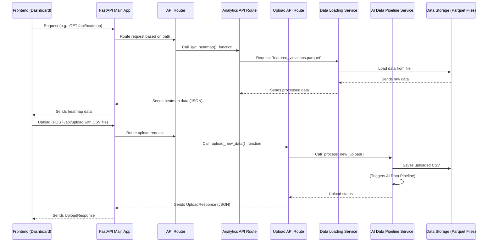

# Chapter 2: FastAPI Backend Services

In [Chapter 1: Frontend Interactive Dashboard](01_frontend_interactive_dashboard_.md), we learned that our dashboard is the interactive "command center" for BTP officers. It's beautiful, responsive, and shows you all the critical insights. But where does all that valuable information come from? How does the dashboard get the list of hotspots, the map data, or process a newly uploaded CSV file?

This is where the **FastAPI Backend Services** come in! Think of it as the brain behind the dashboard, the central "control tower" that handles all the requests and provides the intelligence.

### What Problem Does the Backend Solve?

Imagine the frontend dashboard is a customer in a restaurant, and it wants some data – like "Give me the top parking hotspots" or "Process this new list of violations for me." The frontend can't just magically create this data or perform complex calculations. It needs someone to ask.

This is the problem our FastAPI Backend solves. It's a separate program, built with Python, that:

1.  **Listens for requests** from the frontend (the "customer").
2.  **Processes those requests** (e.g., fetches data, runs calculations, triggers the [AI Data Pipeline](04_ai_data_pipeline_.md)).
3.  **Sends back the results** in a structured, easy-to-understand format (like a menu item).

**Central Use Case:** A BTP officer wants to view the enforcement map with the latest PICI scores, or they need to upload a new CSV file of violations. The FastAPI backend is the engine that makes these interactions possible.

### Key Concepts of Our Control Tower

Let's break down the main ideas behind our backend:

1.  **What is a Backend? (The Kitchen)**
    The backend is like the kitchen of a restaurant. It's where all the *work* happens – food is cooked, ingredients are stored, and dishes are prepared. The customer (frontend) doesn't see the kitchen; they just interact with the waiter. Our backend stores processed data, runs complex AI models, and handles file uploads.

2.  **What is an API? (The Waiter & Menu)**
    API stands for "Application Programming Interface." In our restaurant analogy, the API is like the **waiter** who takes your order and the **menu** that lists what you can order.
    *   **The Waiter:** The backend exposes "endpoints" (like `/api/hotspots` or `/api/upload`). These are specific URLs that the frontend can "call" to ask for something.
    *   **The Menu:** Each endpoint has a specific purpose and expects certain "ingredients" (like a `mode` parameter or an uploaded CSV file) and promises to return specific "dishes" (like a list of hotspots or an upload success message).

3.  **What is FastAPI? (The Super-Efficient Kitchen Staff)**
    FastAPI is a modern, fast, web framework for building APIs with Python. It's known for being very easy to use for developers, and it's built on top of powerful Python tools, making it very performant. It also automatically provides interactive documentation, which is a huge help for understanding what API endpoints are available.

4.  **Its Role in `Gridlock_Round2`:**
    In our project, FastAPI acts as the crucial link between:
    *   The user interface (our [Frontend Interactive Dashboard](01_frontend_interactive_dashboard_.md)).
    *   The stored processed data (like hotspots, map points, recommendations).
    *   The complex [AI Data Pipeline](04_ai_data_pipeline_.md) that generates new intelligence from raw data.

### How Our Backend Solves the Use Case: Officer Actions

Let's revisit our officer's actions from Chapter 1 and see how the backend helps:

#### Use Case 1: Viewing the Enforcement Map

When an officer clicks "Open Enforcement Map" on the dashboard, the frontend needs geographical data to draw the heatmap and hotspot markers.

**Frontend's Request:** The frontend, using `apiClient.js`, makes a `GET` request to a specific backend endpoint.

```javascript
// From frontend\src\utils\apiClient.js
export async function fetchJson(path, options = {}) {
  const response = await fetch(path, options);
  // ... error handling ...
  return response.json(); // Parses the JSON response
}

// Example call from frontend\src\main.jsx or MapView.jsx
// When loading the map view, the frontend asks the backend:
// await fetchJson(modePath("/api/heatmap", currentMode));
// await fetchJson(modePath("/api/hotspots", currentMode));
```
**Explanation:** This snippet shows how the frontend uses `fetchJson` to "ask" the backend for data. It's like calling out to a waiter (the API endpoint) and saying, "Please get me the heatmap data (`/api/heatmap`)" or "Please get me the hotspots (`/api/hotspots`)". The `modePath` function simply ensures the correct data `mode` (historical or new_data) is included in the request.

**Backend's Response:** The backend receives this request, finds the relevant data (which is already pre-computed and stored in efficient files thanks to the [AI Data Pipeline](04_ai_data_pipeline_.md)), and sends it back to the frontend in JSON format.

```json
[
  { "lat": 12.980, "lng": 77.581, "intensity": 0.85, "hour": 9 },
  { "lat": 12.975, "lng": 77.602, "intensity": 0.92, "hour": 10 },
  { "lat": 12.968, "lng": 77.575, "intensity": 0.78, "hour": 11 }
  // ... hundreds or thousands more points ...
]
```
**Explanation:** This is what the backend sends back for the heatmap request. It's a list of points, where each point has a `lat` (latitude), `lng` (longitude), `intensity` (how severe the parking congestion is, based on [PICI Scoring](05_pici__parking_induced_congestion_impact__scoring_.md)), and `hour`. The frontend then takes this structured data and uses it to draw the interactive map.

#### Use Case 2: Uploading New Data

When an officer uses the "Data Upload Interface" to provide a new CSV file, the backend is responsible for receiving and processing that file.

**Frontend's Request:** The frontend gathers the CSV file and sends it to the backend using a `POST` request.

```javascript
// From frontend\src\utils\apiClient.js
export async function uploadCsv(file) {
  const formData = new FormData();
  formData.append("file", file); // Attaches the CSV file
  
  const response = await fetch("/api/upload", { // Sends to the /api/upload endpoint
    method: "POST",
    body: formData, // The file is in the body of the request
  });
  // ... error handling ...
  return response.json();
}

// Example call from frontend\src\main.jsx
// await uploadCsv(file); // Sends the CSV to the backend
```
**Explanation:** The `uploadCsv` function takes the selected CSV file and puts it into a `FormData` object. Then, it uses `fetch` to send this data to the `/api/upload` endpoint on the backend using a `POST` method (which means "I'm sending you something new").

**Backend's Response:** The backend receives the CSV, triggers the [AI Data Pipeline](04_ai_data_pipeline_.md) to process it, and then sends back a simple confirmation.

```json
{
  "status": "success",
  "mode": "new_data",
  "message": "New data processed successfully. View the dashboard in 'New Data' mode."
}
```
**Explanation:** After the backend successfully processes the uploaded CSV through the entire [AI Data Pipeline](04_ai_data_pipeline_.md), it sends this message back to the frontend. This tells the frontend that the data is ready and the dashboard can now be reloaded in "new data" mode to show the updated intelligence.

### Under the Hood: How the Backend Works

Let's peek into the kitchen and see how FastAPI manages these requests.

First, here's a simplified sequence of events for a request, like fetching map data or uploading a file:



Now, let's look at the actual Python code files that make this happen.

#### 1. The Main FastAPI Application (`backend\app\main.py`)

This file is the "front door" of our backend. It's where the FastAPI application is created and set up.

```python
# From backend\app\main.py
from fastapi import FastAPI
from fastapi.middleware.cors import CORSMiddleware
from app.api.router import api_router # Imports our API routes

def create_app() -> FastAPI:
    app = FastAPI(title="Gridlock_Round2 Backend") # 1. Create a FastAPI app instance
    
    # 2. Allow the frontend (which might be on a different web address) to talk to this backend
    app.add_middleware(
        CORSMiddleware,
        allow_origins=["*"], # For simplicity, allow all origins (websites) to access
        allow_methods=["*"], # Allow all HTTP methods (GET, POST, etc.)
        allow_headers=["*"], # Allow all headers
    )
    app.include_router(api_router) # 3. Add all our defined API routes to the app
    return app

app = create_app() # This line actually creates and starts our FastAPI application!
```
**Explanation:** This `main.py` file does three key things:
1.  It creates the core `FastAPI` application.
2.  It sets up `CORSMiddleware`. CORS (Cross-Origin Resource Sharing) is a security feature that prevents websites from different "origins" (like `localhost:5173` for frontend and `localhost:8000` for backend) from talking to each other. `CORSMiddleware` tells the browser that it's okay for our frontend to talk to our backend.
3.  It includes `api_router`, which is where all our specific API endpoints (like `/api/hotspots` or `/api/upload`) are defined and organized.

#### 2. Organizing Our API Endpoints (`backend\app\api\router.py`)

To keep things neat, we don't put all API endpoints in one giant file. Instead, we organize them into different sections using `APIRouter`.

```python
# From backend\app\api\router.py
from fastapi import APIRouter
from app.api.routes import analytics, health, upload # Imports our different API sections

api_router = APIRouter(prefix="/api") # All our routes will automatically start with /api
api_router.include_router(health.router, tags=["health"])     # For checking if backend is alive
api_router.include_router(analytics.router, tags=["analytics"]) # For getting data like hotspots, maps
api_router.include_router(upload.router, tags=["upload"])     # For processing new CSV uploads
```
**Explanation:** Think of `api_router` as the main concierge for all `/api` requests. Instead of handling every single request itself, it directs them to smaller, specialized "routers."
*   `health.router` handles simple checks to see if the server is running.
*   `analytics.router` handles all requests for analytical data (hotspots, recommendations, map data).
*   `upload.router` handles requests related to uploading new files.

#### 3. Serving Analytics Data (`backend\app\api\routes\analytics.py`)

This file contains the "waiters" that fetch and return the processed intelligence data to the frontend.

```python
# From backend\app\api\routes\analytics.py
from typing import List
import pandas as pd
from fastapi import APIRouter
from app.schemas.analytics import Hotspot, HeatmapPoint # Data structures for responses
from app.services.datasets import get_data_dir, load_parquet # Helpers to load data files

router = APIRouter() # This router handles requests related to analytics

@router.get("/hotspots", response_model=List[Hotspot]) # Defines a GET endpoint at /api/hotspots
def get_hotspots(mode: str = "historical"):
    """Return chronic parking violation hotspots."""
    hotspots_path = get_data_dir(mode) / "hotspots.parquet" # Locate the pre-processed hotspots file
    df = load_parquet(hotspots_path) # Load data from the Parquet file
    df = df.where(pd.notnull(df), None) # Clean up any missing values
    return df.to_dict(orient="records") # Convert data into a list of dictionaries (JSON)

@router.get("/heatmap", response_model=List[HeatmapPoint]) # Defines a GET endpoint at /api/heatmap
def get_heatmap(mode: str = "historical", limit: int = 10000):
    """Return raw violation coordinates and PICI scores for the Leaflet heatmap."""
    featured_path = get_data_dir(mode) / "featured_violations.parquet" # Locate the raw violation data
    df = load_parquet(featured_path)
    df = df.sort_values(by="pici_score", ascending=False).head(limit) # Get top N severe points
    # Select and rename columns to match the expected format for the frontend map
    df = df[["latitude", "longitude", "pici_score", "hour"]].rename(
        columns={"latitude": "lat", "longitude": "lng", "pici_score": "intensity"}
    )
    return df.to_dict(orient="records") # Send as JSON
```
**Explanation:**
*   `@router.get("/hotspots")`: This line tells FastAPI that if a `GET` request comes to `/api/hotspots`, it should run the `get_hotspots` function.
*   `response_model=List[Hotspot]`: This is a cool FastAPI feature! It ensures that the data returned by this function always matches the `Hotspot` data structure we've defined, which helps prevent errors.
*   Inside the function, it loads pre-processed data from a `.parquet` file. Parquet files are very efficient for storing large tables of data.
*   `df.to_dict(orient="records")` converts the data into a list of Python dictionaries, which FastAPI then automatically converts into JSON before sending it back to the frontend. The `get_heatmap` function works similarly but prepares data specifically for the interactive map display.

#### 4. Handling File Uploads (`backend\app\api\routes\upload.py`)

This file contains the endpoint responsible for receiving new CSV data from the frontend.

```python
# From backend\app\api\routes\upload.py
from fastapi import APIRouter, File, HTTPException, UploadFile
from app.schemas.upload import UploadResponse # Defines the structure of the upload response
from app.services.pipeline import process_new_upload # Function to trigger the AI pipeline

router = APIRouter() # This router handles requests related to file uploads

@router.post("/upload", response_model=UploadResponse) # Defines a POST endpoint at /api/upload
def upload_new_data(file: UploadFile = File(...)):
    """Accept a CSV export and re-run the AI pipeline for new_data mode."""
    if not file.filename or not file.filename.lower().endswith(".csv"):
        raise HTTPException(status_code=400, detail="Only CSV files are allowed.")

    try:
        process_new_upload(file) # This is where the uploaded file is sent to the AI pipeline
    except HTTPException:
        raise # Re-raise FastAPI HTTP exceptions directly
    except Exception as exc:
        raise HTTPException(status_code=500, detail=f"Pipeline execution failed: {exc}") from exc

    return UploadResponse(status="success", mode="new_data", message="New data processed successfully.")
```
**Explanation:**
*   `@router.post("/upload")`: This line tells FastAPI that a `POST` request (used for sending new data) to `/api/upload` should be handled by `upload_new_data`.
*   `file: UploadFile = File(...)`: FastAPI automatically understands that the incoming request body contains a file, and it handles saving it temporarily.
*   The function first checks if the uploaded file is indeed a CSV.
*   The crucial part is `process_new_upload(file)`. This function is not defined here; it's imported from `app.services.pipeline`. It's where the actual work of saving the file and triggering the [AI Data Pipeline](04_ai_data_pipeline_.md) happens.
*   Finally, it returns a `UploadResponse` indicating success or failure.

#### 5. Triggering the AI Data Pipeline (`backend\app\services\pipeline.py`)

This file is the bridge to the core intelligence system. It takes the uploaded file and hands it over to the [AI Data Pipeline](04_ai_data_pipeline_.md).

```python
# From backend\app\services\pipeline.py
import shutil
from fastapi import HTTPException, UploadFile
from app.core.config import settings # Application settings (e.g., max file size)
from src.data_pipeline import REQUIRED_RAW_COLUMNS # Expected columns in the uploaded CSV
from src.main import run_pipeline # The actual AI data processing pipeline

def process_new_upload(file: UploadFile):
    upload_path = settings.raw_data_dir / "uploaded_violations.csv" # Define where to save the file
    
    # Save the uploaded file from the temporary location to our desired folder
    with upload_path.open("wb") as file_object:
        shutil.copyfileobj(file.file, file_object)

    # Simplified: In reality, there are important checks here (file size, correct columns, etc.)
    # If checks fail, an HTTPException would be raised.

    # If all checks pass, run the full AI data pipeline with this new data!
    run_pipeline(mode="new_data")
```
**Explanation:**
*   `shutil.copyfileobj(file.file, file_object)`: This line takes the uploaded CSV file (which FastAPI temporarily stores) and saves it permanently to our project's designated raw data directory.
*   After saving, there are critical checks (like making sure the file isn't too large or empty, and that it has all the `REQUIRED_RAW_COLUMNS`). These ensure that the [AI Data Pipeline](04_ai_data_pipeline_.md) receives valid data.
*   `run_pipeline(mode="new_data")`: This is the most important line! It calls the main function of our [AI Data Pipeline](04_ai_data_pipeline_.md), telling it to process the newly uploaded CSV and generate fresh insights.

### Conclusion

You've now seen how the **FastAPI Backend Services** act as the central brain of `Gridlock_Round2`. It's the "control tower" that receives requests from the [Frontend Interactive Dashboard](01_frontend_interactive_dashboard_.md), fetches or computes intelligence from the [AI Data Pipeline](04_ai_data_pipeline_.md), and handles the crucial task of processing new data uploads. It's the hidden engine that makes the entire application interactive and intelligent.

In the next chapter, we'll dive into the concept of "Two-Mode Operational Data," which explains how our backend and pipeline cleverly manage and distinguish between "historical" and "newly uploaded" data to provide seamless analysis.

[Next Chapter: Two-Mode Operational Data](03_two_mode_operational_data_.md)

---
