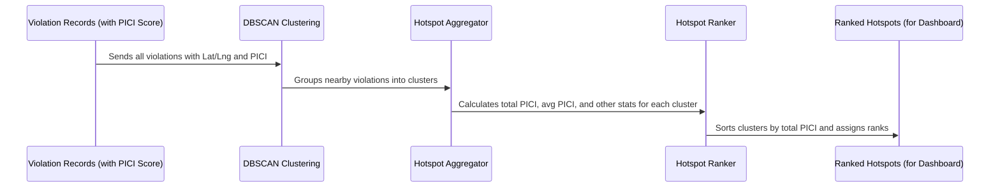

# Chapter 2: Hotspot Detection & Ranking

Welcome back to the `Gridlock_Round2` tutorial! In our [previous chapter, PICI (Parking-Induced Congestion Impact) Score](01_pici__parking_induced_congestion_impact__score_.md), we learned how to give a "severity rating" to a *single* illegal parking incident. But what if many severe incidents are happening in the same area, day after day?

Imagine you're a traffic officer who knows which individual parking violations are bad. Now, your commander asks, "Where should we send our teams to make the biggest difference in reducing traffic jams across the city?" You can't just pick one bad parking spot; you need to find the **problematic *areas***.

This is exactly what **Hotspot Detection & Ranking** helps us do! It's like finding the "trouble zones" in the city where parking violations are most concentrated and causing the most chaos. By finding and ranking these hotspots, traffic police can focus their efforts on the places that need it most, instead of randomly patrolling.

## What is a Hotspot?

In our project, a "hotspot" is simply an area where many illegal parking violations are happening very close to each other. Think of it like a cluster of stars in the night sky – individual stars are violations, and a dense group of them forms a cluster or "hotspot."

Our system doesn't just find *any* cluster of violations. It focuses on clusters where the violations, when combined, have a very high [PICI (Parking-Induced Congestion Impact) Score](01_pici__parking_induced_congestion_impact__score_.md). This means we're looking for areas that are not just busy with parking violations, but busy with violations that significantly mess up traffic.

## How We Find Hotspots: DBSCAN Clustering

To find these clusters of violations, our project uses a smart algorithm called **DBSCAN**. Don't worry about the complex name; the idea is simple:

DBSCAN is like a detective looking for crowded neighborhoods. It works by:

1.  **Looking at each parking violation:** It considers every incident with its GPS coordinates (latitude and longitude).
2.  **Finding "neighbors":** For each violation, it checks how many *other* violations are within a certain distance (e.g., within 50 meters).
3.  **Forming a cluster:** If a violation has enough neighbors close by (e.g., at least 50 other violations within 50 meters), it marks this violation and its neighbors as part of a "cluster" or hotspot.
4.  **Ignoring "lonely" violations:** If a violation doesn't have enough neighbors, it's considered "noise" – an isolated incident that isn't part of a major hotspot. This is great because we only care about *dense* areas of violations.

This is much more effective than just drawing circles on a map, because DBSCAN can find clusters of any shape, which is perfect for violations that follow the curves of a road.

## How We Score and Rank Hotspots

Once DBSCAN has identified all the hotspots (the clusters), we need to know which ones are the *most* important. This is where the [PICI (Parking-Induced Congestion Impact) Score](01_pici__parking_induced_congestion_impact__score_.md) comes in handy again!

For each detected hotspot, our system does two things:

1.  **Calculate Total PICI:** It adds up the PICI Scores of *all* the individual parking violations that belong to that hotspot. A hotspot with many high-PICI violations will have a very high "Total PICI."
2.  **Rank Them:** It then sorts all the hotspots from the one with the highest "Total PICI" to the lowest. The hotspot with the highest score gets **Rank 1**, the next highest gets **Rank 2**, and so on.

This ranking provides traffic police with a clear, prioritized list of the most problematic zones to target first.

## Using Hotspot Information in the Dashboard

As a user of the `Gridlock_Round2` system, you won't directly interact with DBSCAN. Instead, the results are presented in a very easy-to-understand way on the dashboard:

You'll see a **Hotspot Ranking table** that lists the most impactful areas, and a **map view** where these hotspots are clearly marked, often with a different color or icon to show their severity.

Here’s what a snippet of that ranking table might look like on the frontend dashboard:

```html
<!-- Simplified example of a hotspot table row -->
<tr>
  <td><span class="rank-pill">1</span></td>         <!-- Hotspot Rank -->
  <td><strong>Koramangala Police Station</strong></td> <!-- Primary Police Station in the hotspot -->
  <td>785</td>                                     <!-- Total Violations in this hotspot -->
  <td>684.2</td>                                   <!-- Total PICI Score for this hotspot -->
  <td>0.87</td>                                    <!-- Average PICI Score per violation in this hotspot -->
  <td style="color: var(--red);">72% choke</td>     <!-- Estimated traffic capacity loss -->
  <td>12.9345, 77.6250</td>                         <!-- Center GPS coordinates -->
</tr>
```

This table immediately tells you that "Koramangala Police Station" is a top-ranked hotspot (Rank 1), has a high number of violations, and a substantial total PICI score, indicating significant traffic congestion. The "Carriageway Choke" percentage is a simple way to visualize how much road capacity is lost due to parking in that hotspot.

## Under the Hood: How Hotspots are Detected and Ranked

Let's peek behind the curtain to see how our system automatically processes data to find and rank these hotspots.

### Step-by-Step Flow:

Here's a simplified sequence of events:



1.  **Violations with PICI Scores:** The system starts with all the parking violation records, each already having its own [PICI (Parking-Induced Congestion Impact) Score](01_pici__parking_induced_congestion_impact__score_.md) calculated (as we learned in Chapter 1) and its GPS coordinates.
2.  **DBSCAN Clustering:** These violations are fed into the DBSCAN algorithm. DBSCAN scans the map, grouping violations that are "close enough" and "numerous enough" into `cluster_id`s. Any violation that isn't part of a dense cluster is marked as "noise" (cluster\_id = -1).
3.  **Hotspot Aggregation:** For each cluster found by DBSCAN, the system then aggregates all the information. It sums up all the PICI scores within that cluster, counts the number of violations, finds the average GPS center, and determines the most common police station or vehicle type within that cluster.
4.  **Hotspot Ranking:** Finally, these aggregated hotspots are sorted from highest to lowest based on their "Total PICI" score, and a `hotspot_rank` is assigned. This ranked list is then ready to be displayed on the dashboard!

### Diving into the Code (Simplified)

The core logic for hotspot detection is found in the `src/ml_models.py` file. Let's look at some key parts:

First, the system loads the violation data and prepares it for DBSCAN:

```python
# src/ml_models.py (simplified)
import pandas as pd
import numpy as np
from sklearn.cluster import DBSCAN
from sklearn.neighbors import NearestNeighbors # Used for finding the 'center' of the cluster

def cluster_hotspots(input_path, hotspots_out, clustered_out, min_samples: int = 50):
    df = pd.read_parquet(input_path)
    
    # Extract coordinates (latitude, longitude)
    coords = df[['latitude', 'longitude']].values
    coords_radians = np.radians(coords) # DBSCAN uses radians for haversine metric

    # Define how 'nearby' is: 50 meters
    EPSILON_METERS = 50 
    EARTH_RADIUS_KM = 6371.0088
    eps_radians = (EPSILON_METERS / 1000.0) / EARTH_RADIUS_KM

    # Initialize DBSCAN: finds clusters with at least `min_samples` violations
    # within `eps_radians` distance, using a 'haversine' (spherical earth) distance.
    dbscan = DBSCAN(eps=eps_radians, min_samples=min_samples, metric='haversine', algorithm='ball_tree', n_jobs=-1)
    
    # Run DBSCAN and add the assigned cluster_id to each violation
    df['cluster_id'] = dbscan.fit_predict(coords_radians)

    # ... rest of the function for aggregation and ranking ...
```
This snippet shows the setup for DBSCAN. Notice `eps_radians` which translates 50 meters into a distance understandable by the `haversine` metric, which is crucial for accurately measuring distances on the Earth's surface. `min_samples` is set to `50` for historical data (meaning at least 50 violations within 50m radius to form a hotspot), but for smaller, newly uploaded data, it can be adjusted to `5` to still find meaningful clusters for demo purposes.

After DBSCAN assigns `cluster_id`s, the system groups all violations by their `cluster_id` (ignoring noise, which has `cluster_id = -1`) and aggregates their data:

```python
# src/ml_models.py (simplified)
    # ... after DBSCAN ...
    df_hotspots_raw = df[df['cluster_id'] != -1] # Filter out noise

    # Group by cluster_id and aggregate key metrics
    hotspots = df_hotspots_raw.groupby('cluster_id').agg(
        total_violations=('id', 'count'),    # Total number of violations in this hotspot
        mean_lat=('latitude', 'mean'),       # Average latitude
        mean_lng=('longitude', 'mean'),      # Average longitude
        total_pici=('pici_score', 'sum'),    # Sum of all PICI scores in this hotspot (for ranking!)
        avg_pici=('pici_score', 'mean'),     # Average PICI score
        max_pici=('pici_score', 'max'),      # Highest PICI score
        primary_police_station=('police_station', get_mode), # Most common police station
        primary_vehicle_type=('final_vehicle_type', get_mode) # Most common vehicle type
    ).reset_index()

    # ... code to calculate center_lat/lng using medoid (most central actual point) ...

    # Rank hotspots by total PICI score
    hotspots = hotspots.sort_values('total_pici', ascending=False).reset_index(drop=True)
    hotspots['hotspot_rank'] = hotspots.index + 1 # Assign rank starting from 1

    # ... save to parquet files ...
```
This is the heart of the aggregation and ranking. For each `cluster_id`, we `sum` the `pici_score` to get `total_pici`. This `total_pici` is then used to `sort_values` in `descending` order, assigning a `hotspot_rank` to each one. The `get_mode` function simply finds the most frequent value in a series (like the most common police station for that cluster).

## Conclusion

Hotspot Detection & Ranking is a powerful way for `Gridlock_Round2` to turn individual parking incidents into actionable intelligence about problem *areas*. By using DBSCAN to find clusters of violations and then aggregating their [PICI (Parking-Induced Congestion Impact) Score](01_pici__parking_induced_congestion_impact__score_.md), our system provides a clear, ranked list of where traffic police can have the greatest impact. This shifts enforcement from reactive responses to proactive, data-driven strategies.

Now that we know *where* the hotspots are, the next logical question is: *when* should we send patrols to these hotspots? In the next chapter, we'll dive into the **Patrol Recommendation Engine**!

[Next Chapter: Patrol Recommendation Engine](03_patrol_recommendation_engine_.md)

---

