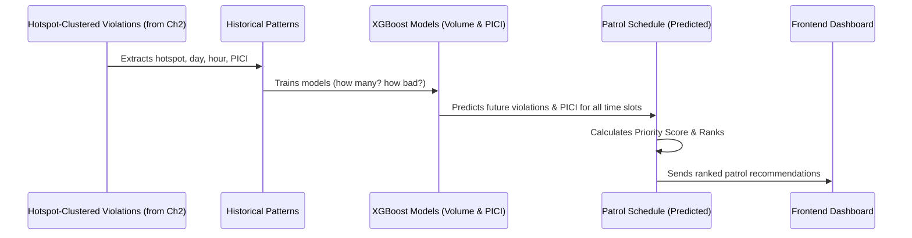

# Chapter 3: Patrol Recommendation Engine

Welcome back to the `Gridlock_Round2` tutorial! In our [previous chapter, Hotspot Detection & Ranking](02_hotspot_detection___ranking_.md), we learned how to pinpoint the city's worst traffic trouble zones where illegal parking causes the most headaches. But knowing *where* the problems are is only half the battle. The next crucial question for traffic officers is: ***When*** should we send our patrols to these hotspots to prevent congestion *before* it gets bad?

Imagine you're a traffic manager. You know Koramangala is a hotspot, but is it worse on Monday mornings or Friday evenings? Should you send a team at 9 AM or 3 PM? Sending patrols randomly is like playing whack-a-mole – you react to problems after they've already caused jams. What if you could anticipate future problems and be there to prevent them?

This is exactly what the **Patrol Recommendation Engine** does! It's our project's intelligent system that acts like a "weather forecast" for parking violations. It predicts *when* and *where* new violations are most likely to happen, helping officers deploy resources proactively for maximum impact, preventing congestion before it even builds up.

## What is the Patrol Recommendation Engine?

The Patrol Recommendation Engine is an AI-powered system that generates smart, proactive patrol schedules. Instead of just showing where past problems were, it looks into the future to suggest optimal times and locations for patrols.

Think of it as a super-smart advisor for traffic police. For each [Hotspot](02_hotspot_detection___ranking_.md) identified in the city, the engine recommends specific "patrol windows" – combinations of day, hour, and location – where a patrol is most needed because violations (and their congestion impact) are expected to be high.

## How Does it Work its Magic? The Prediction Model

The engine's ability to "see the future" comes from analyzing tons of historical violation data. It looks for hidden patterns and trends to understand *why* and *when* violations tend to occur.

The "brain" behind this prediction is a powerful machine learning model called **XGBoost**. Don't worry about the fancy name; for us, it's like a highly experienced detective who has studied thousands of past cases and can now make very accurate guesses about future events based on those patterns.

Here's what XGBoost learns from and predicts:

*   **Input Clues (What it learns from):**
    *   Which [hotspot](02_hotspot_detection___ranking_.md) it is (its location).
    *   The day of the week (Monday, Tuesday, etc.).
    *   The hour of the day (9 AM, 5 PM, etc.).
    *   Whether it's a peak hour, business hour, or holiday.
    *   The month.

*   **What it predicts (The "forecast"):**
    *   **Expected number of violations:** How many illegal parking incidents are likely to occur.
    *   **Expected [PICI (Parking-Induced Congestion Impact) Score](01_pici__parking_induced_congestion_impact__score_.md):** How severe the traffic disruption from those violations will be.

By combining these two predictions (how many violations *and* how bad their impact), the engine can create a **Priority Score**. A higher Priority Score means that particular patrol window (hotspot + day + hour) is more critical and should be prioritized for enforcement.

## Using Patrol Recommendations in the Dashboard

As a traffic officer using the `Gridlock_Round2` system, you won't directly interact with XGBoost. Instead, the results are presented in a clear, actionable way on the dashboard's "Patrol Window" view.

You'll see a weekly calendar grid that shows "hot" time slots (day and hour) across the city. Clicking on a cell reveals a list of specific hotspots that need attention during that time, complete with their predicted violations, PICI score, and overall priority.

Here's what a recommendation might look like in a simplified format:

```json
[
  {
    "hotspot_rank": 1,
    "police_station": "Koramangala",
    "day_of_week": 0, // Monday
    "hour": 9,        // 9 AM
    "predicted_violations": 15.3,
    "predicted_pici": 7.8,
    "priority_score": 119.34
  },
  {
    "hotspot_rank": 5,
    "police_station": "Shivajinagar",
    "day_of_week": 4, // Friday
    "hour": 18,       // 6 PM
    "predicted_violations": 12.1,
    "predicted_pici": 6.5,
    "priority_score": 78.65
  }
]
```
This output tells you that on Monday at 9 AM, Hotspot #1 in Koramangala is a very high priority. On Friday at 6 PM, Hotspot #5 in Shivajinagar is also important. The higher the `priority_score`, the more urgently a patrol is recommended.

The frontend has a dedicated "Patrol Window" section (as seen in `frontend/src/components/DispatchView.jsx`) where these recommendations are displayed in an interactive calendar and list format, allowing officers to "deploy" and "recall" units.

## Under the Hood: How Recommendations are Generated

Let's peek behind the scenes to see how our system processes data to generate these smart patrol recommendations.

### Step-by-Step Flow:

Here's a simplified sequence of events:



1.  **Hotspot-Clustered Violations:** The process starts with the raw parking violation records, which have already been enriched with their [PICI Score](01_pici__parking_induced_congestion_impact__score_.md) and assigned to a [hotspot](02_hotspot_detection___ranking_.md) by DBSCAN (from Chapter 2).
2.  **Historical Pattern Extraction:** For each hotspot, the system looks at all past violations. It extracts patterns like "On Tuesdays between 5-7 PM, Hotspot #3 always has a lot of double parking."
3.  **XGBoost Model Training:** This historical data is used to train two separate XGBoost models:
    *   One model learns to predict the *number of violations* expected in a given hotspot at a specific day and hour.
    *   The second model learns to predict the *average PICI score* (congestion impact) expected for those violations.
4.  **Future Schedule Prediction:** Once trained, these models are then fed *all possible combinations* of hotspots, days of the week, and hours of the day (for the next week, for example). The models then predict the expected violation count and PICI for *each* of these future time slots.
5.  **Priority Score Calculation:** For each predicted time slot, the system calculates a `priority_score` by multiplying the `predicted_violations` by the `predicted_pici`. This makes sure we prioritize areas that will have *both* many violations *and* high impact.
6.  **Ranking and Delivery:** Finally, all these potential patrol windows are ranked by their `priority_score` (highest first) and sent to the frontend dashboard for display.

### Diving into the Code (Simplified)

The core logic for training the models and generating patrol recommendations is found in the `src/ml_models.py` file. Let's look at some simplified pieces.

First, we load the clustered violations and prepare the data by adding time-based clues:

```python
# src/ml_models.py (simplified)
import pandas as pd
import xgboost as xgb
from pathlib import Path

def train_and_predict(clustered_path: Path, hotspots_path: Path, output_path: Path):
    print("Training models and predicting patrols...")
    df = pd.read_parquet(clustered_path) # Load violations with hotspot info

    df_hotspots = df[df['hotspot_rank'] != -1].copy()
    df_hotspots['created_datetime'] = pd.to_datetime(df_hotspots['created_datetime'])
    df_hotspots['hour'] = df_hotspots['created_datetime'].dt.hour
    df_hotspots['day_of_week'] = df_hotspots['created_datetime'].dt.dayofweek
    df_hotspots['month'] = df_hotspots['created_datetime'].dt.month

    # Aggregate historical data to get actual violation counts and PICI per hotspot/day/hour
    actual_counts = df_hotspots.groupby(['hotspot_rank', 'date', 'hour']).agg(
        target_violation_count=('id', 'count'),
        target_avg_pici=('pici_score', 'mean')
    ).reset_index()

    # Create a complete grid for all possible hotspot/date/hour combinations
    # ... code to create 'master_df' with all combinations and features like is_peak_hour, is_business_hours, etc. ...
    # This 'master_df' will be used for training
```
This snippet shows how we take the raw clustered violations, extract time-based features like `hour`, `day_of_week`, and `month`, and then aggregate them to see "what actually happened" (target counts and PICI) for each specific time slot and hotspot. A `master_df` is then prepared, which combines these actual observations with other contextual clues.

Next, we define the features (clues) our XGBoost models will use and train the two models:

```python
# src/ml_models.py (simplified)
    # ... after creating master_df ...
    FEATURES = ['center_lat', 'center_lng', 'day_of_week', 'hour', 'month', 'is_peak_hour', 'is_business_hours', 'is_holiday']
    X = master_df[FEATURES] # Our "clues" for prediction
    y_volume = master_df['target_violation_count'] # What we want to predict (how many violations)
    y_pici = master_df['target_avg_pici']       # What we want to predict (how bad the PICI)

    # Initialize and train XGBoost model for violation count
    model_volume = xgb.XGBRegressor(objective='count:poisson', n_estimators=100, learning_rate=0.1, max_depth=5, random_state=42)
    model_volume.fit(X, y_volume) # Teach the model using historical data

    # Initialize and train XGBoost model for average PICI score
    model_pici = xgb.XGBRegressor(objective='reg:squarederror', n_estimators=100, learning_rate=0.1, max_depth=5, random_state=42)
    model_pici.fit(X, y_pici) # Teach the model using historical data
```
Here, `FEATURES` are the "clues" our models will learn from. `y_volume` and `y_pici` are the "answers" (what we want to predict). We train `model_volume` to predict the number of violations and `model_pici` to predict the average PICI.

Finally, we use these trained models to predict for all future patrol windows and calculate the `priority_score`:

```python
# src/ml_models.py (simplified)
    # Generate all possible future patrol windows (hotspot, day, hour combinations)
    future_grid = []
    # ... code to build 'schedule_df' for all future combinations ...
    schedule_df = pd.DataFrame(future_grid)

    # Use the trained models to make predictions for the future schedule
    schedule_df['predicted_violations'] = model_volume.predict(schedule_df[FEATURES]).clip(min=0)
    schedule_df['predicted_pici'] = model_pici.predict(schedule_df[FEATURES]).clip(min=0, max=10)

    # If predicted violations are very low, set PICI to 0 (no violations, no impact)
    schedule_df.loc[schedule_df['predicted_violations'] < 0.1, 'predicted_pici'] = 0.0

    # Calculate the crucial Priority Score
    schedule_df['priority_score'] = schedule_df['predicted_violations'] * schedule_df['predicted_pici']

    # Sort and save the recommendations
    schedule_df = schedule_df.sort_values('priority_score', ascending=False).reset_index(drop=True)
    schedule_df.to_parquet(output_path, index=False)
```
This part creates a `schedule_df` with every possible patrol opportunity (hotspot, day, hour). Then, it uses our trained `model_volume` and `model_pici` to fill in the `predicted_violations` and `predicted_pici` for each. The `priority_score` is then calculated, combining these two predictions into a single, easy-to-understand metric that helps rank the most critical patrol windows. The recommendations are then sorted by this `priority_score` and saved.

## Conclusion

The Patrol Recommendation Engine is a crucial innovation in `Gridlock_Round2`. By leveraging the power of XGBoost to analyze historical patterns, it moves traffic enforcement from a reactive "chasing problems" approach to a proactive "preventing problems" strategy. This allows traffic police to efficiently deploy their limited resources to the most critical times and locations, maximizing their impact on reducing congestion.

Now that we understand how the system scores individual violations, finds hotspots, and predicts future problem areas, the next step is to see all this intelligence come to life! In the next chapter, we'll explore the **Frontend Dashboard**, where all these insights are presented in an intuitive and interactive way.

[Next Chapter: Frontend Dashboard](04_frontend_dashboard_.md)

---
