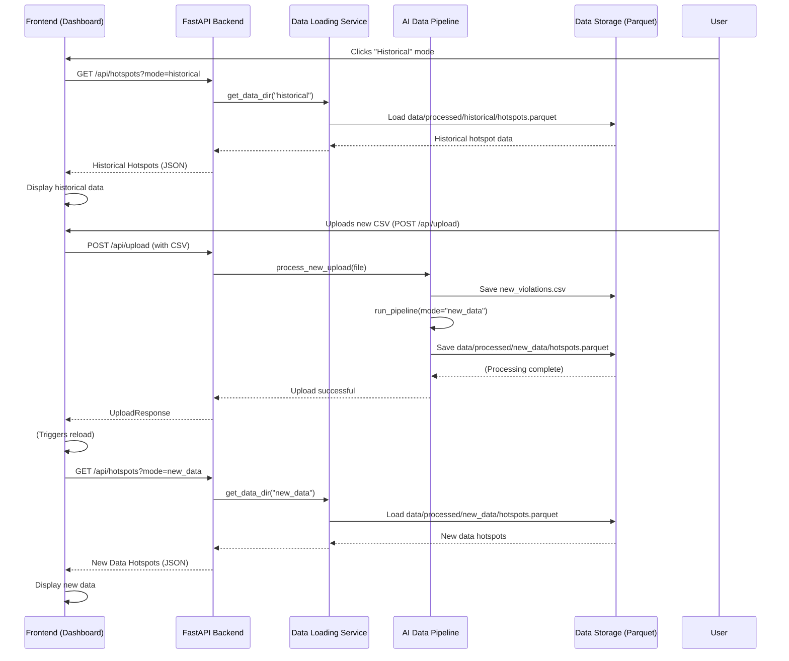

# Chapter 3: Two-Mode Operational Data

In [Chapter 1: Frontend Interactive Dashboard](01_frontend_interactive_dashboard_.md), you learned how to interact with the dashboard, clicking buttons and uploading files. In [Chapter 2: FastAPI Backend Services](02_fastapi_backend_services_.md), we explored how the backend acts as the "kitchen" that prepares all the intelligence for the dashboard. But what if you have different *kinds* of data you want to look at? What if you need both a big picture and a quick update?

This is where the concept of **Two-Mode Operational Data** comes in. It's how `Gridlock_Round2` intelligently manages and presents two different sets of insights to you: one for long-term planning and another for immediate reactions.

### What Problem Does Two-Mode Data Solve?

Imagine you're a BTP officer. You have two main needs:

1.  **Strategic Planning:** You need to understand the *overall trends* of parking violations in Bengaluru over many months. Which areas are *always* bad? When are peak hours across the city? This requires a large, comprehensive dataset that's been processed carefully.
2.  **Immediate Action:** You just got a new report of violations from yesterday's patrol shift. You want to see *right now* what the hotspots are from *just this new data* so you can dispatch patrols for today. This requires processing a smaller, very fresh dataset quickly.

Trying to cram both into one view, or manually switching files, would be messy and confusing. The **Two-Mode Operational Data** system solves this by giving you two distinct "lenses" through which to view the intelligence, without needing two separate applications or complex setups.

**Central Use Case:** A BTP officer needs to quickly switch between viewing a comprehensive, historical analysis of parking violations for strategic planning and seeing immediate operational insights from a newly uploaded dataset for tactical deployment.

### Key Concepts: Your Two Lenses for Intelligence

The system provides two main modes, each serving a different purpose:

1.  **Historical Mode (The Big Picture):**
    *   **What it is:** This mode uses a large, pre-processed dataset, like months or years of violation data. Think of it as a comprehensive archive.
    *   **Purpose:** Ideal for long-term strategic analysis, identifying chronic hotspots, understanding overall temporal patterns, and reporting. It gives you the "big picture."
    *   **Data Source:** The data for this mode lives in the `data/processed/historical/` folder on the backend. This data is stable and doesn't change unless the entire application is rebuilt with a new historical dataset.

2.  **New Data Mode (The Quick Update):**
    *   **What it is:** This mode comes alive after *you* upload a fresh, smaller CSV file (e.g., violations from the last week or even a single day).
    *   **Purpose:** Perfect for immediate operational insights. You can quickly see the impact of recent events, test hypotheses with new information, or react to emerging situations. It's your "real-time pulse" (well, near real-time after processing).
    *   **Data Source:** When you upload a new CSV, the system processes *only that new data* and saves its results to the `data/processed/new_data/` folder. This data is temporary and gets replaced each time you upload a new file.

The clever part? The underlying [AI Data Pipeline](04_ai_data_pipeline_.md) that processes the data (detecting hotspots, calculating scores, recommending patrols) is **the same** for both modes. Only the input data source changes. This means you always get consistent, high-quality intelligence, whether you're looking at history or the latest events.

### How to Use: Switching Between Modes as an Officer

Let's follow our BTP officer through the use case: switching between strategic and tactical views.

#### Step 1: Starting in Historical Mode

When the officer first opens the `Gridlock_Round2` dashboard, it automatically loads in **Historical Mode**. This gives them access to all the long-term trends and insights right away.

```javascript
// From frontend\src\main.jsx
const state = {
  mode: "historical",   // Default data mode when app starts
  view: "dashboard",    // Default view
  isLoading: false,
  // ... other state properties ...
};

// ...
loadDashboard(); // Kickstarts the application, loading the default 'historical' mode
```
**Explanation:** When the application starts, the `state.mode` is set to `"historical"`. The `loadDashboard()` function then fetches all the relevant data for the dashboard from the backend using this `historical` mode.

#### Step 2: Uploading New Data (Activating New Data Mode)

To get immediate insights from fresh data, the officer uses the "Data Upload Interface" (as seen in [Chapter 1: Frontend Interactive Dashboard](01_frontend_interactive_dashboard_.md)). They select a new CSV file and click "Process Upload."

```javascript
// From frontend\src\main.jsx (simplified bindUploadForm)
form.addEventListener("submit", async (event) => {
  // ... (code to get file and show processing status) ...

  try {
    await uploadCsv(file); // Sends the CSV to the backend
    // ... (code to save upload metadata) ...
    await loadDashboard("new_data"); // <<< Crucial: Reload dashboard in "new_data" mode!
  } catch (error) {
    // ... error handling ...
  } finally {
    // ... reset button state ...
  }
});
```
**Explanation:** After successfully sending the CSV to the backend for processing (`uploadCsv(file)`), the most important line here is `await loadDashboard("new_data");`. This function call tells the dashboard to *switch* to the `"new_data"` mode.

#### Step 3: Viewing Insights in New Data Mode

Once the `loadDashboard("new_data")` call completes, the dashboard automatically refreshes. Now, all the charts, maps, and tables display insights derived *only* from the newly uploaded CSV. The officer can immediately see the hotspots and recommendations based on the very latest data.

#### Step 4: Switching Back and Forth

The navigation bar on the left ([`frontend/src/components/Navbar.jsx`](01_frontend_interactive_dashboard_.md#the-navbarjsx-for-easy-navigation)) provides an easy way to switch between these two modes whenever needed.

```javascript
// From frontend\src\main.jsx (simplified bindNav)
document.querySelectorAll("[data-mode]").forEach((button) => {
  button.addEventListener("click", () => {
    const nextMode = button.dataset.mode;
    if (!nextMode || state.isLoading) return; // Don't switch if loading or no mode
    
    // Set view to dashboard if switching modes
    if (nextMode === state.mode && state.view === "dashboard") return;
    state.view = "dashboard";
    
    loadDashboard(nextMode); // Reload the dashboard with the newly selected mode
  });
});
```
**Explanation:** The navigation buttons in `Navbar.jsx` have `data-mode` attributes (e.g., `data-mode="historical"` or `data-mode="new_data"`). When an officer clicks one, the `bindNav` function catches the click, updates the `state.mode` (e.g., to `"historical"`), and then calls `loadDashboard(nextMode)`. This makes the dashboard reload all its data and views using the chosen mode.

### Under the Hood: How It Works

Let's look at how the system manages these two modes behind the scenes.

First, here's a simplified view of the interactions for both modes:



#### 1. The Frontend's `modePath` Utility

The frontend uses a simple utility function called `modePath` to attach the `mode` parameter to every API request it makes to the backend. This is how the backend knows which set of data to provide.

```javascript
// From frontend\src\utils\apiClient.js
export function modePath(path, mode) {
  if (mode === "historical") {
    return path; // No need to add ?mode=historical, it's the default
  }
  return `${path}?mode=${mode}`; // Add ?mode=new_data for new data
}

// Example usage in main.jsx
// fetchJson(modePath("/api/hotspots", state.mode));
```
**Explanation:** This small function checks the current `mode`. If it's `"historical"`, it just returns the API path (e.g., `/api/hotspots`) because "historical" is the default. If it's `"new_data"`, it adds `?mode=new_data` to the path (e.g., `/api/hotspots?mode=new_data`). This simple change tells the backend which data to fetch.

#### 2. The Backend's `get_data_dir` Function

On the backend, when an API request comes in with a `mode` parameter, a core function `get_data_dir` uses this parameter to decide *which folder* to look for the processed data.

```python
# From backend\app\services\datasets.py
from pathlib import Path
from fastapi import HTTPException
from app.core.config import settings

def get_data_dir(mode: str) -> Path:
    if mode not in {"historical", "new_data"}:
        raise HTTPException(status_code=400, detail="Invalid mode. Must be 'historical' or 'new_data'.")
    # This is the key: it returns the path to the correct folder!
    return settings.processed_data_dir / mode 

# Example usage in backend\app\api\routes\analytics.py
# hotspots_path = get_data_dir(mode) / "hotspots.parquet"
```
**Explanation:** This function is a traffic cop for data. It takes the `mode` (either `"historical"` or `"new_data"`) and constructs the full path to the correct data directory. For `"historical"`, it points to `data/processed/historical/`, and for `"new_data"`, it points to `data/processed/new_data/`. All subsequent data loading functions then simply use this path.

#### 3. Triggering the AI Data Pipeline for "New Data"

When a new CSV is uploaded, the backend needs to not only save it but also re-run the entire [AI Data Pipeline](04_ai_data_pipeline_.md) with this new data, making sure the results are saved in the `new_data` folder.

```python
# From backend\app\api\routes\upload.py (simplified)
@router.post("/upload", response_model=UploadResponse)
def upload_new_data(file: UploadFile = File(...)):
    # ... (CSV validation code) ...
    try:
        process_new_upload(file) # This triggers the full pipeline
    except Exception as exc:
        # ... error handling ...
    return UploadResponse(status="success", mode="new_data", message="New data processed successfully.")


# From backend\app\services\pipeline.py (simplified)
from src.main import run_pipeline # The actual AI data processing pipeline

def process_new_upload(file: UploadFile):
    # ... (code to save the uploaded CSV to data/raw/new_violations.csv) ...

    # Run the full AI data pipeline with this new data,
    # making sure it knows to save results in 'new_data' folder
    run_pipeline(mode="new_data") 
```
**Explanation:** The `upload_new_data` endpoint in FastAPI calls `process_new_upload`. This function first saves the raw uploaded CSV, and then crucially calls `run_pipeline(mode="new_data")`. This tells the entire [AI Data Pipeline](04_ai_data_pipeline_.md) to process *only* the new CSV and to store all its generated insights (hotspots, PICI scores, recommendations) specifically in the `data/processed/new_data/` directory.

#### 4. Mode-Specific Algorithm Tuning (DBSCAN example)

Sometimes, the AI algorithms themselves might behave slightly differently depending on the mode. For instance, the DBSCAN hotspot detection algorithm ([Chapter 6: Hotspot Detection (DBSCAN)](06_hotspot_detection__dbscan__.md)) can be tuned.

According to the `README.md` file:
*   **Historical Mode:** Uses `min_samples = 50` for DBSCAN. This is a stricter threshold, requiring at least 50 violations close together to form a hotspot. This is good for large datasets to find *very significant* chronic hotspots.
*   **New Data Mode:** Uses `min_samples = 5`. This is a much smaller threshold, meaning even a small number of violations can form a hotspot. This is useful for smaller, fresh uploads where you still want to identify areas of concern, even if they aren't "chronic" yet.

This clever tuning ensures that both modes provide actionable intelligence, even though the scale and density of their underlying data can be very different.

### Conclusion

You've now seen how `Gridlock_Round2` uses **Two-Mode Operational Data** to provide flexible and powerful insights. By clearly separating "Historical Mode" for long-term strategy and "New Data Mode" for immediate tactical operations, the system offers a real-world product approach that adapts to different user needs. Both modes are powered by the same intelligent backend and [AI Data Pipeline](04_ai_data_pipeline_.md), ensuring consistency and quality.

But what exactly is this "AI Data Pipeline" that processes all this data and generates these insights? That's what we'll explore in the next chapter!

[Next Chapter: AI Data Pipeline](04_ai_data_pipeline_.md)

---

