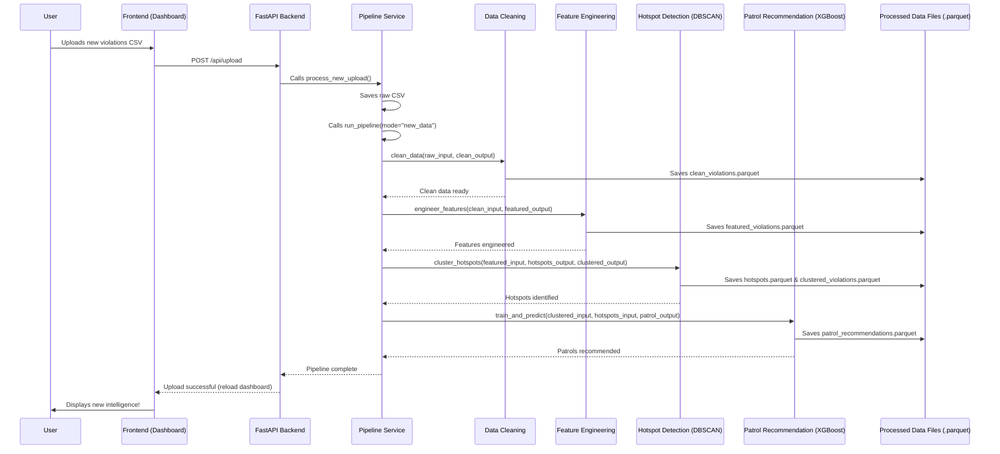

# Chapter 4: AI Data Pipeline

In [Chapter 3: Two-Mode Operational Data](03_two_mode_operational_data_.md), we learned how `Gridlock_Round2` intelligently separates "Historical" data for long-term planning from "New Data" for immediate reactions. Both modes, however, rely on the same powerful engine to transform raw parking violation records into actionable intelligence. This engine is our **AI Data Pipeline**.

### What Problem Does the AI Data Pipeline Solve?

Imagine you have a huge pile of raw parking violation records – maybe thousands or millions of lines in a spreadsheet. This raw data, by itself, isn't very useful for a BTP officer. It's just a list of events. How do you find the *hotspots*? How do you predict *when and where* the next problem will occur? How do you know which violations are *most severe*?

This is the problem the **AI Data Pipeline** solves. Think of it like a **factory assembly line for intelligence**. It takes those raw, unprocessed parking violation records (our "raw materials") and puts them through a series of carefully designed steps. Each step refines, enhances, and analyzes the data, ultimately producing polished, actionable insights (our "finished products") that the [Frontend Interactive Dashboard](01_frontend_interactive_dashboard_.md) can display and the [FastAPI Backend Services](02_fastapi_backend_services_.md) can serve.

**Central Use Case:** A BTP officer has a large CSV file of recent parking violations and needs to quickly understand the new problem areas, their severity, and get patrol recommendations based on this fresh data. The AI Data Pipeline is the automated system that processes this file from start to finish.

### Key Concepts: The Intelligence Assembly Line

Our AI Data Pipeline consists of several sequential stages, much like different stations on an assembly line:

1.  **Data Cleaning (Refining Raw Materials):**
    *   **Purpose:** Raw data is often messy. This stage is like quality control – it removes errors, fills in missing pieces, and ensures data is in a consistent format.
    *   **Example:** Making sure all dates are readable, fixing typos in vehicle types, and removing invalid entries.

2.  **Feature Engineering (Adding Useful Details):**
    *   **Purpose:** This stage transforms the cleaned data into a richer, more meaningful format. It creates new pieces of information ("features") that help the AI models understand the patterns better.
    *   **Example:** Calculating a "PICI score" ([PICI (Parking-Induced Congestion Impact) Scoring](05_pici__parking_induced_congestion_impact__scoring_.md)) for each violation, identifying if it occurred during peak hours, or if the violator is a repeat offender.

3.  **AI Models (Making Predictions & Identifying Patterns):**
    *   **Purpose:** This is where the "intelligence" truly emerges. Specialized AI algorithms analyze the enriched data to find hidden patterns and make predictions.
    *   **Examples:** Using DBSCAN to find clusters of violations and identify [Hotspot Detection (DBSCAN)](06_hotspot_detection__dbscan__.md), and employing XGBoost to predict future violations and generate [Patrol Recommendation Engine (XGBoost)](07_patrol_recommendation_engine__xgboost__.md).

4.  **Output/Insights (Actionable Information):**
    *   **Purpose:** The final products of the pipeline are structured datasets containing the crucial insights, ready to be used by the backend and frontend.
    *   **Example:** A list of ranked hotspots, a dataset of PICI scores for mapping, and a schedule of patrol recommendations.

### How to Use the AI Data Pipeline

From the perspective of a user (or even most of the backend code), you don't directly "run" individual parts of the pipeline. Instead, you trigger the entire assembly line with a single command, often by uploading a new dataset via the frontend.

As we saw in [Chapter 2: FastAPI Backend Services](02_fastapi_backend_services_.md), when a BTP officer uploads a new CSV file, the backend's `upload_new_data` endpoint calls the `process_new_upload` function. This function then calls the core of our pipeline: `run_pipeline`.

```python
# From backend\app\services\pipeline.py (simplified)
from src.main import run_pipeline # The actual AI data processing pipeline

def process_new_upload(file: UploadFile):
    # ... code to save the uploaded CSV file ...

    # This single line kicks off the entire AI Data Pipeline!
    run_pipeline(mode="new_data") # 'new_data' tells the pipeline where to save results
```
**Explanation:** This single line, `run_pipeline(mode="new_data")`, is all it takes to activate the entire intelligence assembly line. The `mode="new_data"` parameter is critical, as it tells the pipeline to process the recently uploaded CSV and save all its generated insights into the `data/processed/new_data/` directory, rather than the historical one (as explained in [Chapter 3: Two-Mode Operational Data](03_two_mode_operational_data_.md)).

### Under the Hood: The Pipeline's Orchestration

Let's look at the master control of our intelligence factory: the `run_pipeline` function.



The core orchestration happens within `src/main.py`, specifically in the `run_pipeline` function. This function is the conductor, calling each specialized stage in order.

#### 1. The Main Orchestrator (`src\main.py`)

The `run_pipeline` function sets up all the file paths and then calls each step of the pipeline one by one.

```python
# From src\main.py (simplified)
from pathlib import Path
from src.data_pipeline import clean_data
from src.feature_engineering import engineer_features
from src.ml_models import cluster_hotspots, train_and_predict

def run_pipeline(mode: str = "historical"):
    print(f"=== Starting ParkSense AI Pipeline [{mode.upper()} MODE] ===")
    
    # 1. Setup Paths (determines if historical or new_data folder)
    BASE_DIR = Path(__file__).resolve().parent.parent
    DATA_DIR = BASE_DIR / "data" / "processed" / mode # Important for Two-Mode Data!
    DATA_DIR.mkdir(parents=True, exist_ok=True)
    
    # ... determine RAW_DATA path based on mode ...
    RAW_DATA = BASE_DIR / "data" / "raw" / "new_violations.csv" # For new_data mode

    CLEAN_DATA = DATA_DIR / "clean_violations.parquet"
    FEATURED_DATA = DATA_DIR / "featured_violations.parquet"
    HOTSPOTS_DATA = DATA_DIR / "hotspots.parquet"
    PATROLS_DATA = DATA_DIR / "patrol_recommendations.parquet"
    
    # 2. Call each stage of the pipeline
    clean_data(RAW_DATA, CLEAN_DATA)
    engineer_features(CLEAN_DATA, FEATURED_DATA)
    cluster_hotspots(FEATURED_DATA, HOTSPOTS_DATA, DATA_DIR / "clustered_violations.parquet", 
                     min_samples=50 if mode == "historical" else 5) # Mode-specific tuning!
    train_and_predict(DATA_DIR / "clustered_violations.parquet", HOTSPOTS_DATA, PATROLS_DATA)
    
    print("\n=== Pipeline Execution Complete ===")

# Example of how it might be called:
# run_pipeline(mode="historical") # Or "new_data" if triggered by upload
```
**Explanation:** This `run_pipeline` function is the core of our "intelligence assembly line."
1.  It first figures out where to find the raw input data and where to save the outputs, based on the `mode` (either "historical" or "new_data").
2.  Then, it simply calls each of the specialized functions (`clean_data`, `engineer_features`, `cluster_hotspots`, `train_and_predict`) in sequence, passing the output of one stage as the input to the next.
3.  Notice the `min_samples` parameter for `cluster_hotspots`: this is an example of the [Two-Mode Operational Data](03_two_mode_operational_data_.md) concept in action, where the *algorithm itself* adjusts based on the data mode!

#### 2. Data Cleaning Stage (`src\data_pipeline.py`)

This stage focuses on making the raw data consistent and usable.

```python
# From src\data_pipeline.py (simplified)
import pandas as pd
from pathlib import Path

REQUIRED_RAW_COLUMNS = {
    'id', 'latitude', 'longitude', 'created_datetime', 'violation_type', ...
}

def clean_data(input_path: Path, output_path: Path):
    """Reads raw violations, parses lists, and saves to clean processed dataset."""
    print(f"Cleaning data from {input_path.name}...")
    
    df = pd.read_csv(input_path) # Read the raw CSV file
    validate_columns(df, REQUIRED_RAW_COLUMNS, input_path.name) # Check for essential columns

    df['created_datetime'] = pd.to_datetime(df['created_datetime'], errors='coerce') # Fix dates
    df = df[df['created_datetime'].notna()].copy() # Remove rows with bad dates

    # ... more cleaning steps like ensuring numeric coordinates, handling violation lists ...
    
    df.to_parquet(output_path, index=False) # Save the cleaned data in an efficient format
    print(f"Cleaned data saved to {output_path.name}")
```
**Explanation:** The `clean_data` function reads the raw CSV, checks if it has all the necessary columns, converts important fields like `created_datetime` to the correct format, and removes any rows that are too broken to be useful. Finally, it saves this much tidier data as a `.parquet` file, which is a fast and efficient way to store large tables.

#### 3. Feature Engineering Stage (`src\feature_engineering.py`)

This is where we add smart new information to our cleaned data.

```python
# From src\feature_engineering.py (simplified)
import pandas as pd
from pathlib import Path

# ... SEVERITY_WEIGHTS, VEHICLE_SIZE_FACTOR, HOLIDAYS dictionaries ...

def engineer_features(input_path: Path, output_path: Path):
    """Computes the PICI severity score and engineered temporal features."""
    print(f"Engineering features from {input_path.name}...")
    
    df = pd.read_parquet(input_path) # Load the cleaned data
    
    # Calculate PICI Score (see Chapter 5 for details)
    df['severity_score'] = df['violation_list'].apply(lambda lst: sum(SEVERITY_WEIGHTS.get(v, 2) for v in lst))
    df['vehicle_size_factor'] = df['final_vehicle_type'].map(VEHICLE_SIZE_FACTOR).fillna(1.0)
    # ... other multipliers like junction_multiplier, peak_hour_multiplier ...
    df['pici_raw'] = (df['severity_score'] * df['vehicle_size_factor'] * df['junction_multiplier'] * df['peak_hour_multiplier'])
    df['pici_score'] = ((df['pici_raw'] / max(df['pici_raw'].max(), 1e-9)) * 10).round(3)

    # Add Temporal Features
    df['hour'] = df['created_datetime'].dt.hour
    df['day_of_week'] = df['created_datetime'].dt.dayofweek
    df['is_weekend'] = df['day_of_week'].apply(lambda d: 1 if d >= 5 else 0)
    # ... other features like is_holiday, is_peak_hour, repeat_offender tracking ...
    
    df.to_parquet(output_path, index=False) # Save the data with all the new features
    print(f"Engineered features saved to {output_path.name}")
```
**Explanation:** The `engineer_features` function takes the clean data and enriches it. It calculates the [PICI (Parking-Induced Congestion Impact) Scoring](05_pici__parking_induced_congestion_impact__scoring_.md) for each violation based on its type, vehicle size, location characteristics, and time. It also adds new temporal features like the hour of day, day of week, and whether it was a weekend or holiday. This enriched dataset is then saved as `featured_violations.parquet`.

#### 4. Hotspot Detection Stage (`src\ml_models.py`)

This stage uses a specific AI model to find geographical problem areas.

```python
# From src\ml_models.py (simplified)
import pandas as pd
from sklearn.cluster import DBSCAN
from pathlib import Path
import numpy as np

def cluster_hotspots(input_path: Path, hotspots_out: Path, clustered_out: Path, min_samples: int = 50):
    """Uses DBSCAN and Geospatial Medoids to identify chronic hotspots."""
    print("Clustering Hotspots...")
    df = pd.read_parquet(input_path) # Load the featured data
    
    coords = df[['latitude', 'longitude']].values
    coords_radians = np.radians(coords)

    # DBSCAN algorithm to find clusters of violations (see Chapter 6 for details)
    dbscan = DBSCAN(eps=(50 / 1000.0) / 6371.0088, min_samples=min_samples, metric='haversine')
    df['cluster_id'] = dbscan.fit_predict(coords_radians) # Assigns a cluster ID to each violation

    # Group violations by cluster to summarize each hotspot
    hotspots = df[df['cluster_id'] != -1].groupby('cluster_id').agg(
        total_violations=('id', 'count'),
        total_pici=('pici_score', 'sum'),
        # ... other summary statistics for each hotspot ...
    ).reset_index()

    hotspots = hotspots.sort_values('total_pici', ascending=False).reset_index(drop=True)
    hotspots['hotspot_rank'] = hotspots.index + 1 # Rank the hotspots

    hotspots.to_parquet(hotspots_out, index=False) # Save the summary of hotspots
    df.to_parquet(clustered_out, index=False) # Save the original data with cluster IDs
    print(f"Hotspots saved to {hotspots_out.name}")
```
**Explanation:** The `cluster_hotspots` function loads the data with engineered features. It then uses the [Hotspot Detection (DBSCAN)](06_hotspot_detection__dbscan__.md) algorithm to identify dense clusters of parking violations, which represent our hotspots. It calculates various statistics for each hotspot (like total violations, total PICI score, main police station, etc.) and then saves two important files: one summarizing the hotspots themselves, and another with the original violations now tagged with their assigned hotspot ID.

#### 5. Patrol Recommendation Stage (`src\ml_models.py`)

The final stage uses another AI model to predict future problems and suggest patrol timings.

```python
# From src\ml_models.py (simplified)
import pandas as pd
import xgboost as xgb # Our prediction model
from pathlib import Path

def train_and_predict(clustered_path: Path, hotspots_path: Path, output_path: Path):
    """Trains the XGBoost Time-Series models and generates patrol recommendations."""
    print("Training models and predicting patrols...")
    df = pd.read_parquet(clustered_path) # Load the clustered violation data
    hotspots_df = pd.read_parquet(hotspots_path) # Load the hotspot summaries

    # Aggregate historical data to create training examples for our prediction model
    df_hotspots = df[df['hotspot_rank'] != -1].copy()
    actual_counts = df_hotspots.groupby(['hotspot_rank', 'date', 'hour']).agg(
        target_violation_count=('id', 'count'),
        target_avg_pici=('pici_score', 'mean')
    ).reset_index()

    # Prepare features for the XGBoost model (see Chapter 7 for details)
    # This includes things like day_of_week, hour, month, is_peak_hour, etc.
    FEATURES = ['center_lat', 'center_lng', 'day_of_week', 'hour', 'month', 'is_peak_hour']
    X = master_df[FEATURES]
    y_volume = master_df['target_violation_count'] # What we want to predict: number of violations
    y_pici = master_df['target_avg_pici'] # What we want to predict: average PICI score

    # Train XGBoost models
    model_volume = xgb.XGBRegressor(objective='count:poisson', random_state=42) # Model for predicting violation count
    model_volume.fit(X_train, y_vol_train)
    
    model_pici = xgb.XGBRegressor(objective='reg:squarederror', random_state=42) # Model for predicting PICI score
    model_pici.fit(X_train, y_pic_train)

    # Generate a "future" schedule for all hotspots, days, and hours
    schedule_df = pd.DataFrame(future_grid_of_hours_days_hotspots)
    schedule_df['predicted_violations'] = model_volume.predict(schedule_df[FEATURES]).clip(min=0)
    schedule_df['predicted_pici'] = model_pici.predict(schedule_df[FEATURES]).clip(min=0, max=10)
    
    schedule_df['priority_score'] = schedule_df['predicted_violations'] * schedule_df['predicted_pici'] # Our final recommendation score

    schedule_df.to_parquet(output_path, index=False) # Save the patrol recommendations
    print(f"Patrol recommendations saved to {output_path.name}")
```
**Explanation:** The `train_and_predict` function takes the clustered violation data and hotspot summaries. It aggregates this historical information to create training data for two [Patrol Recommendation Engine (XGBoost)](07_patrol_recommendation_engine__xgboost__.md) models: one to predict the number of violations and another to predict the average PICI score for each hotspot at different times. After training, it uses these models to predict potential future problems across all hotspots, days, and hours, generating a `priority_score` for each potential patrol window. This schedule of recommendations is then saved as `patrol_recommendations.parquet`.

### Conclusion

You've now taken a tour of the **AI Data Pipeline** – the sophisticated "intelligence assembly line" that powers `Gridlock_Round2`. We've seen how it systematically transforms raw parking violation data through cleaning, feature engineering, and advanced AI models (like DBSCAN for hotspot detection and XGBoost for patrol recommendations) to produce actionable insights. This entire process is orchestrated by the `run_pipeline` function, which can be triggered for either "historical" or "new data" modes, providing fresh intelligence whenever new data becomes available.

In the next chapter, we'll dive deeper into one of the key outputs of our pipeline's feature engineering stage: the [PICI (Parking-Induced Congestion Impact) Scoring](05_pici__parking_induced_congestion_impact__scoring_.md), understanding how we quantify the severity of each parking violation.

[Next Chapter: PICI (Parking-Induced Congestion Impact) Scoring](05_pici__parking_induced_congestion_impact__scoring_.md)

---

