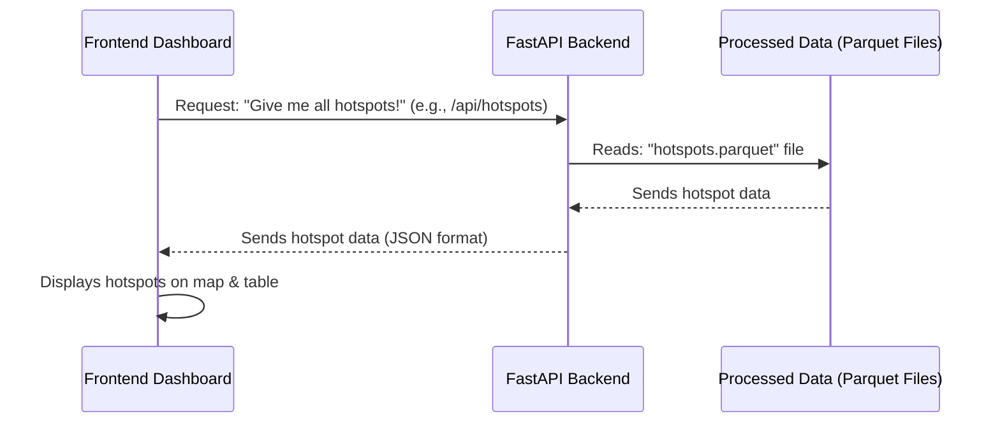

# Chapter 4: Frontend Dashboard

Welcome back to the `Gridlock_Round2` tutorial! In our previous chapters, we've built some powerful AI tools: we learned how the [PICI (Parking-Induced Congestion Impact) Score](01_pici__parking_induced_congestion_impact__score_.md) quantifies individual parking violations, how [Hotspot Detection & Ranking](02_hotspot_detection___ranking_.md) identifies the worst problem areas, and how the [Patrol Recommendation Engine](03_patrol_recommendation_engine_.md) predicts when and where to send patrols.

But all these amazing insights are just numbers and predictions unless they can be easily understood and acted upon by traffic officers. Imagine having a super-smart advisor who gives you lots of critical information, but only in complex code or confusing spreadsheets. That wouldn't be very helpful in a fast-paced environment!

This is where the **Frontend Dashboard** comes in! It's like the **cockpit of an airplane** – it takes all the complex data and AI insights and presents them in a clear, user-friendly way. It's the place where BTP officers can see everything at a glance, interact with the data, and make quick, informed decisions about deploying their teams.

## What is the Frontend Dashboard?

The Frontend Dashboard is the visual, interactive interface of our `Gridlock_Round2` project. Its main job is to transform raw data and AI predictions into **actionable intelligence** for traffic police. Instead of digging through files or running commands, officers can simply open a web page and instantly see:

*   **Interactive Maps**: Showing where violations are happening (hotspots).
*   **Charts & Graphs**: Illustrating patterns over time or by vehicle type.
*   **Tables**: Listing ranked hotspots and patrol recommendations.
*   **Workspaces**: Allowing officers to plan and simulate patrol deployments.

It's designed to be intuitive, making it easy for anyone to explore traffic data and understand what the AI is suggesting.

## How to Use the Dashboard: Your Command Center

As a BTP officer, the dashboard offers several key views to help you manage traffic enforcement:

### 1. The Main Dashboard View

This is your central hub for overall statistics and summary information. You'll find:

*   **Key Metrics**: Quick numbers on total violations, average PICI scores, and overall system health.
*   **Hotspot Ranking**: A table listing the most critical [Hotspots](02_hotspot_detection___ranking_.md) in the city, ordered by their total [PICI Score](01_pici__parking_induced_congestion_impact__score_.md). This tells you which areas are causing the most congestion.
*   **Temporal Insights**: Charts showing when violations typically occur – by hour of day or day of week. This helps understand daily and weekly patterns.
*   **Vehicle Analysis**: Graphs breaking down violations by vehicle type (e.g., cars vs. scooters vs. trucks), highlighting which vehicles are most involved in problematic parking.
*   **Station Load**: A summary of which police stations cover the most problematic areas.
*   **Repeat Offenders**: A list of anonymized vehicle numbers that are frequently violating parking rules.

Here’s a simplified look at how the main dashboard structure is organized (rendered from `frontend/src/components/Dashboard.jsx`):

```html
<!-- Simplified structure of the main dashboard content -->
<main class="shell">
  <!-- ... Navbar and Page Header ... -->

  <!-- Data Context: Tells you if you're viewing Historical or New Data -->
  <section class="data-context">
    <div><span>Data Source</span><strong>BTP Historical Dataset</strong></div>
    <div><span>Coverage</span><strong>Bengaluru-wide violations</strong></div>
    <!-- ... other data context details ... -->
  </section>

  <!-- Key Metrics: Overall numbers -->
  <section class="metrics-grid">
    <!-- ... PICI, Violation Count, Hotspots Count etc. ... -->
  </section>

  <!-- Spatial Intelligence: Where enforcement pressure is concentrated -->
  <section class="analysis-section" id="spatial-intelligence">
    <h2>Where enforcement pressure is concentrated</h2>
    <!-- Hotspot Ranking Table goes here -->
  </section>

  <!-- Operational Load: Station dashboards, repeat offenders -->
  <section class="analysis-grid" id="operational-load">
    <!-- Police Station Dashboard goes here -->
    <!-- Repeat Offenders List goes here -->
  </section>

  <!-- Decision Intelligence: Temporal & Vehicle patterns -->
  <section class="intelligence-grid" id="decision-intelligence">
    <!-- Temporal Insights (charts) goes here -->
    <!-- Vehicle Analysis (charts) goes here -->
  </section>
</main>
```
This HTML skeleton gives you an idea of how the different sections are laid out, each providing a specific type of insight.

### 2. The Enforcement Map View

This is where you visualize all the geospatial intelligence. It's an interactive map of Bengaluru, displaying:

*   **PICI Heatmap**: Areas with a high concentration of high-[PICI Score](01_pici__parking_induced_congestion_impact__score_.md) violations are colored "hot" (yellow to red), showing you at a glance where congestion is worst.
*   **Hotspot Markers**: Individual [Hotspots](02_hotspot_detection___ranking_.md) are marked with clickable pins. Clicking a pin reveals details like the police station, number of violations, and total PICI for that hotspot.
*   **Time-Travel Slider**: This cool feature allows you to "fast-forward" or "rewind" through the hours of the day. The heatmap will change dynamically, showing you how congestion patterns shift throughout a 24-hour period. This is vital for understanding peak hours.
*   **Enforcement Relief Simulation**: A toggle allows you to simulate the traffic relief you'd get if the top chronic hotspots were successfully cleared.

The map is a powerful tool for visual analysis, helping you connect the numbers to real-world locations. (Rendered by `frontend/src/components/MapView.jsx`).

### 3. The Patrol Window View

This is your proactive planning workspace, powered by the [Patrol Recommendation Engine](03_patrol_recommendation_engine_.md). It helps you schedule patrols efficiently:

*   **Weekly Calendar Grid**: A visual calendar showing each day and hour. Cells are colored based on the number of active [Hotspots](02_hotspot_detection___ranking_.md) predicted for that time.
*   **City-wide Hotspots Pop-up**: Clicking a cell in the calendar opens a pop-up listing all the hotspots needing attention at that specific day and hour across the city, ranked by their predicted `priority_score`.
*   **Station-Specific Recommendations**: You can filter recommendations by a particular police station, day, or hour range to see detailed deployment suggestions for your area.
*   **Deploy/Recall Units**: A simulated roster allows you to "deploy" units to specific hotspots and "recall" them, giving you a hands-on feel for resource allocation.

This view (rendered from `frontend/src/components/DispatchView.jsx`) is designed to transform predictive insights into a practical patrol schedule.

## Under the Hood: How the Dashboard Works Its Magic

The Frontend Dashboard is built using modern web technologies:
*   **Vite**: A super-fast build tool for frontends.
*   **JavaScript**: The language that brings interactivity.
*   **Leaflet.js & OpenStreetMap**: For the interactive maps.

Think of it like this: the dashboard is a demanding boss. It needs a lot of information (`PICI scores`, `hotspot ranks`, `patrol recommendations`) from its assistant (the **FastAPI Backend**). The backend, in turn, gets this information from the processed data files that our AI pipeline creates.

Here's a simplified sequence of how the dashboard gets its information:



### 1. The Main Controller (`frontend/src/main.jsx`)

This file is the "brain" of the frontend. It decides which view to show (dashboard, map, or patrol window) and fetches all the necessary data from the backend.

When you first load the page or switch modes, the `loadDashboard` function is called:

```javascript
// frontend/src/main.jsx (simplified)
import { fetchJson, modePath, uploadCsv } from "./utils/apiClient.js";
// ... other imports

async function loadDashboard(mode = state.mode) {
  state.mode = mode;
  state.isLoading = true;
  // ... render loading indicator ...

  try {
    if (state.view === "map") {
      // If showing the map, fetch heatmap points and hotspots
      const [heatmap, hotspots] = await Promise.all([
        fetchJson(modePath("/api/heatmap?limit=10000", mode)),
        fetchJson(modePath("/api/hotspots", mode)),
      ]);
      // ... render map page and initialize map ...
    } else if (state.view === "dispatch") {
      // If showing patrol window, fetch hotspots and recommendations
      const [hotspots, recommendations] = await Promise.all([
        fetchJson(modePath("/api/hotspots", mode)),
        fetchJson(modePath("/api/recommendations", mode)),
      ]);
      // ... render dispatch page and initialize dispatch view ...
    } else {
      // Otherwise, for the main dashboard, fetch all summaries
      const [health, stats, hotspots, stationSummary, temporalSummary] = await Promise.all([
        fetchJson(modePath("/api/health", mode)),
        fetchJson(modePath("/api/stats", mode)),
        fetchJson(modePath("/api/hotspots", mode)),
        fetchJson(modePath("/api/summary/station", mode)),
        fetchJson(modePath("/api/summary/temporal", mode)),
        // ... fetch other summaries (vehicle, repeat offenders) ...
      ]);
      // ... render the main dashboard with all fetched data ...
    }
  } catch (error) {
    // ... handle errors ...
  } finally {
    state.isLoading = false;
  }
}
```
This `loadDashboard` function is crucial. Notice how it makes multiple requests (using `Promise.all` to fetch them all at once) to different **FastAPI Backend** endpoints like `/api/hotspots` or `/api/heatmap`. Each endpoint provides a specific piece of data.

### 2. Communicating with the Backend (`frontend/src/utils/apiClient.js`)

This file handles how the frontend actually "talks" to the **FastAPI Backend**. It's like the project's dedicated phone line.

```javascript
// frontend/src/utils/apiClient.js (simplified)
const API_BASE_URL = import.meta.env.VITE_API_BASE_URL || "";

export async function fetchJson(path) {
  // Construct the full URL for the API request
  const response = await fetch(`${API_BASE_URL}${path}`);

  if (!response.ok) {
    // If the server sends an error (e.g., 404, 500), throw an error
    const detail = await response.text();
    throw new Error(detail || `Request failed with status ${response.status}`);
  }
  // If successful, parse the JSON response
  return response.json();
}

export function modePath(path, mode) {
  // Helper to add '?mode=historical' or '?mode=new_data' to API paths
  const separator = path.includes("?") ? "&" : "?";
  return `${path}${separator}mode=${mode}`;
}
```
The `fetchJson` function is the core of this communication. It uses JavaScript's `fetch` API to send requests to the backend. The `modePath` function helps append `?mode=historical` or `?mode=new_data` to the API requests, allowing the backend to know which dataset to use.

### 3. Rendering the Views (e.g., `Dashboard.jsx`, `MapView.jsx`, `DispatchView.jsx`)

Once the `main.jsx` controller fetches the data, it passes that data to specific component files to render the user interface.

For example, `Dashboard.jsx` receives `hotspots`, `stationSummary`, `temporalSummary`, etc., and uses these to construct the HTML for the main dashboard:

```javascript
// frontend/src/components/Dashboard.jsx (simplified)
import { renderHotspotTable } from "./HotspotTable.jsx";
import { renderMetrics } from "./Metrics.jsx";
// ... other imports for different sections

export function renderDashboard({
  mode, view, navOpen, uploadMeta,
  health, stats, hotspots,
  stationSummary, temporalSummary, vehicleSummary, repeatOffenders,
}) {
  // This function takes all the fetched data as inputs
  const isHistorical = mode === "historical";
  const modeLine = isHistorical ? "Precomputed Bengaluru-wide intelligence..." : "Fresh AI pipeline results...";

  return `
    <main class="shell${navOpen ? " nav-pinned" : ""}">
      <!-- ... Navbar ... -->
      <div class="page-top">
        <!-- ... Page greeting and buttons (e.g., "Open Enforcement Map") ... -->
      </div>

      ${renderDataContext(mode, uploadMeta)} // Render data source info
      ${renderMetrics({ health, stats, mode, hotspots })} // Render the top metrics
      
      <section class="analysis-section" id="spatial-intelligence">
        <h2>Where enforcement pressure is concentrated</h2>
        ${renderHotspotTable(hotspots)} // Render the hotspot ranking table
      </section>

      <section class="analysis-grid" id="operational-load">
        ${renderStationDashboard(stationSummary)} // Render station breakdown
        ${renderRepeatOffenders(repeatOffenders)} // Render repeat offenders
      </section>

      <section class="intelligence-grid" id="decision-intelligence">
        ${renderTemporalInsights(temporalSummary)} // Render temporal charts
        ${renderVehicleAnalysis(vehicleSummary)} // Render vehicle charts
      </section>
    </main>
  `;
}
```
Each `render...` function here takes specific data and uses it to generate the HTML for that section of the dashboard. For instance, `renderHotspotTable(hotspots)` would take the list of `hotspots` and create the rows in the table.

Similarly, the `MapView.jsx` file takes `heatmap` data (coordinates with intensity) and `hotspots` data to initialize and populate the interactive map using the Leaflet library.

```javascript
// frontend/src/components/MapView.jsx (simplified)
import L from "leaflet"; // Import the Leaflet mapping library
import "leaflet.heat"; // Import the heatmap plugin
// ... other imports

export function initMapView(points = [], hotspots = [], mode = "historical") {
  const mapElement = document.getElementById("enforcement-map");
  if (!mapElement) return null;

  const map = L.map("enforcement-map", {
    center: [12.9716, 77.5946], // Bengaluru centre
    zoom: 13.5,
  });

  L.tileLayer("https://{s}.tile.openstreetmap.org/{z}/{x}/{y}.png", {
    attribution: '&copy; <a href="https://www.openstreetmap.org/copyright">OpenStreetMap</a> contributors',
  }).addTo(map);

  if (points && points.length > 0) {
    // Create the heatmap layer using the PICI-weighted points
    const heatLayer = L.heatLayer(
      points.map((p) => [p.lat, p.lng, p.intensity]), // [latitude, longitude, intensity]
      { radius: 20, blur: 15, max: 1.0, gradient: { 0.4: "blue", 0.6: "lime", 0.75: "yellow", 0.9: "orange", 1.0: "red" } }
    ).addTo(map);
  }

  if (hotspots && hotspots.length > 0) {
    hotspots.forEach((h) => {
      const lat = Number(h.center_lat || h.mean_lat);
      const lng = Number(h.center_lng || h.mean_lng);
      // Create a custom icon for hotspot markers
      const customIcon = L.divIcon({/* ... custom HTML for the marker ... */});
      const marker = L.marker([lat, lng], { icon: customIcon });
      // Bind a popup to the marker with hotspot details
      marker.bindPopup(`<h4>Hotspot Rank #${h.hotspot_rank}</h4> ... details ...`);
      marker.addTo(map);
    });
  }
  return map;
}
```
This snippet shows how Leaflet.js is used to create the map, add base tiles from OpenStreetMap, and then layer on the AI-generated heatmap and hotspot markers. The `points` array contains `[latitude, longitude, PICI_intensity]` data for the heatmap, and `hotspots` contains detailed information for each marker.

The `DispatchView.jsx` works similarly, taking `hotspots` and `recommendations` data to populate the weekly calendar and the detailed patrol lists. It also handles the local storage for `assignedUnits` to simulate unit deployment.

## Conclusion

The Frontend Dashboard is the crucial link that brings all the powerful AI-driven insights of `Gridlock_Round2` directly to the hands of BTP officers. By providing interactive maps, clear charts, ranked tables, and an intuitive patrol planning workspace, it empowers proactive and data-informed traffic enforcement. It transforms complex data into simple, actionable intelligence, turning our AI pipeline into a real-world tool for reducing congestion.

Now that you understand how all these insights are presented, let's dive into how the dashboard can switch between different sets of data – historical analysis versus fresh new uploads. In the next chapter, we'll explore **Historical and New Data Modes**!

[Next Chapter: Historical and New Data Modes](05_historical_and_new_data_modes_.md)

---
