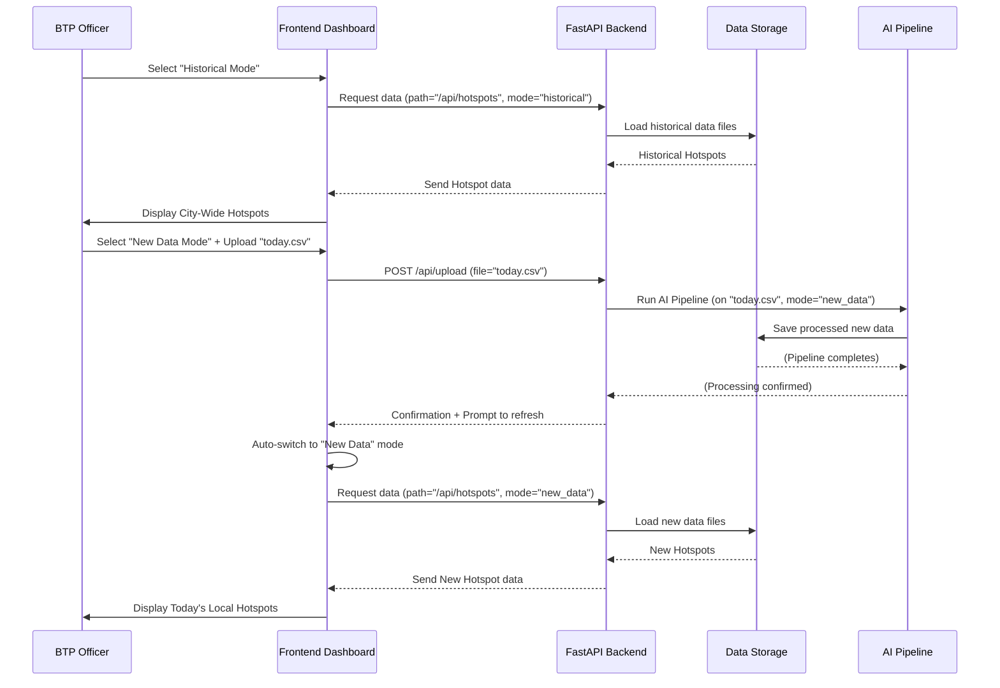

# Chapter 5: Historical and New Data Modes

Welcome back to the `Gridlock_Round2` tutorial! In our [previous chapter, Frontend Dashboard](04_frontend_dashboard_.md), we explored the various screens where traffic officers can visualize data and get insights. Now, imagine you're a BTP officer who needs to make decisions. Sometimes, you need to understand the *big picture* – what are the most common problems across the entire city over many months? Other times, you need to react *right now* – what's happening with the parking violations that just came in from a specific area today?

This is where the concept of **"Historical and New Data Modes"** becomes incredibly useful! It's like having both a detailed, city-wide map that shows long-term trends and a quick, updated local map for a specific area that shows immediate events. Our system allows you to toggle between these two views to get the right intelligence for the job at hand.

## Why Do We Need Different Data Modes?

Think of it this way:
*   A city planner needs to see how illegal parking has affected traffic over the past year to decide where to build new parking lots or change road rules. This needs **Historical Mode**.
*   A patrol supervisor needs to know if a fresh batch of violations from a particular police station this morning shows a new hotspot emerging *right now*, so they can dispatch a team immediately. This needs **New Data Mode**.

Our `Gridlock_Round2` project is designed to serve both these crucial needs by allowing the system to work with two distinct sets of data, toggled on demand.

## What are Historical and New Data Modes?

### 1. Historical Mode

*   **Purpose:** Provides long-term strategic intelligence. This mode helps you understand chronic problems, seasonal patterns, and overall city-wide trends.
*   **Data Source:** Uses a large, pre-analyzed dataset. In our project, this is the entire provided `given.csv` file, processed once to cover many months of Bengaluru traffic violations.
*   **Insights:** You see the "big picture" – the top [Hotspot Detection & Ranking](02_hotspot_detection___ranking_.md) across the entire city over a long period, and [Patrol Recommendation Engine](03_patrol_recommendation_engine_.md) suggestions based on deep historical patterns. This data is stable and doesn't change unless the entire historical dataset is re-processed.

### 2. New Data Mode

*   **Purpose:** Simulates real-time operational use, providing immediate, localized insights.
*   **Data Source:** Uses a fresh, smaller CSV file that you upload. Imagine this is today's parking violations from a specific police station, or data collected during a special event.
*   **Insights:** After you upload your new data, the system quickly processes *only that new data* through the **same AI pipeline** (which we'll explore in the next chapter). You then see hotspots and recommendations generated specifically from your fresh upload. This is dynamic and gives you an "up-to-the-minute" view for specific scenarios.

## How to Use the Data Modes on the Dashboard

The [Frontend Dashboard](04_frontend_dashboard_.md) makes switching between these modes very easy.

1.  **Switching Modes:** On the dashboard, you'll see a clear toggle (often in the sidebar or header) labeled "Historical" and "New Data." Clicking these allows you to switch between the pre-loaded city-wide intelligence and your recently uploaded data.

    Here's a simplified look at the navigation panel in the frontend that lets you switch:

    ```html
    <!-- frontend/src/components/Navbar.jsx (simplified snippet) -->
    <nav class="side-nav">
      <!-- ... Brand and other navigation items ... -->
      <div class="nav-items" role="group" aria-label="Navigation">
        <button class="nav-item is-active" type="button" data-mode="historical" aria-label="Historical">
          <span class="nav-icon">📊</span><span class="nav-label">Historical</span>
        </button>
        <button class="nav-item" type="button" data-mode="new_data" aria-label="New Data">
          <span class="nav-icon">📤</span><span class="nav-label">New Data</span>
        </button>
        <!-- ... Other view buttons like Map, Patrol Window ... -->
      </div>
    </nav>
    ```
    This HTML structure from the `Navbar.jsx` component shows the "Historical" and "New Data" buttons. Clicking these buttons updates the `data-mode` attribute, which triggers the frontend to request data for the selected mode.

2.  **Uploading New Data:** When you select "New Data Mode" for the first time, or if no new data has been uploaded, the dashboard will prompt you to upload a CSV file.

    ```html
    <!-- frontend/src/components/UploadPanel.jsx (simplified snippet) -->
    <section class="upload-workspace">
      <h2>Process a fresh violation export</h2>
      <p>Upload a CSV to generate new hotspots, patrol windows, and station summaries from that file.</p>
      <form id="upload-form">
        <label class="file-picker" for="csv-file">
          <strong id="selected-file-name">Choose a violation export</strong>
        </label>
        <input id="csv-file" type="file" accept=".csv" />
        <button id="upload-button" type="submit">Process Upload</button>
      </form>
    </section>
    ```
    This `UploadPanel.jsx` component provides a simple form. You choose a CSV file, click "Process Upload," and the system takes care of the rest. After a short processing time, the dashboard will automatically refresh and display the analysis *only for your uploaded data*.

## Under the Hood: How Data Modes Work

Let's peek behind the scenes to understand how the system manages these two distinct data contexts.

### Step-by-Step Flow:



1.  **User Interaction:** When you click a mode button or upload a file on the [Frontend Dashboard](04_frontend_dashboard_.md), it triggers an action.
2.  **Frontend Requests:** The frontend sends a request to the [FastAPI Backend](07_fastapi_backend_.md). For most data requests (like getting hotspots or statistics), it includes a special parameter `?mode=historical` or `?mode=new_data`.
3.  **Backend Routes:** The FastAPI backend receives this request. It uses the `mode` parameter to decide which set of processed data files to access.
4.  **Data Processing (for New Data):** If you've just uploaded a new CSV for "New Data Mode," the backend first saves this raw CSV and then runs the entire [AI Processing Pipeline](06_ai_processing_pipeline_.md) on *just that new data*. The pipeline calculates [PICI (Parking-Induced Congestion Impact) Scores](01_pici__parking_induced_congestion_impact__score_.md), performs [Hotspot Detection & Ranking](02_hotspot_detection___ranking_.md), and generates [Patrol Recommendation Engine](03_patrol_recommendation_engine_.md) data, saving all the results to a dedicated "new\_data" folder.
5.  **Data Retrieval:** The backend then loads the appropriate pre-processed data files (either from the `historical` folder or the `new_data` folder).
6.  **Dashboard Display:** Finally, the backend sends this data back to the frontend, which updates the dashboard to show the insights for the selected data mode.

### Diving into the Code (Simplified)

Let's look at some key code snippets that enable this mode-switching functionality.

First, how the frontend app decides which data mode to load:

```javascript
// frontend/src/main.jsx (simplified)
async function loadDashboard(mode = state.mode) {
  state.mode = mode; // Update the current mode in the application state
  state.isLoading = true; // Show a loading indicator

  try {
    // Example for fetching hotspots:
    // Notice how 'modePath' is used to add '?mode=' to the URL
    const hotspots = await fetchJson(modePath("/api/hotspots", mode));
    // ... fetch other data as needed for the dashboard ...

    // Render the dashboard with the fetched data
    // ... renderDashboard({ mode, hotspots, ... });
  } catch (error) {
    // ... handle errors ...
  } finally {
    state.isLoading = false;
  }
}
```
This `loadDashboard` function in `main.jsx` is the heart of the frontend's data loading. When you click a mode button, it calls this function with the desired `mode` ("historical" or "new_data"). It then uses `modePath` to prepare the API request URL.

Next, how `modePath` adds the `?mode=` parameter to your API calls:

```javascript
// frontend/src/utils/apiClient.js (simplified)
// API_BASE_URL might be "http://127.0.0.1:8000" during local development
const API_BASE_URL = import.meta.env.VITE_API_BASE_URL || "";

export async function fetchJson(path) {
  const response = await fetch(`${API_BASE_URL}${path}`);
  // ... error handling and JSON parsing ...
  return response.json();
}

export function modePath(path, mode) {
  // This function adds '?mode=historical' or '?mode=new_data' to the API URL
  const separator = path.includes("?") ? "&" : "?";
  return `${path}${separator}mode=${mode}`;
}
```
The `modePath` function is very important. It takes an API path (like `/api/hotspots`) and the current `mode` ("historical" or "new_data"), and then cleverly adds `?mode=historical` or `?mode=new_data` to the URL. This way, the [FastAPI Backend](07_fastapi_backend_.md) knows which data to serve.

On the backend, the API endpoints receive this `mode` parameter:

```python
# backend/app/api/routes/analytics.py (simplified)
from fastapi import APIRouter
from app.services.datasets import get_data_dir, load_parquet
# ... other imports ...

router = APIRouter()

@router.get("/hotspots")
def get_hotspots(mode: str = "historical"):
    """Return chronic parking violation hotspots."""
    # 'mode' defaults to "historical" if not provided in the request
    hotspots_path = get_data_dir(mode) / "hotspots.parquet"
    df = load_parquet(hotspots_path)
    return df.to_dict(orient="records")
```
Notice `mode: str = "historical"` in the `get_hotspots` function. This tells FastAPI to expect a `mode` parameter in the URL query string (e.g., `/api/hotspots?mode=new_data`). If no mode is specified, it defaults to `"historical"`. The function then uses `get_data_dir(mode)` to correctly point to the data files.

Finally, `get_data_dir` is the function that actually selects the correct folder for data:

```python
# backend/app/services/datasets.py (simplified)
from pathlib import Path
from fastapi import HTTPException
from app.core.config import settings # settings.processed_data_dir is 'data/processed'

def get_data_dir(mode: str) -> Path:
    if mode not in {"historical", "new_data"}:
        raise HTTPException(status_code=400, detail="Invalid mode. Must be 'historical' or 'new_data'.")
    # This line constructs the path: e.g., 'data/processed/historical' or 'data/processed/new_data'
    return settings.processed_data_dir / mode

def load_parquet(path: Path) -> pd.DataFrame:
    # ... logic to load the parquet file from the given path ...
    pass
```
The `get_data_dir` function is simple but crucial. It takes the `mode` and constructs the full path to either `data/processed/historical/` or `data/processed/new_data/`. This ensures that all subsequent data loading functions (like `load_parquet`) read from the correct set of pre-processed files.

For new data uploads, a dedicated endpoint handles receiving the file and triggering the processing:

```python
# backend/app/api/routes/upload.py (simplified)
from fastapi import APIRouter, File, HTTPException, UploadFile
from app.services.pipeline import process_new_upload # This runs the AI pipeline

router = APIRouter()

@router.post("/upload")
def upload_new_data(file: UploadFile = File(...)):
    if not file.filename or not file.filename.lower().endswith(".csv"):
        raise HTTPException(status_code=400, detail="Only CSV files are allowed.")

    try:
        process_new_upload(file) # Run the full AI pipeline on the uploaded file
    except HTTPException:
        raise
    except Exception as exc:
        raise HTTPException(status_code=500, detail=f"Pipeline execution failed: {exc}") from exc

    return {"status": "success", "mode": "new_data", "message": "New data processed."}
```
The `upload_new_data` endpoint directly calls `process_new_upload`, which is where our entire [AI Processing Pipeline](06_ai_processing_pipeline_.md) gets executed on the newly uploaded data, ensuring that "New Data Mode" is always showing fresh results.

## Conclusion

The "Historical and New Data Modes" feature provides immense flexibility and power to `Gridlock_Round2`. It allows BTP officers to switch seamlessly between gaining strategic, long-term insights from a comprehensive historical dataset and obtaining immediate, operational intelligence from fresh, localized data. This dual-mode approach makes the system versatile, supporting both proactive planning and rapid response in traffic enforcement.

Now that you understand how the system manages different data contexts, let's dive deeper into the "brain" that processes all this data. In the next chapter, we'll explore the powerful **AI Processing Pipeline** that makes all these insights possible!

[Next Chapter: AI Processing Pipeline](06_ai_processing_pipeline_.md)

---

