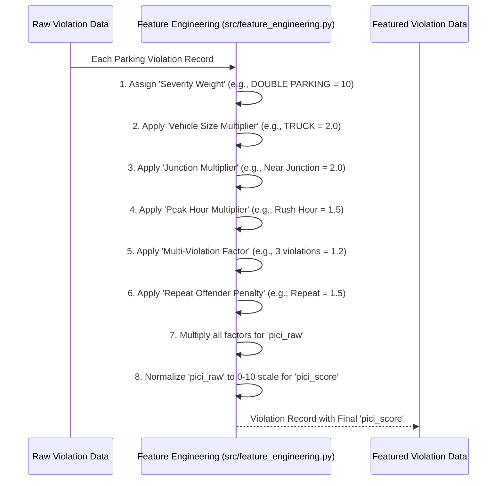

# Chapter 5: PICI (Parking-Induced Congestion Impact) Scoring

In our journey through `Gridlock_Round2`, we've seen how the [AI Data Pipeline](04_ai_data_pipeline_.md) takes raw violation data and transforms it into useful intelligence. A crucial step in this transformation, especially during the "Feature Engineering" phase, is figuring out just how *bad* each individual parking violation actually is. This is where **PICI (Parking-Induced Congestion Impact) Scoring** comes in.

### What Problem Does PICI Scoring Solve?

Imagine you're a traffic police officer in Bengaluru, looking at a long list of illegal parking incidents. Some might seem minor, like a scooter slightly over a white line late at night. Others are clearly major, like a large truck double-parked on a busy main road during rush hour, blocking an entire lane.

You need a way to tell the difference quickly – to prioritize which violations are causing the most chaos and need immediate attention. Since we don't have real-time traffic sensor data for every street, we can't measure the exact delay each parking violation causes.

This is the problem PICI Scoring solves! It's like a **custom severity meter** for parking violations. It assigns a numerical "impact score" to each violation, estimating how much it *likely* contributes to traffic congestion based on its visible characteristics. This helps you focus on the biggest problems, even without fancy traffic flow sensors.

**Central Use Case:** A BTP officer needs to prioritize patrols. By looking at areas with high PICI scores, they can ensure their limited resources are tackling the violations that have the worst impact on traffic.

### Key Concepts of Our Severity Meter

PICI scoring is designed to be smart and logical, combining several factors into one easy-to-understand number:

1.  **Violation Type Matters:** Different types of parking violations have different impacts.
    *   `DOUBLE PARKING` is generally worse than `NO PARKING`.
    *   `PARKING NEAR A JUNCTION` is worse than parking mid-block.
2.  **Vehicle Size Matters:** A large truck blocking a lane causes more disruption than a scooter.
3.  **Time and Place Matter:** A violation during peak hour on a main road near a junction is much more impactful than the same violation at 3 AM on a quiet residential street.
4.  **Repeat Offenders Matter:** A vehicle that constantly violates parking rules probably causes more ongoing issues.

By combining these ideas, PICI gives each parking violation a score, typically from 0 to 10, where a higher score means a higher estimated impact on traffic.

### How to Use PICI Scoring

As a user of the `Gridlock_Round2` dashboard, you don't directly "calculate" a PICI score. Instead, the [AI Data Pipeline](04_ai_data_pipeline_.md) automatically computes it for every single violation record. You then *see* and *use* these scores through the various visualizations and rankings on the dashboard:

*   **Heatmaps:** Areas with many high-PICI violations will glow bright red on the [Enforcement Map View](01_frontend_interactive_dashboard_.md#step-2-visualizing-where-and-when-with-the-enforcement-map).
*   **Hotspot Rankings:** The dashboard will list [Hotspot Detection (DBSCAN)](06_hotspot_detection__dbscan__.md) areas, ranked by their *total aggregated PICI score*, so you know which clusters of violations are the most problematic.
*   **Patrol Recommendations:** The [Patrol Recommendation Engine (XGBoost)](07_patrol_recommendation_engine__xgboost__.md) uses PICI scores to prioritize when and where to send patrols for maximum impact.

For example, if a BTP officer sees a table of hotspots, they can immediately identify the one with the highest PICI score and understand that this is the area demanding the most urgent attention, because our system estimates it's causing the most traffic problems.

### Under the Hood: The PICI Calculation

The PICI score is calculated during the "Feature Engineering" stage of our [AI Data Pipeline](04_ai_data_pipeline_.md), specifically in the `engineer_features` function within `src/feature_engineering.py`. It works by assigning weights and multipliers to different characteristics of each parking violation.

Here's a simplified sequence of how PICI is calculated:



Let's look at the key parts of the code that make this happen:

#### 1. Assigning Severity Weights to Violation Types

First, we define how severe each type of parking violation is. This is a dictionary where each violation type gets a base numerical weight.

```python
# From src\feature_engineering.py
SEVERITY_WEIGHTS = {
    'DOUBLE PARKING': 10,
    'PARKING OPPOSITE TO ANOTHER PARKED VEHICLE': 9,
    'PARKING IN A MAIN ROAD': 8,
    'PARKING NEAR ROAD CROSSING': 7,
    'PARKING NEAR BUSTOP/SCHOOL/HOSPITAL ETC': 6,
    'WRONG PARKING': 4,
    'NO PARKING': 3,
    'DEFECTIVE NUMBER PLATE': 0, # This doesn't cause congestion
}

def engineer_features(input_path: Path, output_path: Path):
    # ... (loading data) ...
    df['severity_score'] = df['violation_list'].apply(
        lambda lst: sum(SEVERITY_WEIGHTS.get(v, 2) for v in lst)
    )
    # ...
```
**Explanation:** This code snippet defines `SEVERITY_WEIGHTS`. Notice how "DOUBLE PARKING" gets a 10, while "NO PARKING" gets a 3 – reflecting their different impacts. The `df['severity_score']` line then calculates a total severity for each violation record by adding up the weights of all violation types found in that record (since one incident can have multiple violations).

#### 2. Applying Multipliers for Vehicle Size, Junctions, and Peak Hours

Next, we introduce multipliers that increase the PICI score for factors that make congestion worse: larger vehicles, being near a junction, or occurring during peak traffic hours.

```python
# From src\feature_engineering.py
VEHICLE_SIZE_FACTOR = {
    'TANKER': 2.0, 'BUS': 2.0, 'TRUCK': 2.0, # Heavy vehicles have larger multipliers
    'CAR': 1.5, 'MAXI-CAB': 1.5,
    'PASSENGER AUTO': 1.2,
    'SCOOTER': 1.0, 'MOTOR CYCLE': 1.0, # Smallest vehicles have base multiplier
    # ... other vehicle types ...
}

def engineer_features(input_path: Path, output_path: Path):
    # ... (previous calculations) ...
    df['vehicle_size_factor'] = df['final_vehicle_type'].map(VEHICLE_SIZE_FACTOR).fillna(1.0)
    
    # Junctions are worse for traffic flow
    df['junction_multiplier'] = df['has_junction'].map({1: 2.0, 0: 1.0}).fillna(1.0)
    
    # Peak hours are when traffic is busiest
    df['peak_hour_multiplier'] = df['is_peak_hour'].map({1: 1.5, 0: 1.0}).fillna(1.0)
    # ...
```
**Explanation:** This part of the code assigns a `vehicle_size_factor` based on the vehicle type (e.g., a "TANKER" gets a 2.0, doubling its impact). It also sets `junction_multiplier` to 2.0 if the violation is near a named junction, and `peak_hour_multiplier` to 1.5 if it's during rush hour. These multipliers increase the overall impact score.

#### 3. Combining All Factors into a Raw PICI Score

Finally, all these weights and multipliers are combined (multiplied together) to get a `pici_raw` score for each violation. Then, this raw score is normalized to fit a simple 0-10 scale.

```python
# From src\feature_engineering.py
def engineer_features(input_path: Path, output_path: Path):
    # ... (all previous factor calculations) ...
    
    # Calculate the raw PICI score by multiplying all factors
    df['pici_raw'] = (
        df['severity_score']
        * df['vehicle_size_factor']
        * df['junction_multiplier']
        * df['peak_hour_multiplier']
        * df['multi_vio_factor'] # Multiplier for multiple violations
        * df['repeat_penalty']   # Penalty for repeat offenders
    )
    
    # Normalize the raw score to a 0-10 scale
    pici_max = df['pici_raw'].max()
    df['pici_score'] = ((df['pici_raw'] / max(pici_max, 1e-9)) * 10).round(3)
    
    df.to_parquet(output_path, index=False)
    # ...
```
**Explanation:** The `pici_raw` calculation multiplies all the individual factors we just discussed. This results in a number that directly reflects the estimated impact. Since this raw number can vary greatly depending on the dataset, we then normalize it (`pici_raw / max(pici_max, 1e-9)) * 10`). This converts the highest raw score to 10 and scales all other scores proportionally, making the `pici_score` easy to interpret between 0 and 10.

### Conclusion

PICI (Parking-Induced Congestion Impact) Scoring is a clever way for `Gridlock_Round2` to estimate the real-world impact of parking violations, even without live traffic data. By using a combination of violation type, vehicle size, location, time, and repeat offender status, it creates a simple, normalized score that helps traffic police prioritize their enforcement efforts. This custom "severity meter" is a vital output of our [AI Data Pipeline](04_ai_data_pipeline_.md)'s feature engineering stage, and it's the foundation for many of the intelligent insights you see on the dashboard.

Now that we understand how individual violations are scored for their impact, how do we use these scores to find geographical "hotspots" of congestion? That's what we'll explore in the next chapter!

[Next Chapter: Hotspot Detection (DBSCAN)](06_hotspot_detection__dbscan__.md)

---
