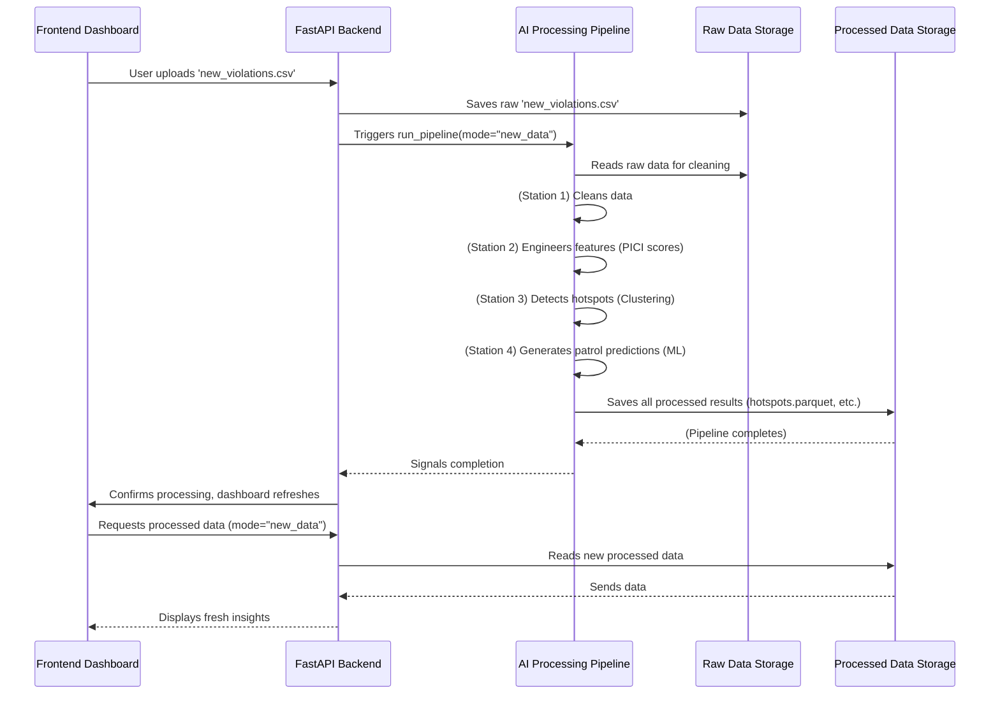

# Chapter 6: AI Processing Pipeline

Welcome back to the `Gridlock_Round2` tutorial! In our [previous chapter, Historical and New Data Modes](05_historical_and_new_data_modes_.md), we learned how our system can switch between looking at a big historical dataset and a fresh, smaller dataset you just uploaded. But how does our system *turn* that raw, newly uploaded parking violation data into all the smart insights – the PICI scores, hotspots, and patrol recommendations – that the dashboard shows?

Imagine you have a big pile of raw materials (like sand, wood, and metal) and you want to build a fancy car. You can't just throw them together! You need a factory with different stations: one for shaping metal, one for assembling the engine, another for painting, and so on.

Our **AI Processing Pipeline** is exactly like that **smart factory** for data! It's the core intelligence engine that takes raw parking violation data (like a messy CSV file) and transforms it, step-by-step, into the refined, actionable insights you see on the dashboard.

## What is the AI Processing Pipeline?

The AI Processing Pipeline is a series of automated steps that `Gridlock_Round2` uses to make sense of parking violation data. It ensures that every piece of raw data, whether it's from our huge historical dataset or a small, new upload, goes through the same intelligent process.

Think of it as an assembly line, where each "station" adds more value and intelligence to the data:

1.  **Station 1: Data Cleaning:** Raw CSV files can be messy. This station makes sure the data is neat and ready for analysis (e.g., fixing dates, making sure coordinates are numbers).
2.  **Station 2: Feature Engineering:** Here, we calculate important "clues" from the cleaned data, like the [PICI (Parking-Induced Congestion Impact) Score](01_pici__parking_induced_congestion_impact__score_.md) for each violation.
3.  **Station 3: Hotspot Detection:** Using these clues, this station finds groups of violations that form "hotspots" using clustering, as we discussed in [Hotspot Detection & Ranking](02_hotspot_detection___ranking_.md).
4.  **Station 4: Patrol Recommendation:** This final station uses machine learning to predict *when* and *where* patrols are needed most, creating the recommendations you see in the [Patrol Recommendation Engine](03_patrol_recommendation_engine_.md).

The output of this entire pipeline is a set of refined, easy-to-use datasets that the [Frontend Dashboard](04_frontend_dashboard_.md) can then display.

## How You "Use" the Pipeline (Behind the Scenes)

As a user of the `Gridlock_Round2` system, you don't directly "run" the pipeline yourself with complex commands. Instead, you interact with it indirectly, especially in **New Data Mode**:

1.  You navigate to the "New Data" section on the dashboard.
2.  You click the "Upload CSV" button and select your new parking violation file.
3.  You click "Process Upload."

Behind the scenes, the system immediately **triggers the AI Processing Pipeline** with your new file. You'll see a loading indicator, and after a few moments, the dashboard will refresh to show the insights generated *specifically from your uploaded data*. It's that simple for you, but a lot of work for the pipeline!

## Under the Hood: The Pipeline's Journey

Let's take a closer look at what happens when the pipeline is triggered, using our "assembly line" analogy.

### Step-by-Step Flow:



1.  **Raw Data Ingest:** Your uploaded CSV file is first saved to a temporary "raw data" area.
2.  **Pipeline Activation:** The [FastAPI Backend](07_fastapi_backend_.md) then calls the main orchestrator function of our **AI Processing Pipeline**.
3.  **Data Cleaning (`src/data_pipeline.py`):** The pipeline's first job is to clean the raw data. This involves:
    *   Making sure all necessary columns are present (validation).
    *   Filtering out "rejected" violations.
    *   Converting dates to the correct format.
    *   Ensuring geographical coordinates are valid numbers.
4.  **Feature Engineering (`src/feature_engineering.py`):** The cleaned data then moves to the next station. Here, the system calculates many useful "clues" from each violation. The most important one is the [PICI (Parking-Induced Congestion Impact) Score](01_pici__parking_induced_congestion_impact__score_.md), but it also figures out things like:
    *   Vehicle categories (e.g., heavy, medium).
    *   Whether the violation happened during peak hours or near a junction.
    *   If it's a repeat offender.
5.  **Hotspot Detection (`src/ml_models.py`):** With PICI scores and other features, the pipeline identifies [Hotspot Detection & Ranking](02_hotspot_detection___ranking_.md). It uses the DBSCAN algorithm to group nearby violations into clusters, which are then ranked by their total PICI score. For new, smaller uploads, the clustering is adjusted to be more sensitive (looking for `min_samples=5` violations within 50 meters, compared to `min_samples=50` for historical data) to ensure even small demo files can show hotspots.
6.  **Patrol Recommendation (`src/ml_models.py`):** Finally, the clustered data is used to train and run the [Patrol Recommendation Engine](03_patrol_recommendation_engine_.md). This uses machine learning (XGBoost) to predict future violation counts and PICI scores for different hotspots, days, and hours, generating a prioritized patrol schedule.
7.  **Processed Data Output:** All these refined results (cleaned data, featured data, hotspots, patrol recommendations) are saved as special `parquet` files in a dedicated `processed/new_data` folder. These `parquet` files are super-efficient for the dashboard to read quickly.

### Diving into the Code (Simplified)

The main brain orchestrating all these steps is the `run_pipeline` function located in `src/main.py`. Let's look at its simplified structure:

```python
# src/main.py (simplified)
from src.data_pipeline import clean_data
from src.feature_engineering import engineer_features
from src.ml_models import cluster_hotspots, train_and_predict
# ... other imports for sanity checks and paths ...

def run_pipeline(mode: str = "historical"):
    print(f"=== Starting ParkSense AI Pipeline [{mode.upper()} MODE] ===")
    
    # Define where raw data is and where processed data will go
    # (e.g., 'data/raw/new_violations.csv' and 'data/processed/new_data/')
    # ... path setup code ...

    # 1. Data Cleaning
    clean_data(RAW_DATA_PATH, CLEAN_DATA_PATH)

    # 2. Feature Engineering (calculates PICI scores, etc.)
    engineer_features(CLEAN_DATA_PATH, FEATURED_DATA_PATH)
    
    # 3. Clustering (finds hotspots)
    clustering_min_samples = 50 if mode == "historical" else 5 # Important!
    cluster_hotspots(
        FEATURED_DATA_PATH,
        HOTSPOTS_DATA_PATH,
        CLUSTERED_DATA_PATH,
        min_samples=clustering_min_samples,
    )
    
    # 4. Temporal Prediction (recommends patrols)
    train_and_predict(CLUSTERED_DATA_PATH, HOTSPOTS_DATA_PATH, PATROLS_DATA_PATH)
    
    # ... print sanity report ...
    print("\n=== Pipeline Execution Complete ===")
```
This `run_pipeline` function is like the factory manager. It calls each specialized station (`clean_data`, `engineer_features`, `cluster_hotspots`, `train_and_predict`) in the correct order, making sure the data flows smoothly from raw to highly intelligent insights. Notice how `clustering_min_samples` cleverly adapts based on the `mode` to ensure useful hotspots are found even for small uploads.

Let's briefly see how the `clean_data` function starts the process:

```python
# src/data_pipeline.py (simplified)
import pandas as pd
from pathlib import Path

# ... REQUIRED_RAW_COLUMNS list and safe_load function ...

def clean_data(input_path: Path, output_path: Path):
    print(f"Cleaning data from {input_path.name}...")
    
    df = pd.read_csv(input_path) # Read the raw CSV
    # ... validation_status filtering ...
        
    df['violation_list'] = df['violation_type'].apply(safe_load) # Parse violation types
    df['created_datetime'] = pd.to_datetime(df['created_datetime'], errors='coerce') # Fix dates
    df = df[df['created_datetime'].notna()].copy() # Remove bad date rows

    # ... more data cleaning like validating lat/lng ...

    df.to_parquet(output_path, index=False) # Save as fast parquet file
    print(f"Cleaned data saved to {output_path.name}")
```
This `clean_data` function is the first station in our factory. It takes the raw CSV, performs essential cleaning steps like converting date strings to proper date objects and making sure coordinates are valid, and then saves the tidy data in a more efficient `parquet` format for the next steps.

The `engineer_features` and `ml_models` functions (which contain `cluster_hotspots` and `train_and_predict`) work similarly, taking the output from the previous step, applying their intelligence, and saving new, enriched data for the next station.

## Conclusion

The AI Processing Pipeline is the powerhouse behind `Gridlock_Round2`. It's the sophisticated "factory assembly line" that tirelessly cleans, enriches, and analyzes raw parking violation data to produce the actionable intelligence displayed on the dashboard. By automating this multi-step process, it ensures that BTP officers always have access to the most refined insights, whether they are looking at historical trends or fresh, newly uploaded data.

Now that we understand how the data gets processed, let's explore how these processed insights are made available to the dashboard. In the next chapter, we'll dive into the **FastAPI Backend**, which acts as the crucial link between our AI pipeline and the user interface.

[Next Chapter: FastAPI Backend](07_fastapi_backend_.md)

---

