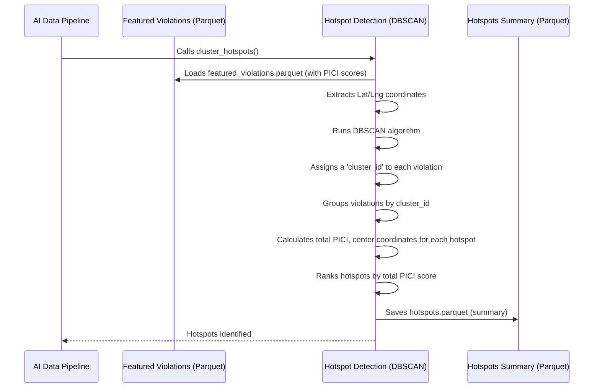

# Chapter 6: Hotspot Detection (DBSCAN)

In our last chapter, [PICI (Parking-Induced Congestion Impact) Scoring](05_pici__parking_induced_congestion_impact__scoring_.md), we learned how `Gridlock_Round2` assigns a "severity score" to each individual parking violation. Now that we know how *bad* each single incident is, the next logical question for a BTP officer is: "Where do these bad incidents *cluster* together? Where are the real problem areas?"

This is exactly what **Hotspot Detection (DBSCAN)** solves. It's the system's "spotlight" for finding where illegal parking violations concentrate, turning scattered incidents into clear, actionable problem zones.

### What Problem Does Hotspot Detection Solve?

Imagine you're trying to find the most popular spots for street food in Bengaluru. You wouldn't look at just one food stall; you'd look for areas where many stalls are grouped closely together, creating a bustling food "hotspot."

Similarly, for parking violations, seeing a single illegally parked car isn't as concerning as finding an entire block notorious for repeat offenders and high-impact violations. Knowing these **hotspots** allows BTP officers to deploy their patrols strategically, focusing resources where they'll have the biggest impact on reducing congestion.

**Central Use Case:** A BTP officer needs to identify the top 10 areas in Bengaluru where illegal parking is most concentrated and causes the most congestion, so they can plan focused enforcement drives. Hotspot Detection provides these critical locations.

### Key Concepts: Finding the Crowded Parties

Hotspot detection in `Gridlock_Round2` uses a smart technique called **DBSCAN**. Don't worry about the long name; it simply stands for "Density-Based Spatial Clustering of Applications with Noise." Think of it like this:

1.  **What's a Hotspot? (The "Party"):** A hotspot is an area where many parking violations (our "people") are found very close to each other. It's a "dense" group.
2.  **How to Find a Party? (DBSCAN's Rules):** DBSCAN works by looking at two simple rules for each parking violation:
    *   **`epsilon` (or `eps`): The "Radius of Friendship":** This is a distance. If you're a parking violation, `epsilon` is how far you're willing to look to find "friends." If another violation is within your `epsilon` distance, you consider it a neighbor. In our system, this is set to 50 meters.
    *   **`min_samples`: The "Minimum Party Size":** This is a number. To form a proper "party" (a hotspot), you need at least `min_samples` friends within your `epsilon` distance. If you don't have enough friends, you might just be a lone violator.
3.  **"Noise": The Lone Wolves:** If a parking violation can't find enough friends within `epsilon` distance to meet the `min_samples` requirement, it's considered "noise." These are isolated incidents and don't form a hotspot on their own.

By applying these two rules to all parking violations, DBSCAN finds these "parties" or clusters, which are our desired hotspots!

### How to Use Hotspot Detection

As a BTP officer using the `Gridlock_Round2` [Frontend Interactive Dashboard](01_frontend_interactive_dashboard_.md), you don't directly run DBSCAN. Instead, the [AI Data Pipeline](04_ai_data_pipeline_.md) automatically runs it for you whenever new data is processed. You then see the powerful results directly on your screen:

*   **Enforcement Map View:** Hotspot locations are marked clearly on the map, often with markers that show their rank and total PICI score.
*   **Hotspot Table:** A table on the main dashboard ([Chapter 1: Frontend Interactive Dashboard](01_frontend_interactive_dashboard_.md)) lists the hotspots, ranked by their total [PICI (Parking-Induced Congestion Impact) Scoring](05_pici__parking_induced_congestion_impact__scoring_.md). This directly helps you answer the central use case of finding the top problem areas.

For example, when you switch to "New Data" mode after uploading a fresh CSV, the system instantly recalculates hotspots using DBSCAN and shows you the latest problem areas based *only* on that new data.

### Under the Hood: DBSCAN in Action

Hotspot detection is a key part of the "AI Models" stage within our [AI Data Pipeline](04_ai_data_pipeline_.md). The `run_pipeline` function calls a specific function, `cluster_hotspots`, which handles all the DBSCAN magic.

Here's a simplified view of how it fits into the pipeline:



Now, let's look at the actual code that performs this clustering, found in `src/ml_models.py`.

#### 1. Loading Data and Setting Up Coordinates

The `cluster_hotspots` function first loads the processed data (which already includes PICI scores) and prepares the location coordinates for DBSCAN.

```python
# From src\ml_models.py
import pandas as pd
import numpy as np
from sklearn.cluster import DBSCAN
from pathlib import Path

def cluster_hotspots(input_path: Path, hotspots_out: Path, clustered_out: Path, min_samples: int = 50):
    """Uses DBSCAN to identify chronic hotspots."""
    print("Clustering Hotspots...")
    df = pd.read_parquet(input_path) # Load data with PICI scores

    coords = df[['latitude', 'longitude']].values # Get latitude and longitude
    coords_radians = np.radians(coords) # Convert to radians for distance calculation
    # ...
```
**Explanation:** This code snippet loads the `featured_violations.parquet` file. This file contains all the individual parking violations, now enriched with features like `pici_score`. It then extracts the `latitude` and `longitude` of each violation and converts them to "radians," which is a special format needed for calculating geographical distances accurately with DBSCAN.

#### 2. Configuring and Running DBSCAN

Next, the DBSCAN algorithm is set up with its `epsilon` (distance) and `min_samples` (minimum size) parameters, and then it's run on our violation locations.

```python
# From src\ml_models.py
# ... (previous code) ...

    EARTH_RADIUS_KM = 6371.0088 # Earth's radius for distance calculation

    EPSILON_METERS = 50 # Our "radius of friendship" is 50 meters
    eps_radians = (EPSILON_METERS / 1000.0) / EARTH_RADIUS_KM # Convert 50m to radians

    dbscan = DBSCAN(eps=eps_radians, min_samples=min_samples, metric='haversine', algorithm='ball_tree', n_jobs=-1)
    df['cluster_id'] = dbscan.fit_predict(coords_radians) # Run DBSCAN and assign a cluster ID

    # ...
```
**Explanation:**
*   `EPSILON_METERS = 50`: This is our chosen "radius of friendship." Any two violations within 50 meters of each other can potentially be part of the same hotspot.
*   `eps_radians`: DBSCAN needs this distance in a special "radians" unit, which is calculated using the Earth's radius.
*   `min_samples=min_samples`: This is the "minimum party size." As discussed in [Chapter 3: Two-Mode Operational Data](03_two_mode_operational_data_.md), this value changes:
    *   For **Historical Mode**: `min_samples = 50` (stricter, for chronic hotspots over a large dataset).
    *   For **New Data Mode**: `min_samples = 5` (less strict, to find smaller clusters in newly uploaded data).
*   `dbscan.fit_predict(coords_radians)`: This is where DBSCAN does its work! It looks at all the points and assigns a `cluster_id` to each. If a violation is "noise" (not part of any cluster), it gets a `cluster_id` of -1.

#### 3. Summarizing and Ranking Hotspots

After DBSCAN finds the clusters, the code summarizes each cluster (hotspot) by calculating its total PICI score, finding a central point, and then ranking them.

```python
# From src\ml_models.py
# ... (previous code) ...

    df_hotspots_raw = df[df['cluster_id'] != -1] # Keep only violations that belong to a cluster

    hotspots = df_hotspots_raw.groupby('cluster_id').agg(
        total_violations=('id', 'count'), # Count how many violations in this hotspot
        total_pici=('pici_score', 'sum'), # Sum up PICI scores for total impact
        avg_pici=('pici_score', 'mean'),  # Average PICI score
        # ... other summary stats like mean_lat, mean_lng, primary_police_station ...
    ).reset_index()

    # (Simplified) Find a representative "center point" (medoid) for each hotspot
    # The actual code iterates to find the point closest to the average lat/lng within the cluster.
    hotspots['center_lat'] = hotspots['mean_lat'] # Placeholder for brevity, actual logic is more complex
    hotspots['center_lng'] = hotspots['mean_lng'] # Placeholder for brevity

    hotspots = hotspots.sort_values('total_pici', ascending=False).reset_index(drop=True)
    hotspots['hotspot_rank'] = hotspots.index + 1 # Assign a rank (1st, 2nd, etc.)

    hotspots.to_parquet(hotspots_out, index=False) # Save the hotspot summary
    df.to_parquet(clustered_out, index=False) # Save the original data with cluster_ids
    print(f"Hotspots saved to {hotspots_out.name}")
```
**Explanation:**
*   `df_hotspots_raw = df[df['cluster_id'] != -1]`: We filter out the "noise" (-1 cluster IDs) and keep only the violations that belong to a detected hotspot.
*   `hotspots.groupby('cluster_id').agg(...)`: This is where we create a summary for each hotspot. We count the `total_violations`, sum up their `pici_score` (giving us the `total_pici` for the entire hotspot), calculate the `avg_pici`, and even find the `primary_police_station` for that area.
*   `hotspots['center_lat']` / `hotspots['center_lng']`: The actual code calculates a "geospatial medoid," which is a fancy way of saying it finds the *actual violation point* that is most central to the cluster. This gives us a precise coordinate to mark the hotspot on the map.
*   `hotspots.sort_values(...)`: The hotspots are then sorted from highest `total_pici` to lowest, and a `hotspot_rank` is assigned. This directly provides the prioritized list for the BTP officer!
*   Finally, two files are saved: `hotspots.parquet` (the summary table of all detected and ranked hotspots) and `clustered_violations.parquet` (the original violation data, now with their assigned `cluster_id` and `hotspot_rank`).

### Conclusion

You've now seen how **Hotspot Detection (DBSCAN)** is the "spotlight" of `Gridlock_Round2`, transforming individual parking violations into actionable, ranked problem areas. By using the DBSCAN algorithm with carefully chosen parameters, the system identifies dense clusters of high-impact violations, providing BTP officers with a clear roadmap for targeted enforcement. This foundational step of identifying *where* the problems are then feeds directly into figuring out *when* and *how* to best intervene.

In our final chapter, we'll explore how all this intelligence comes together to recommend precise patrol schedules using an advanced prediction model.

[Next Chapter: Patrol Recommendation Engine (XGBoost)](07_patrol_recommendation_engine__xgboost__.md)

---
