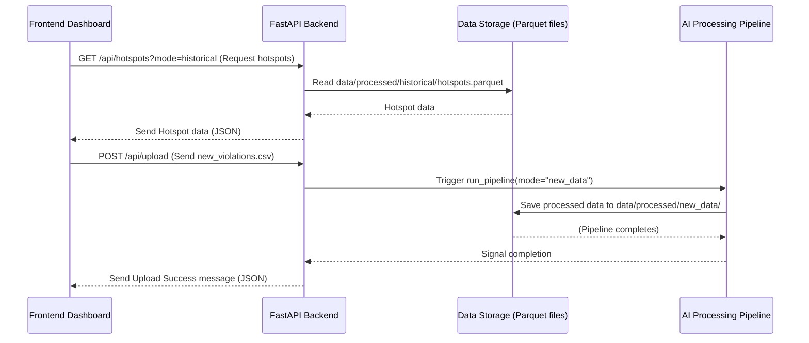

# Chapter 7: FastAPI Backend

Welcome back to the `Gridlock_Round2` tutorial! We've journeyed through the core intelligence of our project: from understanding individual [PICI (Parking-Induced Congestion Impact) Scores](01_pici__parking_induced_congestion_impact__score_.md), to finding [Hotspot Detection & Ranking](02_hotspot_detection___ranking_.md), generating [Patrol Recommendation Engine](03_patrol_recommendation_engine_.md) suggestions, and seeing it all come to life on the [Frontend Dashboard](04_frontend_dashboard_.md) across [Historical and New Data Modes](05_historical_and_new_data_modes_.md), powered by the [AI Processing Pipeline](06_ai_processing_pipeline_.md).

Now, let's talk about how all these parts *talk to each other*. Imagine our system is a complex body. The AI pipeline is the brain that thinks, the dashboard is the eyes and hands that interact with the world, and the processed data files are the memory. But what's the central nervous system that connects the brain to the eyes and hands, making sure messages are sent and received clearly and quickly?

That's where the **FastAPI Backend** comes in! It's the project's central nervous system, acting like a super-efficient messenger or a helpful waiter in a busy restaurant.

## What is a Backend?

In simple terms, a "backend" is the part of a software application that users *don't* directly see. It runs on a server (a powerful computer) and handles all the heavy lifting behind the scenes.

Think of it like this:
*   The **Frontend Dashboard** is the beautiful menu and the friendly waiter who takes your order at a restaurant.
*   The **Backend** is the kitchen, the chefs, and the storage room. When you order "hotspots" (like a dish), the waiter (backend) goes to the kitchen, gets the ingredients (data), prepares them, and brings the "dish" back to you.

The backend's main jobs are:
1.  **Receiving Requests:** Getting "orders" from the frontend (like "show me all violations" or "upload this new data").
2.  **Processing Data:** Fetching information from our processed data files (like `hotspots.parquet`) or telling the [AI Processing Pipeline](06_ai_processing_pipeline_.md) to run.
3.  **Sending Responses:** Delivering the requested information back to the frontend in a structured format (usually JSON, which is like a standardized recipe card).
4.  **Enforcing Rules:** Making sure things like file sizes for uploads are within limits, or that requests are coming from valid sources.

## What is FastAPI?

FastAPI is a modern, fast (hence the "Fast" in its name), web framework for building APIs with Python. An "API" (Application Programming Interface) is essentially a set of rules that allows different software applications to communicate with each other. It defines how data should be requested and how it will be delivered.

In our `Gridlock_Round2` project, FastAPI is the chosen tool to build this "waiter" or "central nervous system." It excels at:
*   **Speed:** It's very quick at handling requests.
*   **Ease of Use:** It's designed to be easy for developers to use and build APIs.
*   **Documentation:** It automatically generates interactive documentation for our API, which is helpful for understanding what requests you can make.

So, whenever the [Frontend Dashboard](04_frontend_dashboard_.md) needs anything – whether it's the list of top hotspots, the latest statistics, or wants to upload a new CSV file – it sends a message to our **FastAPI Backend**.

## How the Frontend Uses the FastAPI Backend

From the frontend's perspective, using the backend is like making a phone call to ask for information or give an instruction. Each specific "ask" has a unique "phone number" (called an **endpoint** or **route**).

Here are some examples of what the frontend might ask:

*   **"Show me the top hotspots!"**
    *   Frontend sends a request to: `/api/hotspots`
    *   Backend responds with a list of hotspots (their rank, location, PICI score, etc.) in JSON format.

*   **"What are the overall statistics?"**
    *   Frontend sends a request to: `/api/stats`
    *   Backend responds with total violations, number of hotspots, etc.

*   **"I have new data to process!"**
    *   Frontend sends a special request (an "upload") to: `/api/upload`
    *   Backend receives the file, triggers the [AI Processing Pipeline](06_ai_processing_pipeline_.md), and then confirms it's done.

The frontend often also specifies *which* data it wants, using a `mode` parameter: `?mode=historical` or `?mode=new_data`. This tells the backend to fetch either the long-term city-wide data or the freshly processed data from an upload.

## Under the Hood: How FastAPI Works

Let's peek behind the kitchen doors to see how our FastAPI backend handles these requests.

### Step-by-Step Flow



1.  **Request Arrives:** The FastAPI backend constantly "listens" for incoming requests (like a waiter listening for orders).
2.  **Route Matching:** It checks the incoming "phone number" (the URL path, e.g., `/api/hotspots`) and matches it to a specific Python function designed to handle that request.
3.  **Parameter Handling:** It reads any extra details, like the `mode` parameter (`historical` or `new_data`) or the uploaded file.
4.  **Logic Execution:**
    *   **For Data Retrieval (GET requests):** The backend calls functions to load the correct `parquet` files from the `data/processed/{mode}` folder.
    *   **For Data Uploads (POST requests):** The backend first saves the raw CSV file and then triggers the `run_pipeline` function from our [AI Processing Pipeline](06_ai_processing_pipeline_.md) to process this new data. It also performs checks, like ensuring the uploaded file isn't too big.
5.  **Response Generation:** Once the data is fetched or the processing is done, FastAPI converts the Python data (like a Pandas DataFrame) into a JSON format that the frontend can easily understand.
6.  **Response Sent:** The JSON data is sent back to the frontend dashboard.

### Diving into the Code (Simplified)

Our FastAPI backend lives in the `backend/app` directory.

#### 1. The Main FastAPI App (`backend/app/main.py`)

This file sets up the main FastAPI application. It's like turning on the "restaurant" and setting up the general rules, such as allowing the frontend (which runs on a different address) to talk to it (that's what `CORSMiddleware` does).

```python
# backend/app/main.py (simplified)
from fastapi import FastAPI
from fastapi.middleware.cors import CORSMiddleware
from app.api.router import api_router # Imports all our specific "routes"
from app.core.config import settings

def create_app() -> FastAPI:
    app = FastAPI(title=settings.app_name, description=settings.app_description)

    # This allows your frontend (e.g., http://localhost:5173) to talk to your backend
    app.add_middleware(
        CORSMiddleware,
        allow_origins=settings.allow_origins, # e.g., ["http://localhost:5173"]
        allow_credentials=True,
        allow_methods=["*"],
        allow_headers=["*"],
    )

    # This connects all our specific API "phone numbers" (routes)
    app.include_router(api_router)

    return app

app = create_app()
```
This code creates the `FastAPI` instance (`app`) and tells it to `include_router(api_router)`, which loads all the specific "phone numbers" (like `/api/hotspots` or `/api/upload`) that the backend will respond to.

#### 2. Handling Data Requests (`backend/app/api/routes/analytics.py`)

This file contains functions that define how the backend responds to requests for analytical data, such as hotspots, statistics, or summaries.

```python
# backend/app/api/routes/analytics.py (simplified)
from typing import List
from fastapi import APIRouter
from app.schemas.analytics import Hotspot # Defines the structure of a Hotspot response
from app.services.datasets import get_data_dir, load_parquet # Helpers to get data

router = APIRouter()

@router.get("/hotspots", response_model=List[Hotspot])
def get_hotspots(mode: str = "historical"):
    """Return chronic parking violation hotspots."""
    # 1. Figure out which data directory to use (historical or new_data)
    hotspots_path = get_data_dir(mode) / "hotspots.parquet"
    
    # 2. Load the data from that parquet file
    df = load_parquet(hotspots_path)
    
    # 3. Convert the data into a list of dictionaries (JSON format) and return it
    return df.to_dict(orient="records")
```
This snippet shows a typical FastAPI *endpoint*. The `@router.get("/hotspots")` part tells FastAPI that this Python function `get_hotspots` should run whenever a GET request is made to `/api/hotspots`.

Notice `mode: str = "historical"`. This means if the frontend asks for `/api/hotspots`, `mode` will automatically be `"historical"`. If it asks for `/api/hotspots?mode=new_data`, `mode` will be `"new_data"`. This `mode` is then used by `get_data_dir(mode)` to fetch data from the correct folder.

#### 3. Locating Data Files (`backend/app/services/datasets.py`)

This helper file is crucial for letting the backend know *where* to find the processed data, depending on whether we're in `historical` or `new_data` mode.

```python
# backend/app/services/datasets.py (simplified)
from pathlib import Path
from fastapi import HTTPException
from app.core.config import settings # Contains base paths like 'data/processed'
import pandas as pd

def get_data_dir(mode: str) -> Path:
    if mode not in {"historical", "new_data"}:
        raise HTTPException(status_code=400, detail="Invalid mode.")
    # This constructs the path, e.g., 'data/processed/historical'
    return settings.processed_data_dir / mode

def load_parquet(path: Path) -> pd.DataFrame:
    # This function actually reads the .parquet file from the given path
    # (Simplified for brevity, includes caching and error handling)
    try:
        df = pd.read_parquet(path)
        return df
    except Exception as exc:
        raise HTTPException(status_code=500, detail=f"Failed to read {path.name}: {exc}")
```
The `get_data_dir` function is straightforward but vital. It takes the `mode` and creates the complete path to either `data/processed/historical` or `data/processed/new_data`. This ensures that `load_parquet` always reads from the correct set of processed files.

#### 4. Handling File Uploads (`backend/app/api/routes/upload.py`)

This file defines the endpoint for uploading new CSV files and triggers the [AI Processing Pipeline](06_ai_processing_pipeline_.md).

```python
# backend/app/api/routes/upload.py (simplified)
from fastapi import APIRouter, File, HTTPException, UploadFile
from app.services.pipeline import process_new_upload # Imports our pipeline function
from app.core.config import settings # To get max file size

router = APIRouter()

@router.post("/upload") # This handles POST requests to /api/upload
def upload_new_data(file: UploadFile = File(...)): # Expects a file in the request
    # 1. Basic check: Is it a CSV file?
    if not file.filename or not file.filename.lower().endswith(".csv"):
        raise HTTPException(status_code=400, detail="Only CSV files are allowed.")

    # 2. Check file size (e.g., max 50MB) BEFORE processing
    if file.size and file.size > settings.max_upload_size_bytes:
        raise HTTPException(status_code=413, detail="File too large. Max is 50MB.")
        
    # 3. If everything looks good, trigger the AI pipeline!
    try:
        process_new_upload(file) # This calls src/main.py's run_pipeline()
    except HTTPException: # Re-raise any specific HTTP errors from the pipeline
        raise
    except Exception as exc: # Catch any other pipeline errors
        raise HTTPException(status_code=500, detail=f"Pipeline failed: {exc}")

    # 4. If successful, send a confirmation message
    return {"status": "success", "mode": "new_data", "message": "New data processed."}
```
Here, the `@router.post("/upload")` decorator indicates that this function handles incoming file uploads. `file: UploadFile = File(...)` is how FastAPI expects to receive the uploaded file. Before doing any heavy processing, it checks if the file is a CSV and if its size is within limits (using `settings.max_upload_size_bytes` from `app/core/config.py`). Finally, `process_new_upload(file)` is the crucial step where our entire [AI Processing Pipeline](06_ai_processing_pipeline_.md) is executed on the new data.

#### 5. Configuration Settings (`backend/app/core/config.py`)

This file stores important settings for our application, such as allowed origins for CORS, file paths, and upload limits.

```python
# backend/app/core/config.py (simplified)
from pathlib import Path
from pydantic import BaseModel

class Settings(BaseModel):
    app_name: str = "ParkSense AI API"
    # ... other app settings ...

    processed_data_dir: Path = Path(__file__).resolve().parents[3] / "data" / "processed"
    raw_data_dir: Path = Path(__file__).resolve().parents[3] / "data" / "raw"

    max_upload_size_bytes: int = 50 * 1024 * 1024 # This is our 50MB limit!

settings = Settings()
```
This `Settings` object provides easy access to configuration values throughout the backend, like the `max_upload_size_bytes` that we saw being used in the upload endpoint.

## Conclusion

The FastAPI Backend is the unsung hero of the `Gridlock_Round2` project. It serves as the crucial communication hub, connecting the interactive [Frontend Dashboard](04_frontend_dashboard_.md) with the powerful [AI Processing Pipeline](06_ai_processing_pipeline_.md) and the stored data. By efficiently receiving requests, performing necessary logic (like loading data or triggering processing), enforcing rules, and sending back structured responses, it ensures that all the intelligence we've built is readily available and actionable for BTP officers. It truly is the central nervous system that makes our AI-driven solution a cohesive and responsive application.

---

