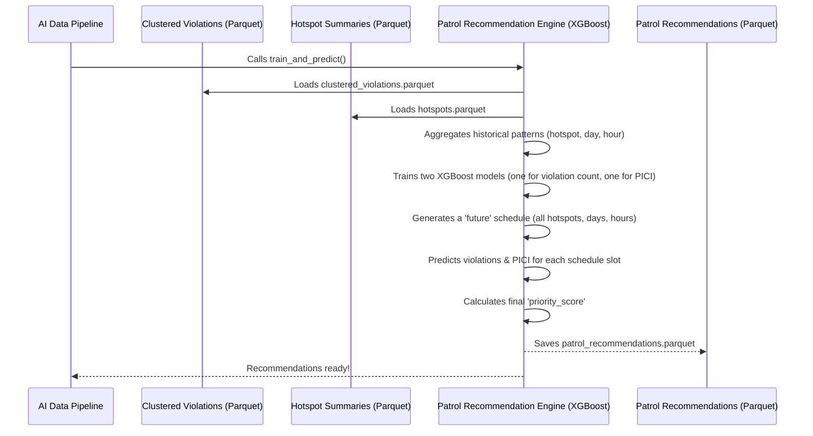

# Chapter 7: Patrol Recommendation Engine (XGBoost)

In our last chapter, [Hotspot Detection (DBSCAN)](06_hotspot_detection__dbscan__.md), we learned how `Gridlock_Round2` uses the DBSCAN algorithm to find *where* illegal parking violations are concentrated, identifying the problem areas for BTP officers. But knowing *where* isn't always enough. Officers also need to know *when* is the best time to send patrols to these hotspots to have the greatest impact.

This is where the **Patrol Recommendation Engine (XGBoost)** comes in! It's the "traffic enforcement weather forecaster" for `Gridlock_Round2`, taking all the intelligence we've gathered and turning it into actionable suggestions for future patrols.

### What Problem Does the Patrol Recommendation Engine Solve?

Imagine a BTP officer looking at a map full of glowing red hotspots. They know these are bad areas. But how do they decide if it's better to send a patrol to Koramangala at 9 AM or to Madiwala at 5 PM? Manually sifting through historical data for every hotspot, day, and hour would be impossible.

The **Patrol Recommendation Engine** solves this by acting like a smart assistant. It learns from all the past violation patterns within those identified hotspots to predict **when and where** future violations are most likely to occur and have the highest impact. It's like a weather app advising you on the best time to carry an umbrella based on predicted rain – but for traffic enforcement!

**Central Use Case:** A BTP officer needs specific, prioritized recommendations for patrol times and locations for the upcoming week to efficiently deploy resources and maximize the reduction of parking-induced congestion. This engine provides that precise guidance.

### Key Concepts: Your Smart Patrol Planner

The Patrol Recommendation Engine uses powerful AI to turn historical data into future foresight:

1.  **Learning from History:** The engine first studies past violations within each hotspot. It looks at factors like:
    *   What day of the week did violations happen?
    *   What time of day?
    *   Was it a peak hour? A holiday?
    *   What was the [PICI (Parking-Induced Congestion Impact) Scoring](05_pici__parking_induced_congestion_impact__scoring_.md) of those past violations?
2.  **XGBoost: The Smart Pattern Finder:** We use a powerful machine learning model called **XGBoost**. Don't worry about the complex name; just think of it as a highly skilled detective. It's really good at finding hidden patterns in the data that humans might miss. For example, it might learn that "Hotspot A on Tuesdays between 8-10 AM tends to have many high-PICI violations."
3.  **Making Predictions:** Once XGBoost has "learned" these patterns, it can look at a *future* time (e.g., next Wednesday at 9 AM) and for *each hotspot*, predict:
    *   How many violations are likely to occur?
    *   What will be their average [PICI (Parking-Induced Congestion Impact) Scoring](05_pici__parking_induced_congestion_impact__scoring__.md)?
4.  **Prioritized Recommendations:** Based on these predictions, the engine calculates a "priority score" for every possible patrol window (hotspot + day + hour). Higher priority means a more impactful patrol opportunity. These are then presented as a ranked list, telling the officer exactly where and when to focus.

### How to Use the Patrol Recommendation Engine

As a BTP officer using the `Gridlock_Round2` [Frontend Interactive Dashboard](01_frontend_interactive_dashboard_.md), you don't directly run the XGBoost model. It's an automated part of the [AI Data Pipeline](04_ai_data_pipeline_.md). You simply access its recommendations through the "Patrol Window (Dispatch) View".

#### Step 1: Navigating to the Patrol Window

From the main dashboard, you click the "Open Patrol Window" button (as described in [Chapter 1: Frontend Interactive Dashboard](01_frontend_interactive_dashboard_.md)).

```javascript
// From frontend\src\components\Dashboard.jsx
// Inside the renderDashboard function, this button is created:
<button type="button" data-view="dispatch" class="btn">
  <svg>...</svg>
  Open Patrol Window
</button>
```
**Explanation:** Clicking this button tells the frontend to switch to the "dispatch" view, where patrol recommendations are displayed.

#### Step 2: Filtering and Viewing Recommendations

In the Patrol Window, you'll see a list of recommended patrol times and locations. You can use filters to narrow down the suggestions, for example, by selecting a specific police station or day of the week.

The recommendations will look something like this (though presented in a clearer UI table):

| Rank | Hotspot Name | Police Station | Day | Hour Range | Predicted Violations | Avg PICI Score | Priority Score |
| :--- | :----------- | :------------- | :-- | :--------- | :------------------- | :------------- | :------------- |
| 1    | Koramangala 4th Block | Koramangala    | Mon | 09:00 - 10:00 | 25                 | 7.8            | 195            |
| 2    | Madiwala Market     | Madiwala       | Tue | 17:00 - 18:00 | 18                 | 8.1            | 145.8          |
| ...  | ...          | ...            | ... | ...        | ...                  | ...            | ...            |

**Explanation:** The dashboard shows a ranked list of patrol opportunities. The `Predicted Violations` and `Avg PICI Score` come directly from our XGBoost model's predictions. The `Priority Score` helps BTP officers quickly identify the most impactful patrol windows, fulfilling our central use case.

### Under the Hood: The XGBoost Detective

The Patrol Recommendation Engine is the final AI stage within our [AI Data Pipeline](04_ai_data_pipeline__.md). The `run_pipeline` function calls `train_and_predict`, which handles all the XGBoost logic.

Here's a simplified view of how it fits into the pipeline:



Now, let's look at key parts of the code in `src/ml_models.py` that implement this.

#### 1. Preparing Training Data

First, we need to gather all the historical data for each hotspot, day, and hour to teach our XGBoost models.

```python
# From src\ml_models.py (simplified)
import pandas as pd
import xgboost as xgb # Our prediction model
from pathlib import Path

def train_and_predict(clustered_path: Path, hotspots_path: Path, output_path: Path):
    print("Training models and predicting patrols...")
    df = pd.read_parquet(clustered_path) # Load clustered violations
    hotspots_df = pd.read_parquet(hotspots_path) # Load hotspot summaries

    df_hotspots = df[df['hotspot_rank'] != -1].copy() # Filter to actual hotspots
    df_hotspots['date'] = pd.to_datetime(df_hotspots['created_datetime']).dt.date
    df_hotspots['hour'] = pd.to_datetime(df_hotspots['created_datetime']).dt.hour

    # Group historical violations by hotspot, date, and hour to get training targets
    actual_counts = df_hotspots.groupby(['hotspot_rank', 'date', 'hour']).agg(
        target_violation_count=('id', 'count'), # How many violations happened
        target_avg_pici=('pici_score', 'mean') # What was their average PICI
    ).reset_index()

    # Create a complete grid of all possible hotspot/date/hour combinations
    # Fill in zeros where no violations occurred
    # ... (code for master_df creation and feature engineering) ...
    # ... like day_of_week, month, is_peak_hour, is_business_hours, is_holiday ...
```
**Explanation:** This snippet first loads the clustered violations (which have `hotspot_rank` and `pici_score`). It then groups these historical records by hotspot, date, and hour to count the violations (`target_violation_count`) and calculate their average PICI score (`target_avg_pici`). This becomes the "answer key" the XGBoost model will learn from. It also builds a complete `master_df` with features like `day_of_week`, `hour`, and `is_peak_hour` for every possible combination of hotspot, day, and hour.

#### 2. Training the XGBoost Models

Now, we train two separate XGBoost models: one to predict the number of violations and another to predict the average PICI score.

```python
# From src\ml_models.py (simplified)
# ... (previous data preparation and feature engineering) ...

    # Define the features our models will use for prediction
    FEATURES = ['center_lat', 'center_lng', 'day_of_week', 'hour', 'month', 'is_peak_hour', 'is_business_hours', 'is_holiday']
    X = master_df[FEATURES] # Input features for the model
    y_volume = master_df['target_violation_count'] # What we want to predict (volume)
    y_pici = master_df['target_avg_pici'] # What we want to predict (PICI)

    # ... (code to split data into training and testing sets for evaluation) ...

    # Initialize and train the XGBoost model for violation count
    model_volume = xgb.XGBRegressor(objective='count:poisson', random_state=42)
    model_volume.fit(X_train, y_vol_train) # The model learns from historical patterns

    # Initialize and train the XGBoost model for average PICI score
    model_pici = xgb.XGBRegressor(objective='reg:squarederror', random_state=42)
    model_pici.fit(X_train, y_pic_train) # The model learns from historical PICI patterns
```
**Explanation:** We define `FEATURES` that describe each potential patrol window (like the hotspot's location, day of week, and hour). Then, we create two `XGBRegressor` models. `model_volume` learns to predict the `target_violation_count`, and `model_pici` learns to predict the `target_avg_pici`. The `.fit()` method is where the "learning" happens, as XGBoost finds patterns in `X_train` that explain `y_vol_train` and `y_pic_train`.

#### 3. Generating Future Recommendations

Once the models are trained, we use them to predict for a future schedule (e.g., all 24 hours of 7 days for every hotspot).

```python
# From src\ml_models.py (simplified)
# ... (after models are trained) ...

    # Create a grid representing all future potential patrol windows
    future_grid = []
    for _, row in hotspots_df.iterrows():
        h_rank = row['hotspot_rank']
        c_lat = row['center_lat']
        c_lng = row['center_lng']
        for d in range(7): # For each day of the week
            for hr in range(24): # For each hour
                # ... generate features for this future window (is_peak_hour, etc.) ...
                future_grid.append({
                    'hotspot_rank': h_rank, 'center_lat': c_lat, 'center_lng': c_lng,
                    'day_of_week': d, 'hour': hr, # ... other features ...
                })

    schedule_df = pd.DataFrame(future_grid) # Convert the future grid into a DataFrame
    schedule_df['predicted_violations'] = model_volume.predict(schedule_df[FEATURES]).clip(min=0)
    schedule_df['predicted_pici'] = model_pici.predict(schedule_df[FEATURES]).clip(min=0, max=10)
    
    # Calculate the final priority score
    schedule_df['priority_score'] = schedule_df['predicted_violations'] * schedule_df['predicted_pici']
    
    # ... (fallback logic for sparse data) ...

    schedule_df = schedule_df.sort_values('priority_score', ascending=False).reset_index(drop=True)
    schedule_df.to_parquet(output_path, index=False) # Save the recommendations
    print(f"Patrol recommendations saved to {output_path.name}")
```
**Explanation:** This part generates a "future schedule" by creating a row for every possible combination of hotspot, day, and hour. For each of these rows, it uses the trained `model_volume` and `model_pici` to make predictions (`predicted_violations` and `predicted_pici`). Finally, it multiplies these two predictions to get a `priority_score`, ranking the most impactful patrol opportunities first. These recommendations are then saved to `patrol_recommendations.parquet`, ready for the backend to serve.

#### 4. Smart Fallback for Sparse Data (for "New Data" Mode)

Especially when processing a small, newly uploaded CSV (in "New Data" mode, as discussed in [Chapter 3: Two-Mode Operational Data](03_two_mode_operational_data__.md)), the XGBoost models might not have enough data to make robust predictions, sometimes predicting zero violations everywhere. To prevent an empty recommendation list, there's a clever fallback mechanism:

```python
# From src\ml_models.py (simplified)
# ... (after priority score calculation) ...

    if schedule_df['priority_score'].max() <= 0: # If all predictions are zero or negative
        # Fallback: use observed historical patterns within the newly uploaded data
        observed_windows = df_hotspots.groupby(['hotspot_rank', 'day_of_week', 'hour']).agg(
            fallback_violations=('id', 'count'),
            fallback_pici=('pici_score', 'mean'),
        ).reset_index()
        
        # Merge observed data back into the schedule
        schedule_df = schedule_df.drop(columns=['predicted_violations', 'predicted_pici', 'priority_score']).merge(
            observed_windows,
            on=['hotspot_rank', 'day_of_week', 'hour'],
            how='left',
        )
        schedule_df['predicted_violations'] = schedule_df['fallback_violations'].fillna(0).astype(float)
        schedule_df['predicted_pici'] = schedule_df['fallback_pici'].fillna(0).astype(float)
        schedule_df['priority_score'] = schedule_df['predicted_violations'] * schedule_df['predicted_pici']
        # ... (clean up temporary columns) ...
```
**Explanation:** This `if` statement checks if the models predicted a zero or very low `priority_score` everywhere (which can happen with very little training data). If so, it doesn't rely on the "unreliable" predictions. Instead, it falls back to simply reporting the *observed* `target_violation_count` and `target_avg_pici` from the uploaded data for each hotspot, day, and hour. This ensures that even with a small, new dataset, the BTP officer still gets meaningful, actionable recommendations based on what *did* happen, rather than an empty list.

### Conclusion

You've now reached the culmination of our intelligence journey! The **Patrol Recommendation Engine (XGBoost)** is the final, crucial step in `Gridlock_Round2`. It leverages the power of machine learning (specifically, XGBoost) to predict future parking violation patterns within identified hotspots. By learning from historical data and [PICI (Parking-Induced Congestion Impact) Scoring](05_pici__parking_induced_congestion_impact__scoring_.md), it generates a prioritized list of specific times and locations, acting as a smart "traffic enforcement weather forecaster." This actionable intelligence empowers BTP officers to deploy their limited resources strategically, moving from reactive responses to proactive, data-driven enforcement that maximizes impact on Bengaluru's traffic congestion.

This completes our exploration of the core concepts behind `Gridlock_Round2`! You've seen how raw data is transformed into a powerful, interactive system, designed to make a real difference in urban traffic management.

---

