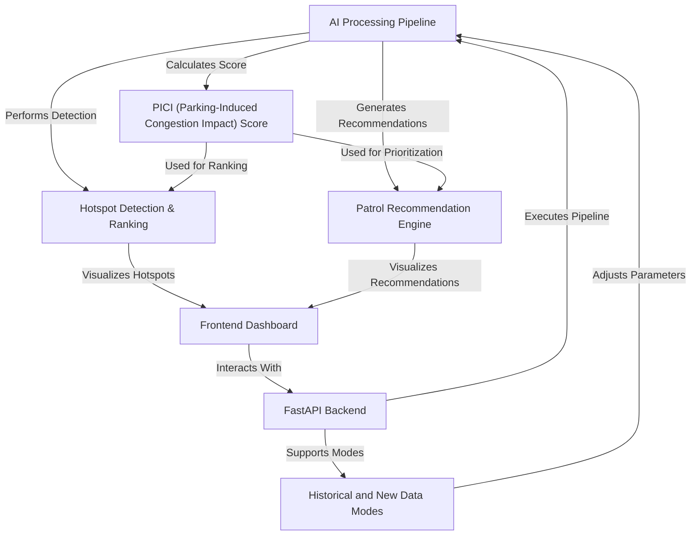

# Tutorial: Gridlock_Round2

ParkSense AI is an innovative system that leverages artificial intelligence to transform raw parking violation data from Bengaluru Traffic Police into *actionable intelligence*. It automatically identifies **hotspots** of illegal parking, quantifies their *congestion impact (PICI score)*, and generates **proactive patrol recommendations**. All these insights are presented through an interactive *frontend dashboard* that also supports processing of *new data uploads* for dynamic operational planning.

**Source Repository:** [None](None)

## Chapters

1. [PICI (Parking-Induced Congestion Impact) Score
](01_pici__parking_induced_congestion_impact__score_.md)
2. [Hotspot Detection & Ranking
](02_hotspot_detection___ranking_.md)
3. [Patrol Recommendation Engine
](03_patrol_recommendation_engine_.md)
4. [Frontend Dashboard
](04_frontend_dashboard_.md)
5. [Historical and New Data Modes
](05_historical_and_new_data_modes_.md)
6. [AI Processing Pipeline
](06_ai_processing_pipeline_.md)
7. [FastAPI Backend
](07_fastapi_backend_.md)

---

