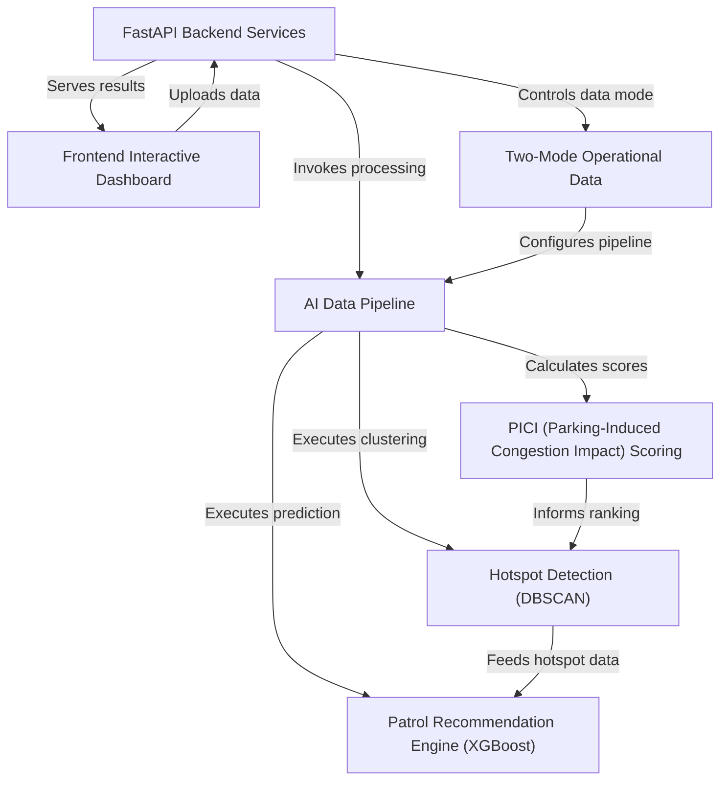

# Tutorial: Gridlock_Round2

ParkSense AI is an *intelligent system* that helps Bengaluru Traffic Police (BTP) combat **parking-induced traffic congestion**. It acts like a digital detective, using an **AI data pipeline** to analyze parking violation records, automatically pinpoint areas with concentrated illegal parking (*hotspots*), and predict when and where new problems are likely to emerge. The system then provides **actionable patrol recommendations** through an *interactive dashboard*, allowing officers to target enforcement strategically and *reduce traffic woes*.

**Source Repository:** [None](None)

## Chapters

1. [Frontend Interactive Dashboard
](01_frontend_interactive_dashboard_.md)
2. [FastAPI Backend Services
](02_fastapi_backend_services_.md)
3. [Two-Mode Operational Data
](03_two_mode_operational_data_.md)
4. [AI Data Pipeline
](04_ai_data_pipeline_.md)
5. [PICI (Parking-Induced Congestion Impact) Scoring
](05_pici__parking_induced_congestion_impact__scoring_.md)
6. [Hotspot Detection (DBSCAN)
](06_hotspot_detection__dbscan__.md)
7. [Patrol Recommendation Engine (XGBoost)
](07_patrol_recommendation_engine__xgboost__.md)

---

